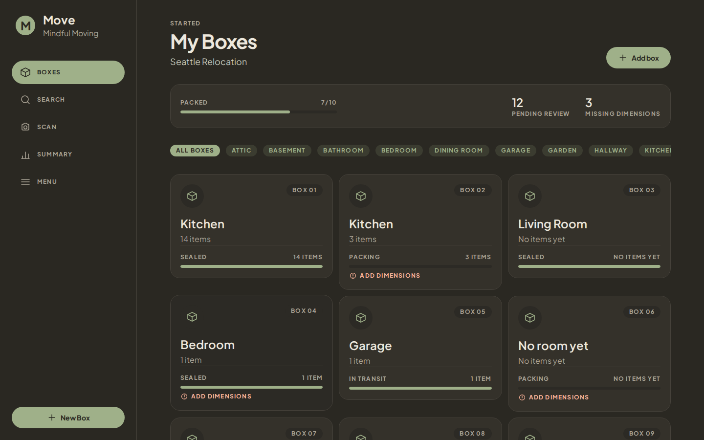
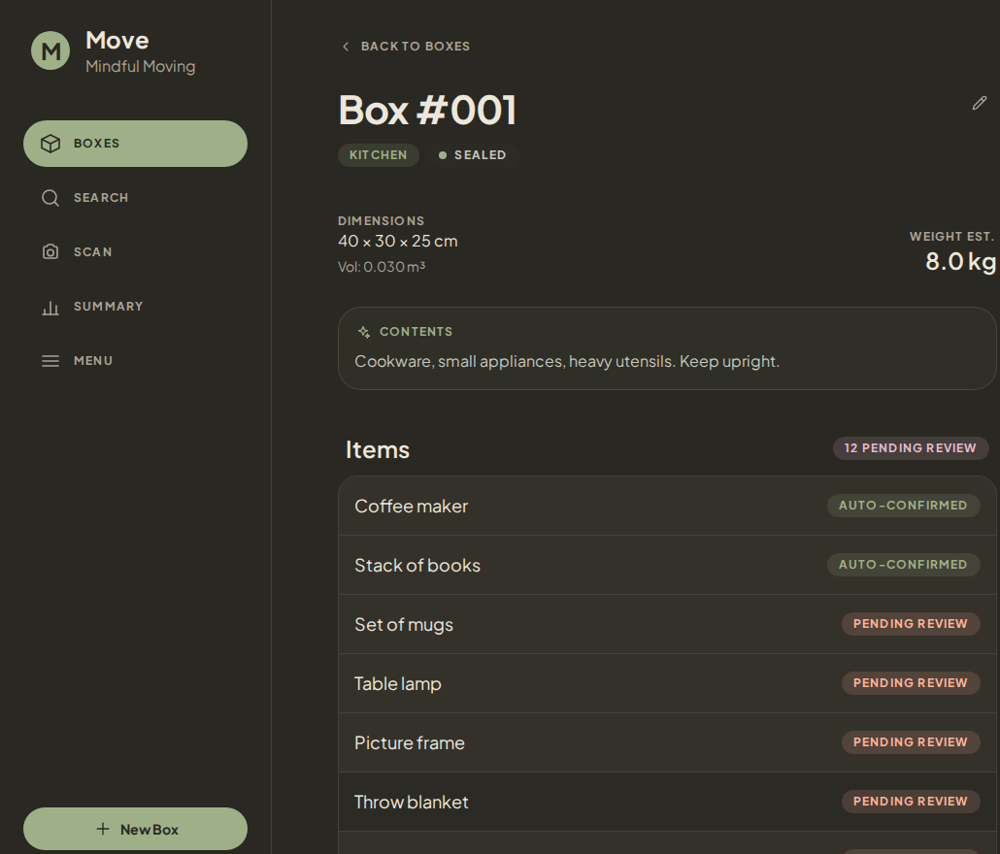
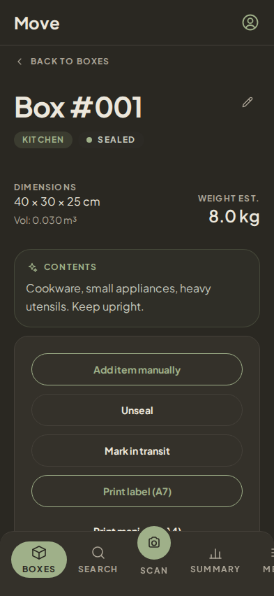
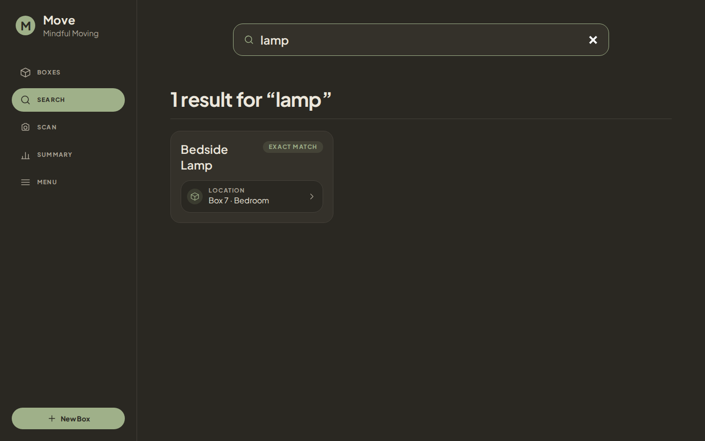
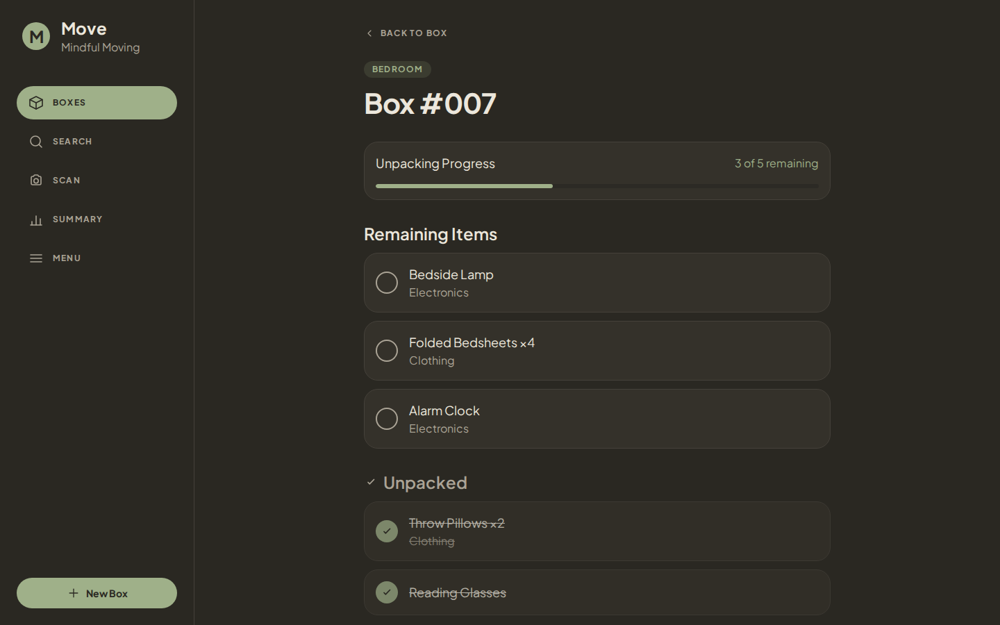
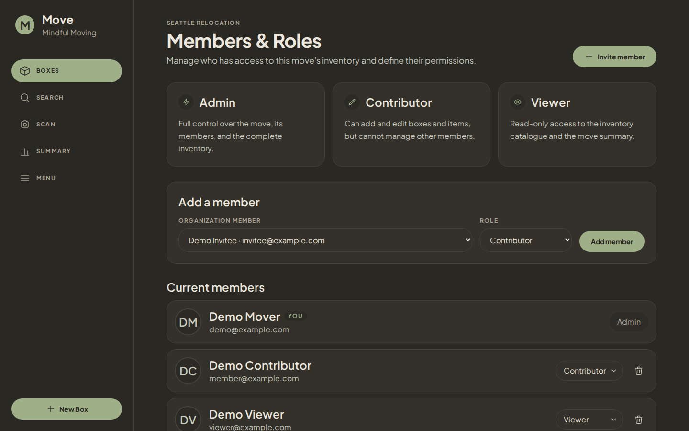
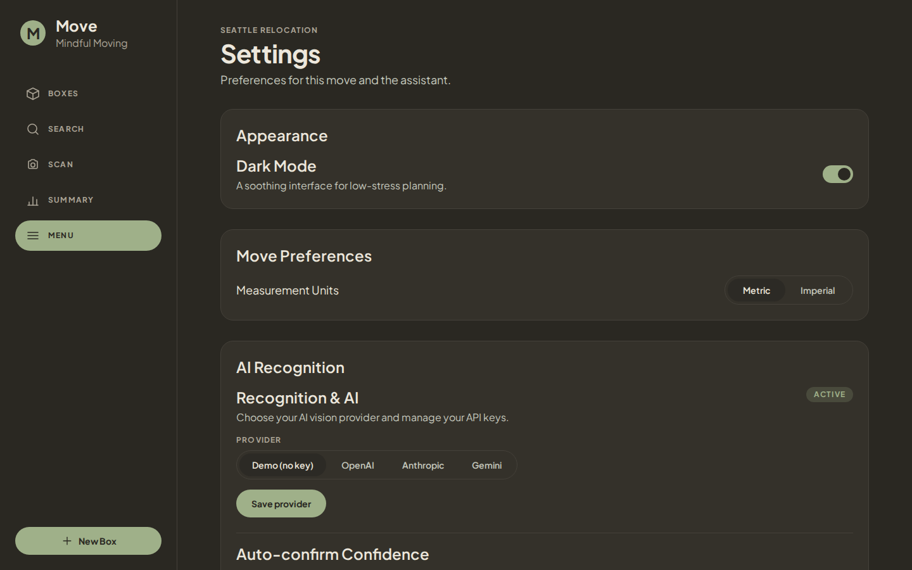
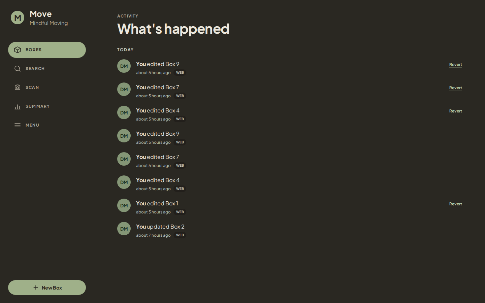
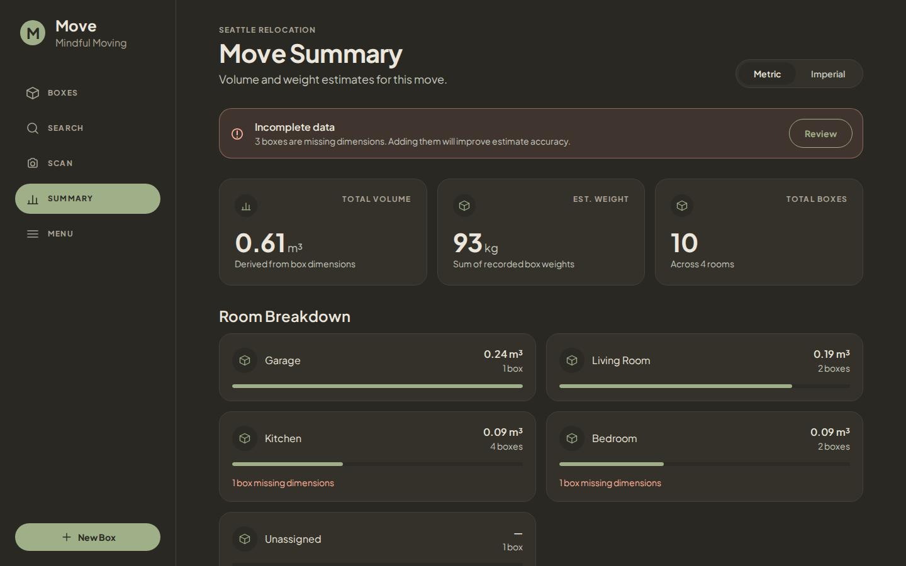
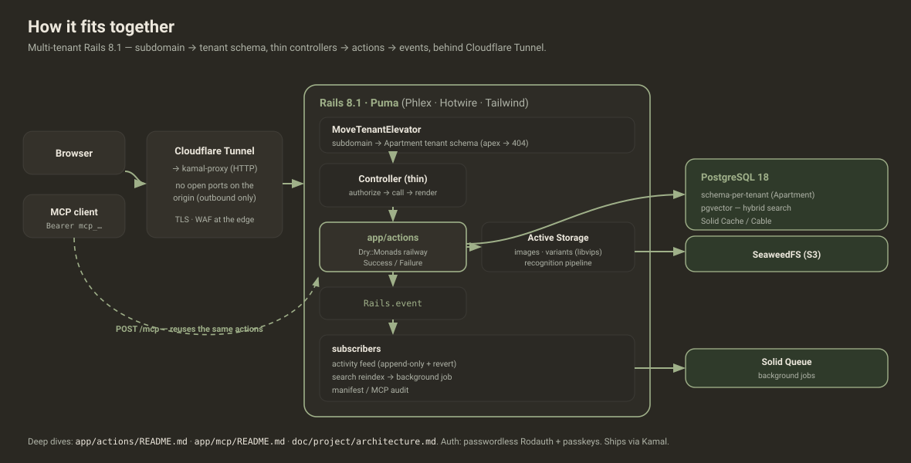

<h1 align="center">📦 Move</h1>

<p align="center"><em>Mindful moving — pack, recognise, search, unpack.</em></p>

<p align="center">
  
  
  
  
  
  
</p>

**Move** is a calm, collaborative **moving-inventory manager**. Pack your things into
numbered boxes, **snap a photo and let AI list the contents**, find anything across the
whole move with hybrid search, print **QR labels**, and tick items off as you unpack at
the other end — solo or with your household, each with the right role. An **MCP
assistant** lets an AI client query and update a move programmatically. Built on a
multi-tenant Rails 8.1 stack — **no Node, server-rendered with Phlex + Hotwire**.



---

## ✨ Screenshots

### Pack

|  |  |
|---|---|
|  |  |
| **Box detail & lifecycle** — dimensions, an AI-suggested contents summary, and items the camera recognised (auto-confirmed vs. pending review). | **Designed mobile-first** — a calm dark UI with a docked tab bar; every surface is responsive. |

### Find & finish

|  |  |
|---|---|
|  |  |
| **Hybrid search** — full-text + trigram + vector embeddings, best-match first, with the box each item lives in. | **Unpacking mode** — a per-box checklist at the destination, with a progress bar and an unpacked pile. |

### Collaborate & automate

|  |  |
|---|---|
|  |  |
| **Members & roles** — share a move; admin / contributor / viewer permissions, enforced server-side. | **Settings & AI** — bring your own vision provider (OpenAI / Anthropic / Gemini) per move, or run the key-free demo. |

|  |  |
|---|---|
| **Activity feed** — an append-only journal of every change, with one-click **revert**. | **Volume & weight summary** — totals and a per-room breakdown for planning the van. |

---

## 🧩 Features

- **Boxes with a lifecycle** — `packing → sealed → in transit → unpacking → unpacked`,
  with QR labels (A7) and printable manifests (A4).
- **AI photo recognition** — snap a box's contents; a vision model lists the items,
  categories, fragility and tags. **Per-move bring-your-own-key** (OpenAI / Anthropic /
  Gemini), or a key-free demo provider.
- **Hybrid search** — PostgreSQL full-text + trigram fuzzy match **+ pgvector** semantic
  embeddings, blended and ranked, across every confirmed item.
- **Controlled vocabularies** — rooms, categories and tags the recognition steers toward.
- **Collaboration** — share a move; **admin / contributor / viewer** roles enforced by
  ActionPolicy.
- **Unpacking mode** — destination-side checklists + a "box unpacked" celebration.
- **Activity feed** — append-only history (Logidze) with attributed **revert**.
- **MCP assistant** — a stateless JSON-RPC `/mcp` endpoint exposing per-move tools to an
  AI client, reusing the very same business logic as the web UI.
- **Passwordless auth** — Rodauth email links + passkeys (WebAuthn) + Google sign-in.
- **Multi-tenant** — schema-per-organisation isolation via Apartment.

---

## 🏗️ How it works



A subdomain selects the **tenant** (Apartment switches to that org's PostgreSQL schema);
the request hits a **thin controller** that calls an action in
[`app/actions/`](app/actions/README.md) — the Dry::Monads "railway" where **all** domain
logic lives. Actions emit `Rails.event` events that fan out to subscribers (the activity
feed, search reindex via Solid Queue, audit logs). The
[`app/mcp/`](app/mcp/README.md) assistant endpoint reuses those same actions, so it can't
bypass authorization, tenancy, or audit. Images go to SeaweedFS via Active Storage; the
whole thing runs behind a Cloudflare Tunnel (no open ports on the origin).

> Deep dives: **[`app/actions/README.md`](app/actions/README.md)** ·
> **[`app/mcp/README.md`](app/mcp/README.md)** ·
> **[`doc/project/architecture.md`](doc/project/architecture.md)** (full Mermaid diagrams).

---

## 🛠️ Built with

**Ruby 4.0 · Rails 8.1** · **Phlex** (server-side components) · **Hotwire** (Turbo +
Stimulus) · **Tailwind CSS** (standalone CLI — no Node) · **PostgreSQL 18 + pgvector** ·
**ros-apartment** (schema-per-tenant) · **Rodauth** (passwordless + passkeys + OAuth) ·
**ActionPolicy** · **Dry::Monads** · **Discard** · **Logidze** · **Solid Queue / Cache /
Cable** · **Active Storage → SeaweedFS (S3)** · **ruby-vips** · the **`mcp`** gem ·
**Prawn** + **rqrcode** (labels & manifests) · **Kamal** + **Cloudflare Tunnel** ·
**RSpec** · **Brakeman** · **RuboCop**.

---

## 🚀 Run it locally

Everything runs in containers, driven by `bin/cli` (Ruby is pinned via **mise** — prefix
Ruby commands with `mise x --`).

```bash
bin/cli services start     # app + database + mail + storage
bin/rails db:seed          # demo org, a "Seattle Relocation" move, a demo account
```

Then open **https://move.workeverywhere.docker** (local mail at
**https://mail.workeverywhere.docker**), sign in passwordless as the seeded demo account,
and you'll land on the org subdomain (`acme.workeverywhere.docker`) inside the demo move.

| `bin/cli …` | what it does |
|---|---|
| `services start` | start app + db + mail + storage together |
| `app rebuild \| restart \| console \| logs` | manage the app container |
| `db prepare \| reset \| console` | manage the database |
| `mail start` · `storage start` | local mail inbox · SeaweedFS S3 gateway |
| `tree` | list every command |

---

## ✅ Testing & quality

```bash
mise x -- bundle exec rubocop          # style (autocorrect: -A)
mise x -- bin/erb_lint --lint-all      # ERB/Phlex lint
mise x -- brakeman --exit-on-warn      # security scan
mise x -- bundle exec rspec spec --exclude-pattern "spec/system/**/*_spec.rb"   # unit
TEST_BROWSER=rack_test mise x -- bundle exec rspec spec/system                   # system
```

CI runs `lint` + `test` on every PR; `main` is protected.

---

## ☁️ Deployment

Push to `main` → **auto-deploy to [move-easy.org](https://move-easy.org)** via **Kamal**.
The origin has **no open inbound ports**: traffic flows Browser → Cloudflare edge (TLS,
WAF) → **Cloudflare Tunnel** (outbound-only) → kamal-proxy → Rails (Puma + in-process
Solid Queue) → **PostgreSQL 18** (Kamal accessory, pgvector). Secrets come from **Doppler**;
Active Storage uses a shared **SeaweedFS** S3 gateway. Skip a deploy with `[skip deploy]`
in the commit subject.

---

## 📚 Documentation

- **[`doc/project/`](doc/project/)** — architecture, the reproducible "new app" recipe,
  diagrams.
- **[`app/actions/README.md`](app/actions/README.md)** — the business-logic layer (actions
  → events → subscribers), with diagrams.
- **[`app/mcp/README.md`](app/mcp/README.md)** — the MCP assistant surface, with diagrams.
- **[`doc/phases/`](doc/phases/)** — the design-led, screen-by-screen implementation plan.
