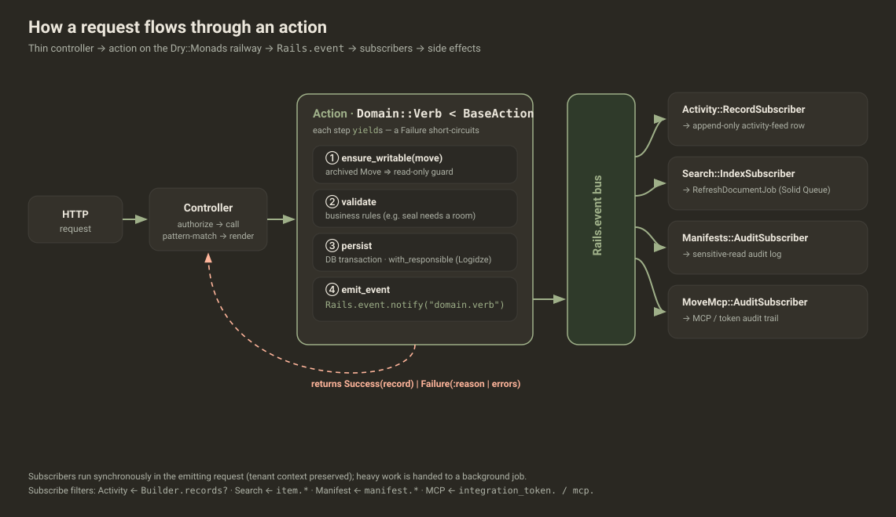
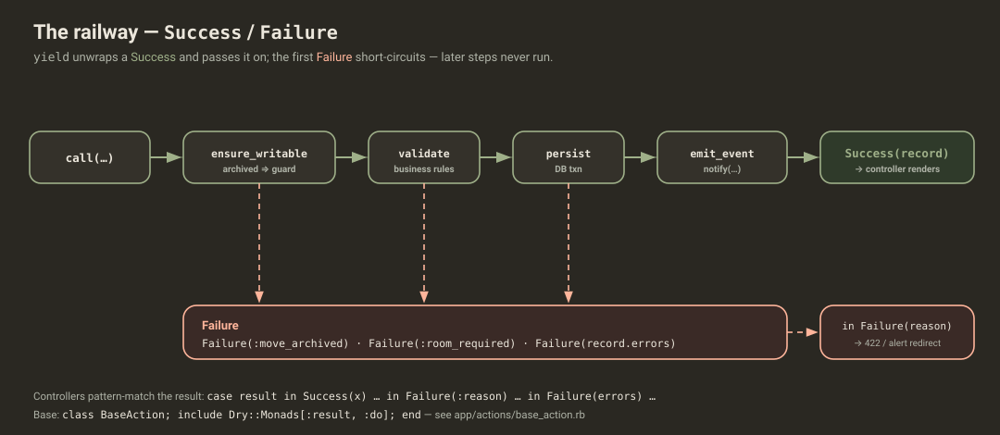
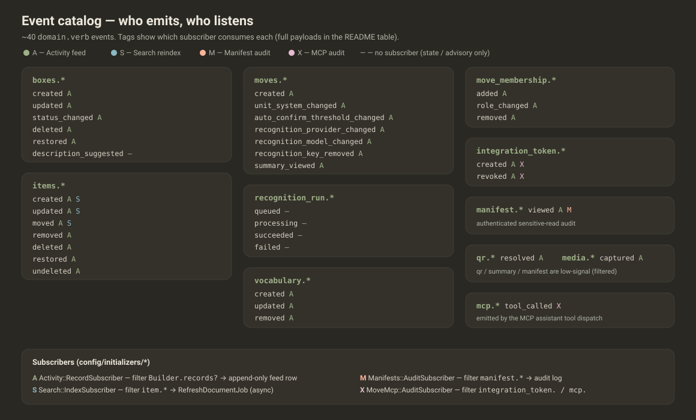
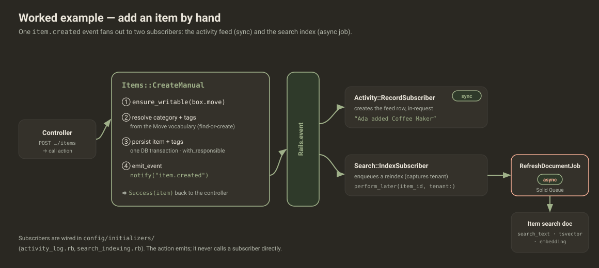

# Actions — the business-logic layer

> **All** domain logic lives here. Models stay persistence-focused (associations,
> validations, scopes); controllers stay thin (authorize → call → pattern-match →
> render); side effects travel by event, never by callback. One action = one file
> = one verb: `app/actions/<domain>/<verb>.rb` → `Domain::Verb < BaseAction`.
>
> This README is the visual/onboarding tour. The terse agent reference (templates +
> conventions) is [`AGENTS.md`](AGENTS.md).

---

## Why Actions?

Putting each domain operation in its own object — rather than in a fat model
callback or a chunky controller — buys three things:

- **Testable.** An action is plain Ruby: `Domain::Verb.new.call(...)` and assert on
  the returned `Success`/`Failure`. No HTTP, no controller, no view.
- **Composable.** Actions call other actions on the same railway
  (`Boxes::Delete` → `Discards::Cascade`), and a `Failure` anywhere stops the chain.
- **Observable.** Every action emits a `domain.verb` event. Cross-cutting work
  (activity feed, search index, audit logs) subscribes — the action never knows or
  cares who is listening.

---

## The big picture

A request is authorized by the controller, handed to an action, and the action's
event fans out to subscribers that do the cross-cutting work — while the action
returns a `Success`/`Failure` the controller pattern-matches on.



---

## The railway (Dry::Monads)

`BaseAction` mixes in `Dry::Monads[:result, :do]`. Every step is `yield`ed: `yield`
unwraps a `Success` and passes the value on, or **short-circuits** on the first
`Failure` so later steps never run. The controller then matches the final result.



```ruby
# app/actions/base_action.rb
class BaseAction
  include Dry::Monads[:result, :do]

  # Archived-Move invariant in one place: a user-facing *mutating* action's first
  # step is `yield ensure_writable(move)`. Web, MCP and jobs all inherit it.
  def ensure_writable(move)
    return Failure(:move_archived) unless move.writable?
    Success()
  end

  # Attribute the Logidze version(s) created in the block to `actor` (the activity
  # feed's "who did this" + attributed revert). Non-transactional on purpose.
  def with_responsible(actor, &) = Logidze.with_responsible(actor&.id, transactional: false, &)
end
```

---

## Anatomy of an action

A real one — [`app/actions/boxes/create.rb`](boxes/create.rb):

```ruby
module Boxes
  class Create < BaseAction
    include Boxes::RoomResolution               # shared mixin: find-or-create a room by name

    def call(move:, params:, creator:)
      yield ensure_writable(move)               # 1. guard — archived Move is read-only
      box = yield with_responsible(creator) {   # 2. persist, attributed to the actor
        persist(move, params)
      }
      yield emit_event(box, creator)            # 3. announce what happened
      Success(box)                              # 4. hand the record back
    end

    private

    def persist(move, params)
      box = nil
      ActiveRecord::Base.transaction do         # room + box share one transaction
        room = find_or_create_room(move, params[:room_name])
        box = move.boxes.create!(number: params[:number].presence || next_number(move),
                                 qr_token: SecureRandom.urlsafe_base64(16),
                                 room:, description: params[:description], **dimensions(params))
      end
      Success(box)
    rescue ActiveRecord::RecordInvalid => e
      Failure(e.record.errors)                  # validations → ActiveModel::Errors
    end

    def emit_event(box, creator)
      Rails.event.notify("box.created", box_id: box.id, move_id: box.move_id, created_by_id: creator&.id)
      Success()
    end
  end
end
```

---

## Patterns at a glance

| Pattern | Shape | Example |
|---|---|---|
| **Create / Update** | guard → persist (txn, `with_responsible`) → emit → `Success(record)` | [`boxes/create.rb`](boxes/create.rb), [`boxes/update.rb`](boxes/update.rb) |
| **Guard + state transition** | guard → **validate the rule** → persist the transition → emit | [`boxes/transition_status.rb`](boxes/transition_status.rb) |
| **Delete (capture ids first)** | capture ids/batch → cascade discard → emit (record is gone after) | [`boxes/delete.rb`](boxes/delete.rb) → [`discards/cascade.rb`](discards/cascade.rb) |
| **Resolve from vocabulary** | a shared mixin find-or-creates rooms/categories/tags by name | [`boxes/room_resolution.rb`](boxes/room_resolution.rb), [`items/form_resolution.rb`](items/form_resolution.rb) |

Guard-then-validate, from [`boxes/transition_status.rb`](boxes/transition_status.rb):

```ruby
def validate(box, to)
  return Failure(:invalid_transition) unless box.can_transition_to?(to)
  return Failure(:room_required) if to == "sealed" && box.room_id.blank?
  Success()
end
```

---

## Controller integration

Controllers stay thin — call the action, pattern-match, render:

```ruby
# app/controllers/boxes_controller.rb
result = Boxes::Create.new.call(move: @move, params: box_params.to_h.symbolize_keys, creator: current_user)

case result
in Dry::Monads::Success(box)
  redirect_to move_boxes_path(@move), notice: t(".created", number: box.number)
in Dry::Monads::Failure(errors)                 # ActiveModel::Errors → re-render the form
  box = @move.boxes.new(box_params)
  box.errors.merge!(errors)
  render Views::Boxes::New.new(move: @move, box:), status: :unprocessable_content
end
```

A business-rule failure is a symbol the controller maps to a message:
`in Dry::Monads::Failure(:room_required) then redirect_to …, alert: t("boxes.transition.room_required")`.

---

## Events & side effects

Actions emit ~40 `domain.verb` events. Five subscribers (wired in
`config/initializers/`) consume them by filter and do the cross-cutting work. The
action emits and returns; it **never** calls a subscriber directly.



| Subscriber | Wired in | Filter | Does |
|---|---|---|---|
| `Activity::RecordSubscriber` | `activity_log.rb` | `Activity::Builder.records?` | Appends the activity-feed row (sync, in-request) |
| `Search::IndexSubscriber` | `search_indexing.rb` | `item.*` (`created`/`updated`/`moved`) | Enqueues `Search::RefreshDocumentJob` (async) |
| `MediaVariants::PrewarmSubscriber` | `media_variants.rb` | `media.captured` | Enqueues `MediaVariants::PrewarmJob` to warm display variants (async, #316) |
| `Manifests::AuditSubscriber` | `manifest_audit.rb` | `manifest.*` | Logs the authenticated sensitive read |
| `MoveMcp::AuditSubscriber` | `mcp_audit.rb` | `integration_token.` / `mcp.` | MCP / token audit trail |

**Event catalog** (consumers: **A** activity · **S** search · **P** prewarm · **M** manifest · **X** MCP · **—** none):

| Domain | Events | Key payload | Consumers |
|---|---|---|---|
| `box` | `created` `updated` `status_changed` `deleted` `restored` | `box_id, move_id, actor/editor/creator_id` (+ `to`, `discard_batch_id`) | A |
| `box` | `description_suggested` | `box_id, source` | — (advisory) |
| `item` | `created` `updated` `moved` `removed` `deleted` `restored` `undeleted` | `item_id, box_id, move_id` (+ `created_via`, `to_box_id`, `batch_id`) | A; **S** for `created`/`updated`/`moved` |
| `media` | `captured` `moved` | `media_id, box_id, move_id` (+ `to_box_id` for `moved`) | A, **P** for `captured`; (`moved` also emits an `item.moved` per co-located item → **S**) |
| `move` | `created` `unit_system_changed` `auto_confirm_threshold_changed` `recognition_provider_changed` `recognition_model_changed` `provider_key_set` `provider_key_removed` `embedding_provider_changed` `summary_viewed` | `move_id` (+ changed value / `provider`) | A (`summary_viewed` low-signal) |
| `move_membership` | `added` `role_changed` `removed` | `move_id, user_id, role` | A |
| `integration_token` | `created` `revoked` | `move_id, token_id` | A, **X** |
| `vocabulary` | `created` `updated` `removed` | `move_id, kind, record_id` | A |
| `manifest` | `viewed` | `box_id, move_id, actor_id` | A (low-signal), **M** |
| `qr` | `resolved` | `box_id, move_id, actor_id` | A (low-signal) |
| `recognition_run` | `queued` `processing` `succeeded` `failed` | `recognition_run_id, box_id` (+ `item_count`/`error_code`) | — (drives run state / UI) |
| `session_handoff` | `minted` `consumed` | `token_id, user_id, organization_slug` | — (audit trail; apex→subdomain handoff, #280) |

> **Rails 8.1 events.** Subscribers respond to `#emit(event)` (not `#call`); the
> event is a hash — `event[:name]`, `event[:payload]`. See root `AGENTS.md` §4.

---

## A worked example

Adding one item by hand: a single `item.created` event drives **two** subscribers —
the activity feed (synchronously) and the search index (via an async job).



---

## Adding a new action

1. Create `app/actions/<domain>/<verb>.rb` inheriting `BaseAction`.
2. Implement `call(named:, args:)`, chaining steps with `yield` (`ensure_writable`
   first for a mutating action; `persist` inside `with_responsible(actor)`).
3. Emit a `domain.verb` via `Rails.event.notify`. If there's downstream work, add a
   subscriber (`app/subscribers/…`) + register it in `config/initializers/`.
4. Call it from the controller and pattern-match `Success`/`Failure`.
5. Unit-test the action directly: `.new.call(...)`, assert on the monad.

---

## Cross-cutting conventions

- **Archived-Move guard.** `yield ensure_writable(move)` is the first step of any
  user-facing mutation — the single source of truth for "archived Move is read-only".
- **Attribution.** Wrap persistence in `with_responsible(actor) { … }` so Logidze
  records who made the change (powers the activity feed's attributed revert).
- **Tenancy.** Actions run inside the active Apartment tenant schema; the caller
  (controller / job / MCP) owns switching the tenant. Don't re-resolve it here.
- **Transactions.** Multi-write persistence runs in one `ActiveRecord::Base
  .transaction`; rescue `RecordInvalid` → `Failure(record.errors)` so a failed write
  rolls back cleanly (e.g. no orphan room on a failed box create).
- **Errors.** `Failure(record.errors)` for validations · `Failure(:symbol)` for
  business rules · `Failure(:not_found)` · `Failure("message")`.

---

## Directory structure

```
app/actions/
├── base_action.rb          # the railway base + ensure_writable + with_responsible
├── README.md  ·  AGENTS.md  ·  CLAUDE.md  ·  diagrams/  (svg + editable excalidraw)
├── boxes/          create · update · delete · restore · transition_status · suggest_description · room_resolution
├── captures/       create
├── discards/       cascade · cascade_restore
├── items/          create_manual · update · rename · move · mark_removed · delete · restore · restore_to_box · form_resolution
├── manifests/      generate
├── move_integration_tokens/   create · revoke
├── move_memberships/          add · change_role · remove · admin_guard
├── indexing_runs/  start · record_progress
├── moves/          create · set_unit_system · set_auto_confirm_threshold · set_recognition_provider · set_embedding_provider · set_provider_key · remove_provider_key · volume_summary · default_vocabularies
├── organizations/  create
├── qr/             resolve
├── recognition_runs/   enqueue · process · retry
├── reviews/        mark_photo_reviewed
├── search/         items · refresh_document · reindexing
├── session_handoffs/   mint · consume   # apex→subdomain single-use token (#280)
└── vocabularies/   create · update · remove
```

---

**For AI agents:** the templates, conventions, and "adding an action" checklist
live in [`AGENTS.md`](AGENTS.md) (this directory). The architecture-wide picture
(tenancy, request flow, search, MCP) is in [`../../doc/project/architecture.md`](../../doc/project/architecture.md).
