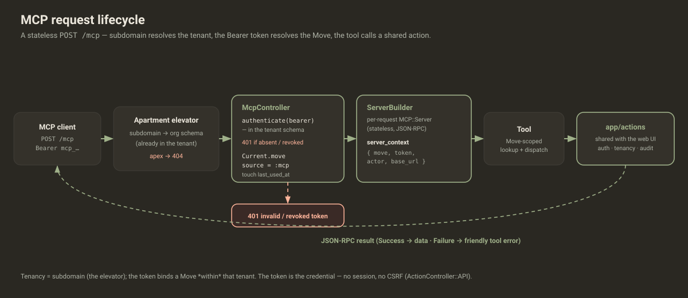
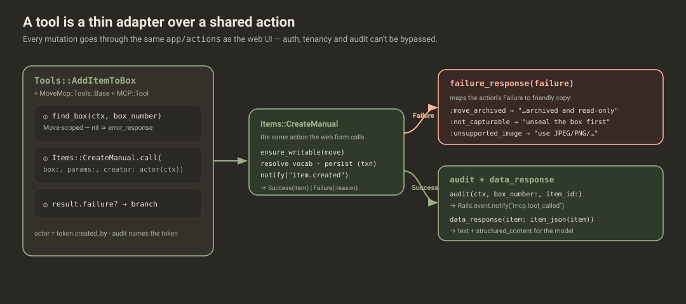
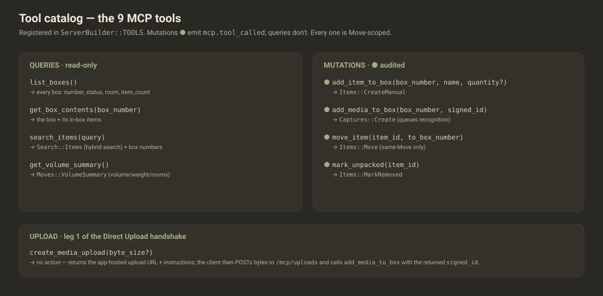
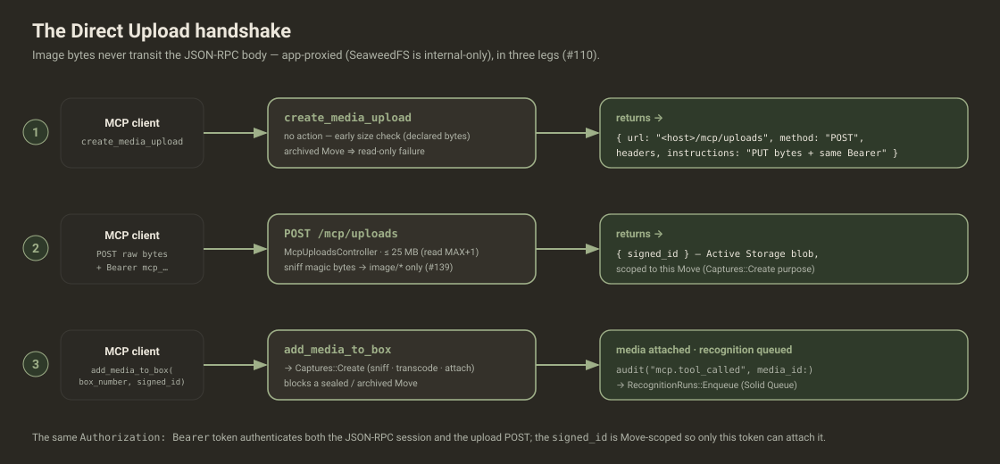

# MCP — the assistant surface

> A **stateless JSON-RPC endpoint** (`POST /mcp`) that exposes a small set of tools
> over **one Move**, authenticated by a per-Move Bearer integration token. Every tool
> is a thin adapter: it resolves a **Move-scoped** record and dispatches to the **same
> [`app/actions`](../actions/README.md)** the web UI uses — so MCP can't bypass
> authorization, tenancy, or audit.
>
> Built on the official `mcp` gem. This README is the visual tour; the terse agent
> reference is [`AGENTS.md`](AGENTS.md).

---

## Request lifecycle

The Apartment elevator resolves the **tenant** from the subdomain; the Bearer token
resolves the **Move** within it; the controller builds a fresh `MCP::Server` per
request and dispatches the tool, which calls a shared action.



```ruby
# app/controllers/mcp_controller.rb  (ActionController::API — the token is the credential, no CSRF)
def handle
  Current.tenant = Apartment::Tenant.current
  Current.move   = @token.move
  Current.source = :mcp                       # domain events are attributed to the assistant

  server    = MoveMcp::ServerBuilder.build(token: @token, base_url: request.base_url)
  transport = MCP::Server::Transports::StreamableHTTPTransport.new(server, stateless: true, enable_json_response: true)
  status, headers, body = transport.handle_request(request)
  # … render body/status/headers …
end
```

---

## Authentication & tenancy

Three layers, in order (`app/controllers/concerns/mcp_authentication.rb`):

1. **Tenant** — `require_tenant!` rejects the apex with **404**; the
   `MoveTenantElevator` has already switched to the org schema by subdomain.
2. **Token** — `authenticate_integration_token!` resolves the Bearer token *within*
   that schema; **401** if absent or revoked.
3. **Rate limit** — a per-token cap (`POST /mcp` 60/min, `POST /mcp/uploads` 30/min —
   tighter, each upload is up to 25 MB) runs *after* the token is resolved but before
   the tool; over quota → **429**. Backed by `Rails.cache` (Solid Cache in prod), so
   the window is shared across app instances.

`last_used_at` is recorded in an **after_action**, deliberately — a **401** or **429**
request halts before the action, so it performs **no** DB write. Only a request that
passed auth *and* the rate limit *and* ran the tool touches `last_used_at`, which keeps
a rejected flood from amplifying DB writes.

```ruby
# app/models/move_integration_token.rb
TOKEN_PREFIX = "mcp_"
def self.generate_raw_token = "#{TOKEN_PREFIX}#{SecureRandom.urlsafe_base64(32)}"
def self.digest(raw)         = Digest::SHA256.hexdigest(raw.to_s)   # only the digest is stored
def self.authenticate(raw)   = raw.blank? ? nil : active.find_by(token_digest: digest(raw))
```

The token binds a **Move within the tenant** — it carries no tenant of its own. The
raw token is shown **once** at creation; tokens are admin-managed via
`MoveIntegrationTokens::Create` / `Revoke` (which emit `integration_token.created` /
`revoked`).

---

## Anatomy of a tool

A tool is a thin adapter: resolve a Move-scoped record → call a shared action → map
the result. Real one — `app/mcp/move_mcp/tools/add_item_to_box.rb`:



```ruby
module MoveMcp::Tools
  class AddItemToBox < Base
    tool_name "add_item_to_box"
    description "Add a manually-entered item to a box, identified by its box number."
    input_schema(properties: {
      box_number: { type: "integer" }, name: { type: "string" }
    }, required: %w[box_number name])

    def self.call(box_number:, name:, server_context:, **)
      box = find_box(server_context, box_number)                       # Move-scoped
      return error_response("No box ##{box_number} in this move.") if box.nil?

      result = ::Items::CreateManual.new.call(                         # the SAME action as the web UI
        box:, params: { name: }, creator: actor(server_context)
      )
      return failure_response(result.failure) if result.failure?       # Failure → friendly tool error

      item = result.value!
      audit(server_context, box_number: box.number.to_i, item_id: item.id)  # → mcp.tool_called
      data_response(item: item_json(item))
    end
  end
end
```

`MoveMcp::Tools::Base` (`tools/base.rb`) provides the shared helpers: the
`server_context` accessors (`move`/`token`/`actor` = `token.created_by`/`base_url`),
the Move-scoped `find_box` / `find_item`, the `failure_response(failure)` symbol→copy
map, `audit(...)`, and the `box_json` / `item_json` serialisers.

---

## The tool catalog

Nine tools, registered in `MoveMcp::ServerBuilder::TOOLS`. Mutations dispatch to a
shared action and emit `mcp.tool_called`; queries are read-only.



| Tool | Args | Action called | Audited | Returns |
|---|---|---|:--:|---|
| `list_boxes` | — | — | | `{ boxes }` |
| `get_box_contents` | `box_number` | — | | `{ box, items }` |
| `search_items` | `query` | `Search::Items` | | `{ query, results }` |
| `get_volume_summary` | — | `Moves::VolumeSummary` | | `{ totals, rooms }` |
| `add_item_to_box` | `box_number, name` | `Items::CreateManual` | ● | `{ item }` |
| `add_media_to_box` | `box_number, signed_id` | `Captures::Create` | ● | `{ media_id, recognition }` |
| `move_item` | `item_id, to_box_number` | `Items::Move` | ● | `{ item }` |
| `mark_unpacked` | `item_id` | `Items::MarkRemoved` | ● | `{ item }` |
| `create_media_upload` | `byte_size?` | — (returns upload URL) | | `{ url, method, instructions }` |

---

## Shared actions, never duplicated

The MCP layer owns **no** business logic. Each mutating tool calls the same
`app/actions` the web controllers do, so the archived-Move guard
(`ensure_writable → Failure(:move_archived)`), validations, tenancy, and the domain
events all come for free. The tool's only job is to translate: resolve a Move-scoped
record, then map the action's `Failure(:symbol)` to friendly copy —

```ruby
# tools/base.rb
def failure_response(failure)
  message = {
    move_archived:     "This move is archived and is read-only.",
    not_capturable:    "That box is sealed — unseal it before adding media.",
    unsupported_image: "That file isn't a supported image (use JPEG, PNG, WEBP, HEIC, or TIFF)."
  }[failure]
  error_response(message || "Action failed: #{failure}")
end
```

Records are always loaded through `move(context).boxes / .items`, so a token can
**never** reach another Move or Organization — Apartment schema isolation is the
second layer beneath it.

---

## The Direct Upload handshake (#110)

Images don't fit in a JSON-RPC body, and the SeaweedFS gateway is internal-only — so
uploads are **app-proxied** in three legs:



1. **`create_media_upload`** returns the app-hosted upload URL + instructions (no
   action; a cheap early size check on the declared bytes).
2. The client **POSTs the raw bytes** to `/mcp/uploads` with the *same* Bearer token.
   `McpUploadsController` reads at most `MAX+1` bytes (bounds memory), **sniffs the
   magic bytes** (`Marcel` → `image/*` only, #139 — never trusts the declared name),
   creates the blob, and returns a **Move-scoped `signed_id`**.
3. **`add_media_to_box(box_number, signed_id)`** → `Captures::Create` attaches the
   blob, transcodes non-native formats, blocks a sealed/archived Move, and queues
   recognition.

---

## Audit & events

Mutating tools call `audit(...)` → `MoveMcp::Audit.record` emits **`mcp.tool_called`**
(`source: :mcp`, `tool`, `token_id`, `token_name`, `move_id`, + affected ids).
`MoveMcp::AuditSubscriber` (wired in `config/initializers/mcp_audit.rb`, filter
`AUDITED_PREFIXES = %w[integration_token. mcp.]`) logs each to `[mcp.audit]`,
synchronously in-request so the tenant is still live. The domain events the shared
actions emit (`item.created`, etc.) flow to their own subscribers — see the
[actions event catalog](../actions/README.md#events--side-effects).

---

## Adding a new tool

1. Create `app/mcp/move_mcp/tools/<name>.rb` subclassing `MoveMcp::Tools::Base`.
2. Declare `tool_name`, `description`, `input_schema` (no empty `required: []` — the
   gem rejects it).
3. Implement `self.call(**args, server_context:)`: resolve a **Move-scoped** record
   (`find_box` / `find_item` / `move(context)`), dispatch to a **shared action**, map
   `result.failure?` via `failure_response`, then `audit(...)` + `data_response`.
4. Register it in `MoveMcp::ServerBuilder::TOOLS`.
5. Spec it (`spec/mcp/...`) — call `Tool.call(...)` with a stub `server_context`.

---

## Security model

- **Move-scoped lookups** — every record is loaded through the token's Move; no
  cross-Move or cross-Organization reach.
- **Token = credential** — no session, no CSRF (`ActionController::API`); the raw
  token is shown once, stored only as a SHA-256 digest, revocable.
- **No bypass** — mutations reuse the web UI's actions, so the same archived-Move
  guard, authorization, tenancy, and audit apply.
- **Uploads** — byte-sniffed, size-capped, Move-scoped `signed_id`; bytes never
  transit the JSON-RPC body.
- **Rate-limited** — a per-token cap (60/min JSON-RPC, 30/min uploads) via
  `Rails.cache`, so a compromised token can't exhaust resources; `last_used_at` is an
  after_action, so a **429**/**401** performs no DB write.

---

## Directory structure

```
app/mcp/
├── README.md  ·  AGENTS.md  ·  CLAUDE.md  ·  diagrams/  (svg + editable excalidraw)
└── move_mcp/
    ├── server_builder.rb     # builds the per-request MCP::Server + server_context
    ├── audit.rb              # MoveMcp::Audit.record → mcp.tool_called
    ├── audit_subscriber.rb   # logs integration_token.* + mcp.* to [mcp.audit]
    └── tools/
        ├── base.rb           # context accessors · Move-scoped lookups · failure_response · audit · *_json
        ├── list_boxes.rb · get_box_contents.rb · search_items.rb · get_volume_summary.rb   (queries)
        ├── add_item_to_box.rb · add_media_to_box.rb · move_item.rb · mark_unpacked.rb       (mutations)
        └── create_media_upload.rb                                                           (upload)
```

Controllers/routes: `POST /mcp` → `McpController#handle`; `POST /mcp/uploads` →
`McpUploadsController#create`; auth in `concerns/mcp_authentication.rb`.

---

**For AI agents:** the tool template, conventions, and add-a-tool checklist live in
[`AGENTS.md`](AGENTS.md). The actions these tools call are documented in
[`../actions/README.md`](../actions/README.md); the architecture-wide MCP picture
(with a sequence diagram) is in
[`../../doc/project/architecture.md`](../../doc/project/architecture.md) §7.
