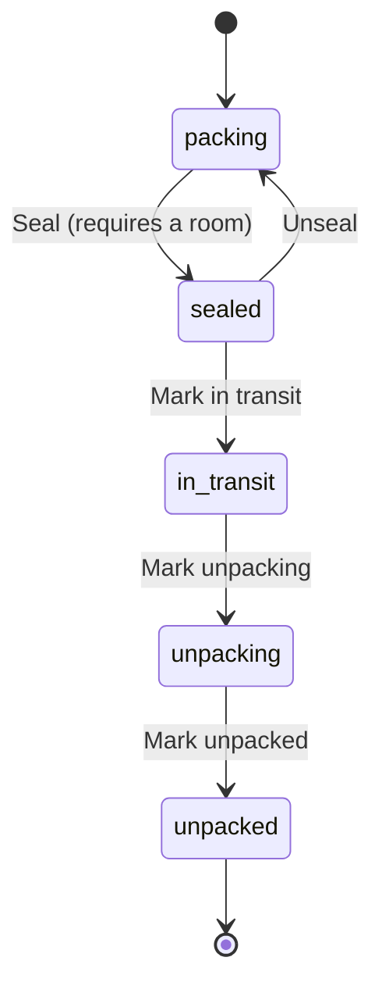

# Phase D3 — Box Detail & Lifecycle · Steps (flight recorder)

Append-only log of how the work unfolded. Companion to `Phase D3 - Box Detail and Lifecycle.md`.

## Scope decision
The substantive, buildable D3 deliverable is the **lifecycle** (update + status
transitions with guards) and the **detail layout** (identity, room, dimensions +
derived volume + weight, action set). Items inventory, media gallery, and
recognition runs depend on later-phase models, so they render as placeholders /
integration points — exactly as item counts did in D2:
- Items list → **D5** (Item model)
- Media gallery + Capture → **D4** (Media + capture)
- Recognition runs → **D4** (`Ui::RecognitionState` wired, inert)
- Generate label/QR → **D9**

## Box lifecycle (Domain §5.2)

`Boxes::TransitionStatus` validates the target against `Box::TRANSITIONS`
server-side (a stale UI can't force an illegal jump) and enforces
seal-requires-room. Capture into a sealed box is blocked (`Box#capturable?` is
true only while `packing`); the D4 capture action will honour it.

## Build order (atomic commits)
1. `72865c6` — Box lifecycle predicates + `TRANSITIONS` + derived `volume_cm3`;
   `BoxMeasurements` presenter (unit-aware display, canonical cm/kg); BoxCard
   progress switched to `packed?`.
2. `2ba1267` — `Boxes::Update` + `Boxes::TransitionStatus` actions; extracted
   `Boxes::RoomResolution` (shared with Create).
3. `d80e3de` — show/edit/update + member `transition` routes; `BoxPolicy`;
   controller actions (archived → read-only redirect).
4. `0d67d0b` — `Views::Boxes::Show` (B1) + `Edit`; `BoxForm` `submit_label`;
   BoxCard links to the detail; i18n; request + system specs.
5. `5edd2c1` — seeds across all five lifecycle states.

## Gotchas hit
- **`sealed?` semantics tightened.** D2's `sealed?` meant "past packing"; D3 needs
  precise predicates, so `sealed?` now means exactly `sealed` and `packed?`
  (= `!packing?`) drives the grid progress. Updated BoxCard accordingly.
- **Lazy `t(".archived")` was per-action.** `require_writable_move!` runs across
  several actions, so the lazy key resolved differently each time; switched to an
  explicit `t("boxes.archived")`.
- **`format` is a Phlex helper** — used `Kernel.format("%03d", …)` in the view.

## Verification
See the phase doc §9. Live-verified on `acme.move-easy.docker`; the
seal-requires-room guard and the unseal transition were exercised in the browser.
