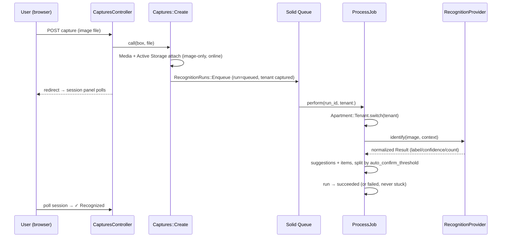

# Phase D4 — Capture Image & Recognition Pipeline · Steps (flight recorder)

Append-only log of how the work unfolded. Companion to `Phase D4 - Capture Image.md`.

## Capture → recognition pipeline

Provider is behind `RecognitionProviders` (fake/openai/anthropic via
`RECOGNITION_PROVIDER`, default fake). No raw vendor data or bounding boxes are
ever stored — only `label/confidence/count` and operational metadata.

## Storage & jobs
- **Active Storage**: tables are in the tenant template (Media is tenant-scoped —
  NOT in Apartment `excluded_models`). dev/test = Disk; **prod = the shared
  host-wide SeaweedFS S3** gateway (already serving the sibling apps) via move's
  own `move` bucket (`STORAGE_ENDPOINT=http://seaweedfs:8333`, `force_path_style`).
  Images are served through **proxy URLs** (`rails_storage_proxy_path`) so the
  internal S3 endpoint is never exposed. **No per-app accessory** — that would add
  a second redundant SeaweedFS to the box (corrected post-merge after spotting the
  shared instance; bucket created with `weed shell s3.bucket.create -name move`).
- **Solid Queue**: async in dev (in-process), `:inline` in test (capture →
  recognition completes in the example), in-Puma in prod (`SOLID_QUEUE_IN_PUMA`).
  Jobs never inherit request context — `ProcessJob` restores the Apartment tenant
  from its args.

## Build order (atomic commits)
1. `7d195ab` — Active Storage install + `seaweedfs` S3 service + prod accessory.
2. `f8aacf5` — Media / RecognitionRun / RecognitionSuggestion / Item models.
3. `9355bfe` — RecognitionProviders (fake + thin openai/anthropic) under app/services.
4. `c96e87a` — Captures::Create + RecognitionRuns::{Enqueue,Process,Retry} + ProcessJob.
5. `dda0524` — Capture screen (B2) + Stimulus session poller.
6. `ae9c98f` — box-detail gallery + read-only items + boxes-home counts.
7. `d203e72` — seed a captured photo with the recognized-item split.
8. `e9094df`, `6f0e479` — live-verification fixes (below).

## Gotchas hit (caught by live verification — tests passed but dev broke)
- **`session` is a reserved controller method.** Naming the polled action
  `session` shadowed `ActionController#session`; the layout calls `session` (via
  CSRF) while rendering → `AbstractController::DoubleRenderError`. Renamed to
  `session_panel` (and `retry`, a Ruby keyword, to `retry_recognition`). Tests
  missed it because **CSRF is disabled in the test env**. Live testing is why.
- **`with_attached_image` over-eager-loads.** Bullet flagged it loading
  `variant_records` + `preview_image_attachment` that the proxy gallery never
  uses. Preload just `includes(image_attachment: :blob)`.
- **`Media` model ↔ action namespace.** `Media` is a model class, so the capture
  action can't live under a `Media::` module — used `Captures::Create`.
- **`media` inflection.** Made uncountable so `Media` maps to the `media` table.

## Verification
See the phase doc §9. Live-verified end-to-end on `acme.workeverywhere.docker`.
