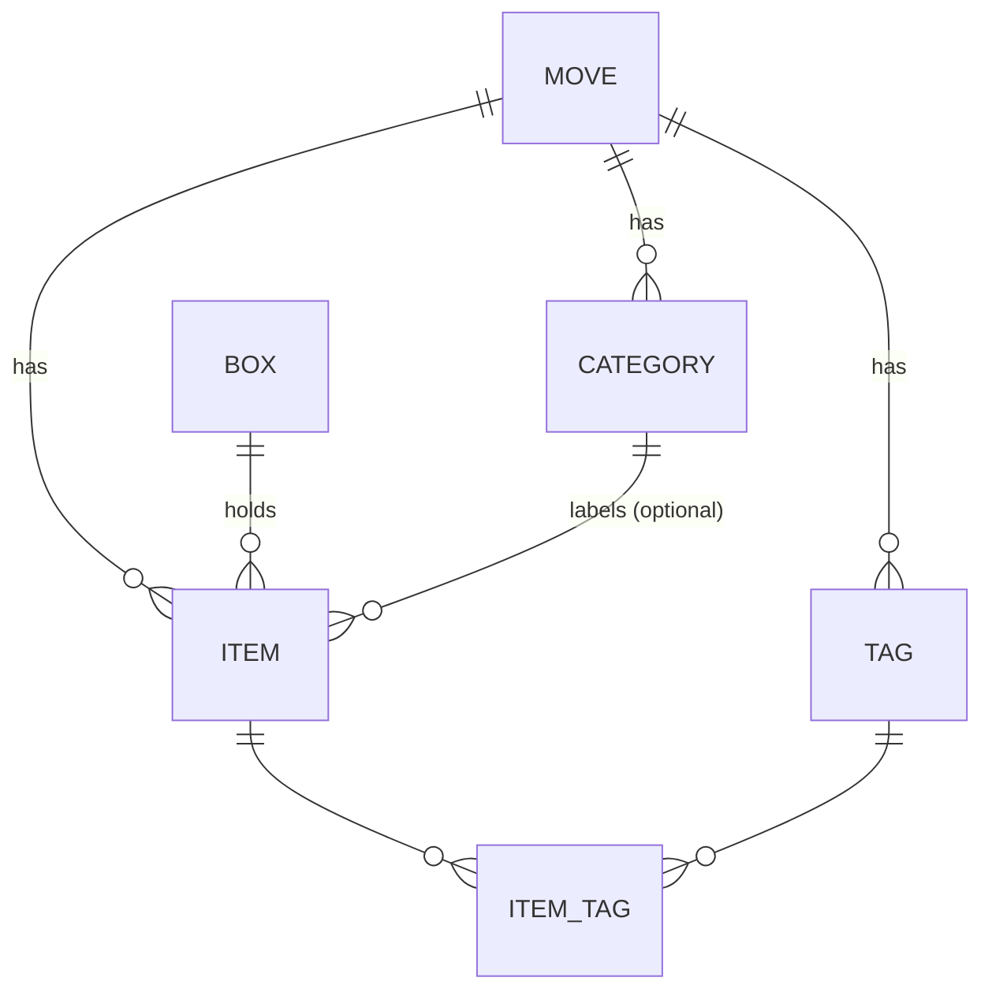

# Phase D5 — Manual Add & Item Detail/Edit · Steps (flight recorder)

Append-only log of how the work unfolded. Companion to
`Phase D5 - Manual Add and Item Detail.md`.

## Scope decision: category + tags

The B3/C3 designs show a **Category** select and **Tags** chips, but no
vocabulary models existed (`item.rb` previously said "deferred to D7"). The D5
spec lists them as *selection-only pickers reading the managed Move vocabularies
(management in D7)*. **Decision (confirmed with the user): build the minimal
vocabulary models now** — `Category`, `Tag`, and the `item_tags` join, all
Move-scoped tenant tables — selection-only with server-side enforcement, leaving
the **management UI** to D7. Faithful to the designs without pulling D7 forward.

## Data model

- `categories` / `tags`: Move-scoped, unique name per Move (case-insensitive).
- `items.category_id`: optional FK (nullify on category destroy).
- `item_tags`: join, unique `[item_id, tag_id]`.

## Domain actions (`app/actions/items/`)

All Dry::Monads + `Rails.event`; category/tags resolved selection-only via the
shared `Items::FormResolution` concern (an id outside the Move's set →
`Failure(:invalid_category|:invalid_tag)`, never created here).

| Action | Effect |
|--------|--------|
| `CreateManual` | born **confirmed**, `created_via: manual`, no source media |
| `Update` | name/category/quantity/fragile/tags; user edit is authoritative |
| `Move` | changes `box_id`, **keeps presence `in_box`**, same-Move only |
| `MarkRemoved` / `RestoreToBox` | flip presence axis only (review untouched) |

## Two independent axes

Review (`pending_review|auto_confirmed|confirmed|needs_correction`) and presence
(`in_box|removed`) are independent — rendered as separate chips on C3, mutated by
separate actions. Moving an item is **not** a presence change.

## Routes / authorization

- `new`/`create` nested under the **box** (B3, "Adding to Box #001").
- `show`/`update` + `move`/`mark_removed`/`restore` nested under the **Move**
  (C3) so the record survives a box-to-box move.
- `ItemPolicy`: read for any signed-in user; every mutation requires a writable
  (non-archived) Move → viewers/archived Moves cannot mutate.

## UI

`Components::ItemForm` (shared by B3/C3) — `Ui::Field`/`Ui::Select`, a
Stimulus-wired `Ui::QuantityAdjuster` (`quantity_adjuster_controller.js`), a
fragile toggle, and selection-only tag chips. C3 (`Views::Items::Show`) adds the
source-media panel (full image, never cropped), the box-to-box Move control, and
Remove/Restore. Box detail now links item rows to C3 and enables the manual-add
entry.

## Activity / history entry point (deferred)

The spec mentions an activity/history entry point (Technical Foundation §8.2).
No audit-feed surface exists yet, so it is **not** wired in D5 — logged here as
deferred to the phase that introduces the audit feed.

## Out of scope (unchanged)

Recognition review actions keep/correct/false (D6); search (D8); vocabulary
**management** screens (D7).
