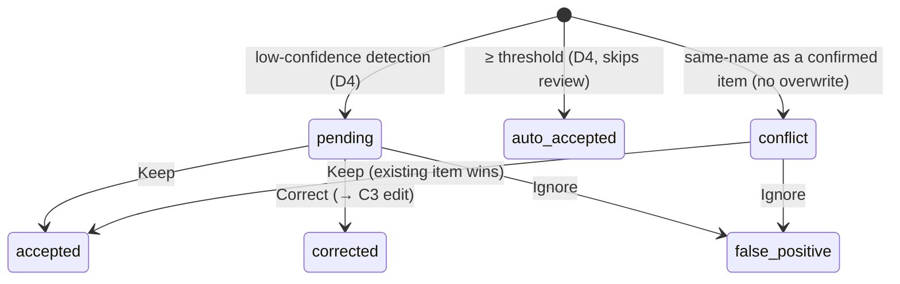

# Phase D6 — Review Flow · Steps (flight recorder)

Append-only log of how the work unfolded. Companion to
`Phase D6 - Review Flow.md`.

## Scope decisions

- **Activity feed (confirmed with user):** keep/correct/false **emit `Rails.event`
  domain events** (`recognition_suggestion.kept|corrected|false_positive`); **no
  persistent ActivityLog** — D6 ships no activity surface and acceptance doesn't
  require one (D5 deferred it too). The feed model + screen land with the phase
  that introduces an activity view.
- **C2 quantity is read-only** in this phase: "Keep" means *accept as detected*,
  so it does not silently edit. Quantity/field tweaks go through **Correct** →
  the C3 item edit (the design's C2 stepper is honoured there). Logged as a minor
  discrepancy in `DESIGN-DISCREPANCIES.md`.

## Review model

The review unit is a `RecognitionSuggestion`. The queue (C1) and walk (C2) operate
on **unresolved** suggestions: `state ∈ {pending, conflict}`, ordered
**lowest-confidence first**.

Item side-effects: Keep/Correct → item `review_state: confirmed`; Ignore → item
`presence_state: removed` (leaves inventory + future search).

## No-overwrite / conflict (Domain §6.4)

`RecognitionRuns::Process` now checks, per detection, for an existing **confirmed**
item of the same (case-insensitive) name in the box. If found it records the
detection as a `conflict` suggestion **linked to that item** — never overwriting
it and never adding a duplicate inventory row. The conflict surfaces in the queue
(terracotta hairline) for human resolution (Keep existing / Ignore duplicate).

## Routes / surfaces

- `GET .../boxes/:id/review` → C1 queue · `GET .../review/:id` → C2 item-by-item.
- `PATCH .../review/:id/{keep,correct,mark_false_positive}`.
- Box detail's pending badge links into the queue.
- Actions advance to the next unresolved suggestion (lowest confidence), then
  back to the box at end-of-queue. **No** mark-all / bulk / crop anywhere.

## Out of scope (unchanged)

Search ranking (D8), vocabulary management (D7), unpacking (D10), persistent
activity feed.
