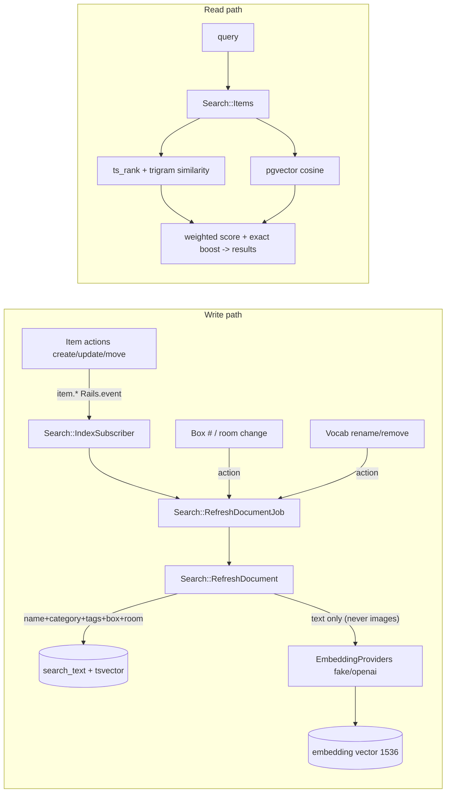

# Phase D8 — Hybrid Search · Steps (flight recorder)

Append-only log of how the work unfolded. Companion to
`Phase D8 - Hybrid Search.md`.

- **Issue:** #74 · **PR:** _fill_ · **Branch:** `feature/search` · **Release:** `v0.13.0-search`.
- **Decisions (confirmed with user):** full hybrid now (pgvector); embeddings via
  OpenAI `text-embedding-3-small` (1536-dim) in prod, deterministic **fake** in
  dev/CI/test.

## Architecture

- **Projection:** `item_search_documents` (one row/item) — `search_text`,
  generated `search_tsvector` (GIN), `embedding vector(1536)` (HNSW cosine),
  trigram GIN on `search_text`. Lexical/trigram works without an embedding, so
  the column is nullable and (re)generated async.
- **Query (`Search::Items`):** weighted `ts_rank_cd` + `similarity()` + cosine
  with an exact-match boost; `WHERE` requires at least one signal; excludes
  needs_correction/removed (the `searchable` scope) unless `include_hidden`.
  Drops the semantic leg when the query yields no embedding (graceful fallback).
- **Freshness (event-driven, not model callbacks — AGENTS.md §2):** item actions
  (manual, update, move) + recognition materialization emit `item.*` Rails.events;
  `Search::IndexSubscriber` enqueues the refresh job. Denormalized sources (box
  number/room, vocab rename/remove) reindex affected items from their actions via
  `Search::Reindexing`. (An earlier draft used `Item#after_commit`; moved to the
  event path on review so indexing stays out of models.)

## Infra gotchas (hard-won)

- **pgvector image.** Stock `postgres:18` has `pg_trgm` (contrib) but **not**
  pgvector. Swapped dev/CI/prod to `pgvector/pgvector:pg18`. Prod = a manual
  `kamal accessory` cutover (an app deploy doesn't reboot accessories).
- **glibc collation mismatch.** `pgvector/pgvector:pg18` ships an older Debian
  (glibc 2.36) than the current stock `postgres:18` (2.41), so a volume created
  by stock 18 blocks `createdb` from `template1` ("collation version mismatch").
  Dev: reinitialised the volume fresh (disposable data). **Prod cutover must
  `ALTER DATABASE … REFRESH COLLATION VERSION` (+ `REINDEX`) or start fresh** —
  recorded in `new-app-recipe.md`.
- **pgvector + Apartment.** New tenant schemas couldn't resolve the `vector`
  type / opclasses (`type "<tenant>.vector" does not exist`) because the
  extension lives in `public` and Apartment rewrites `public.X` → `<tenant>.X`
  during the clone. Fix: add `vector vector_cosine_ops gin_trgm_ops` to
  `config.pg_excluded_names` (same mechanism as `citext`).
- **`neighbor` gem** for array↔vector mapping + `nearest_neighbors`. The hybrid
  ranking SQL stays hand-rolled (no library does lexical+trigram+vector together)
  and uses `CAST(:vec AS vector)` — `::vector` collides with Rails `:name` binds;
  `.select` doesn't bind, so the SELECT is sanitized explicitly.

## Design deltas (§D1)

- **No per-item images** in the data model → result cards are text-first (the
  Stitch mockup shows photos). Mic/voice button omitted. Filter control deferred.
- **Nav entry point wired:** `Current.move`/`nav_section` let the shared app
  shell build Move-scoped Boxes + Search links (Scan/Summary/Menu stay stubs).

## Verification
- Unit: `407 examples, 0 failures` (+ provider/model/action/request specs).
- System (`rack_test`): search flow green. RuboCop + Brakeman clean.
- Live `/product-review`: empty/hints, exact (coffee), synonym ("blow dryer"→Hair dryer · Close match · Box 5·Garage), no-results, pending_review excluded, nav active, mobile no-overflow, no N+1.
