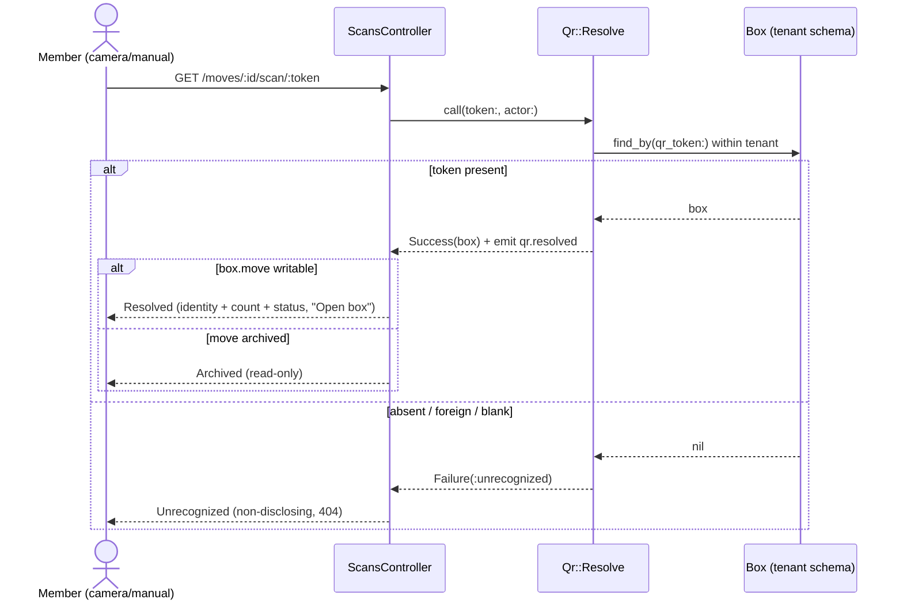

# Phase D9 — Labels, QR & Scan — Steps (flight recorder)

Append-only log of how D9 was executed. Companion to the spec
(`Phase D9 - Labels QR and Scan.md`) and the GitHub issue/PR.

## Issue & branch
- Issue: **#81** — Phase D9 — Labels, QR & Scan (E1 + E2). User approved the plan.
- Branch: `feature/qr-labels-scan` from `main`.

## Decisions (confirmed with user before build)
- **PDFs server-side via Prawn** (`prawn`, `prawn-table`) + `rqrcode`/`chunky_png`
  for the QR PNG. Pure Ruby → **no Dockerfile / Kamal accessory change**.
- **In-app scanner = vendored jsQR** (`vendor/javascript/jsqr.js`, importmap pin)
  driven by a Stimulus controller; manual-entry fallback.
- **Resolve is Move-scoped** (`/moves/:id/scan/:token`) — keeps the app-shell
  layout + nav context and avoids a second controller; still tenant-isolated by
  `qr_token`, so a foreign token is simply absent → non-disclosing "unrecognized".
- Roles today = admin/member (contributor/viewer are D11): admin edits, member
  read-only. Label/manifest read access = `BoxPolicy#show?` (any signed-in user).

## Commits (atomic)
| sha | what |
|-----|------|
| 6c82c6f | deps: prawn/rqrcode/chunky_png + vendored jsQR (importmap) |
| d06d805 | routes, BoxPolicy#label?/#manifest?, Qr::Resolve action + spec |
| 76cbb43 | BoxLabelPdf / BoxManifestPdf + Manifests::Generate audit + controllers + specs |
| 3e49749 | ScansController, qr_scanner Stimulus controller, 4 E2 views, nav + box-detail buttons, i18n |
| eb661fa | policy + system specs; archived-box seed |

## Scan resolution flow

Manifest read is audited: `ManifestsController` → `Manifests::Generate` emits
`manifest.viewed` → `Manifests::AuditSubscriber` logs it (events-not-callbacks).

## Live verification (/product-review on acme.workeverywhere.docker)
- Label PDF: `application/pdf`, opaque (number/room/QR), **no contents**. ✓
- Manifest PDF: `application/pdf`; `[manifest.audit] tenant=acme box=… actor=…`
  logged. ✓
- Scanner page: viewfinder + manual entry; "Scan" nav active. ✓
- Manual resolve → Resolved: identity + "23 items" + "Sealed", "Open box";
  status unchanged. ✓
- Foreign/garbage token → Unrecognized (non-disclosing). ✓
- Archived-move box → "ARCHIVED · READ ONLY", read-only. ✓
- Dark default; seeds idempotent (one "Portland Archive" archived box). ✓
- **Camera live-decode** (jsQR) needs a real device/camera; not exercisable in the
  headless agent-browser. The controller module loads (manual-entry path uses the
  same controller and works), so registration is confirmed; camera decode is
  validated on a real device.

## Dev gotcha (recurring — see agent memory)
Adding a vendored importmap asset (`vendor/javascript/jsqr.js`) does **not** show
up in dev until `bin/rails assets:precompile` **and an app restart** — the running
Puma memoises Propshaft's manifest at boot, so a fresh pin resolves to
`Propshaft::MissingAssetError` until both are done. **Not a code bug**: production
precompiles at image build, so the importmap includes `jsqr` there automatically.

## Audit trail
- Issue: #81 · PR: <fill> · Release: `v0.14.0-qr-labels-scan` <fill>
