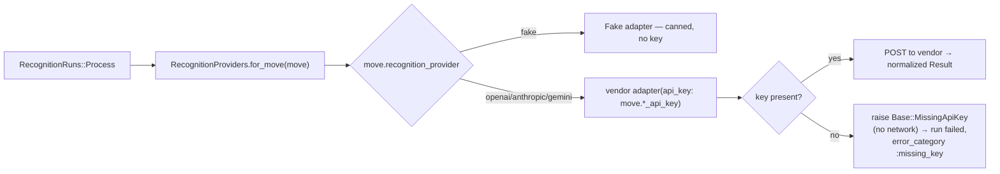
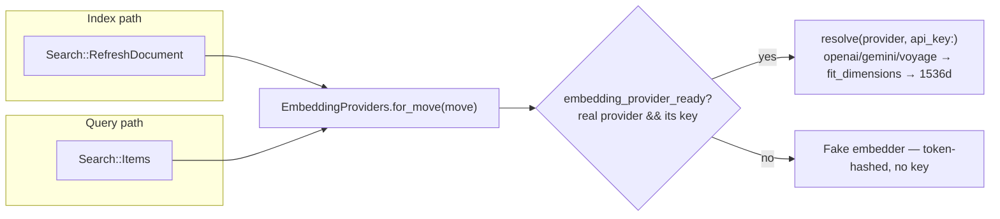

# AI providers (recognition + embeddings)

<!-- Both recognition (#185) and embeddings (#232) are per-Move bring-your-own-key. -->

Move's AI layer is **provider-agnostic**: domain code talks to
`RecognitionProviders` / `EmbeddingProviders`, never a vendor API.

**Both capabilities are now per-Move, bring-your-own-key** (recognition #185,
embeddings #232) — there is **no app-wide AI key**:

- **Keys are entered once per vendor in Settings → AI Capability** (admin-only,
  #242): one encrypted key each for OpenAI, Anthropic, Gemini, Voyage
  (`Move::PROVIDER_KEYS`). The Recognition & AI and Semantic Search sections below
  are then pure *selectors* — a provider whose key isn't set renders **disabled**
  ("needs key"). Keys are managed by `Moves::SetProviderKey` /
  `Moves::RemoveProviderKey`; a key entered once powers whichever features list
  that vendor.
- **Recognition is per-Move BYO.** Provider in `moves.recognition_provider`;
  default is the deterministic, network-free **`fake`** (no key, no cost).
  OpenAI/Anthropic/Gemini each need that vendor's key.
- **Embeddings are per-Move BYO and vendor-neutral** (#232/#237). Provider in
  `moves.embedding_provider` — `fake`/`openai`/`gemini`/`voyage`. Each real adapter
  conforms its native vector to the fixed 1536-d pgvector column via
  `Base#fit_dimensions` (cosine-preserving zero-pad / truncate). OpenAI and Gemini
  reuse the same vendor key as recognition; **Voyage is search-only with its own
  key** (Anthropic has no first-party embeddings API). Default **`fake`**
  (token-hashed pseudo-vectors); embeddings **degrade gracefully** — a real
  provider without its key falls back to `fake` rather than erroring. Switching the
  provider re-embeds the Move with **live progress over ActionCable** (#239).

> There is **no app-wide AI key** any more. The `OPENAI_API_KEY` /
> `EMBEDDING_PROVIDER` env vars were removed from the deploy path in #234 —
> `config/deploy.yml`, `.github/workflows/deploy.yml` (export + required-secrets
> check), and `.kamal/secrets` no longer reference them, so the app container
> carries no shared AI credential, and **`OPENAI_API_KEY` is not an app secret**:
> remove it from Doppler `move/prd`.
>
> The one remaining consumer — the **Release Bug Scan** workflow
> (`.github/workflows/release-bug-scan.yml`, the Codex action on `v*` tags) — is a
> **CI concern, not an application one**. It uses a **distinctly named** repo secret
> **`CODEX_OPENAI_API_KEY`**, set directly in GitHub (Settings → Secrets and
> variables → Actions). The name deliberately differs from `OPENAI_API_KEY` because
> the Doppler→GitHub integration propagates Doppler *removals* to GitHub: reusing
> the same name would let removing the app's Doppler key delete the scan's secret.
> A distinct name keeps the CI credential outside the Doppler-managed set, so the
> app key can be removed from Doppler with no effect on CI.

| Capability | Module | Selector | Adapters | Default model (openai) |
|---|---|---|---|---|
| Image recognition | `app/services/recognition_providers/` | **per Move** (`moves.recognition_provider`; keys in AI Capability) | `fake` (default), `openai`, `anthropic`, `gemini` | `gpt-5.5` |
| Text embeddings (D8 search) | `app/services/embedding_providers/` | **per Move** (`moves.embedding_provider`; keys in AI Capability) | `fake` (default), `openai`, `gemini`, `voyage` (all → 1536d) | `text-embedding-3-small` @ 1536d |

### How a recognition provider is resolved (per Move)

`RecognitionRuns::Process` calls `RecognitionProviders.for_move(run.move)`, which
reads `move.recognition_provider` and builds that adapter **with the Move's own
key** (`move.recognition_api_key_for(provider)`). Keys live in encrypted columns
on `moves` (`ActiveRecord::Encryption`; the encryption keys are in
`credentials.active_record_encryption`, decrypted in every environment via
`RAILS_MASTER_KEY`). Keys are entered in the shared **AI Capability** panel and
managed by `Moves::SetProviderKey` / `Moves::RemoveProviderKey`; the provider
selector is `Moves::SetRecognitionProvider` (provider + model override, no key).
All are gated by `MovePolicy#manage_recognition_keys?` (admin). Keys are
**write-only** in the UI — only `••••`+last-4 is ever rendered.

**Strict BYO — no shared-key fallback.** A Move that selects a real provider with
no key fails the run fast with `RecognitionProviders::Base::MissingApiKey`
**before any network call** (→ `RecognitionRun#error_category == :missing_key` →
the capture surface shows *"Add this move's AI provider API key in Settings"*).
The deployment's environment is never consulted for a recognition key.

### How an embedding provider is resolved (per Move)

Both the indexing path (`Search::RefreshDocument`, run per item by
`Search::RefreshDocumentJob`) and the query path (`Search::Items`) call
`EmbeddingProviders.for_move(move)`. It resolves the selected provider built with
the Move's own key (`move.embedding_api_key_for(provider)` — `openai`/`gemini`
reuse the recognition key, `voyage` its own) only when the Move is
*embedding-ready* (a real provider **and** its key is stored); otherwise it returns
the network-free **`Fake`** embedder. Every real adapter normalizes to the fixed
1536-d column (`Base#fit_dimensions`). Because the same resolver feeds both stored
item vectors and the query vector, the two always live in the **same vector
space** — the precondition for cosine ranking to mean anything.

**Switching the provider re-embeds the Move, with live progress.**
`Moves::SetEmbeddingProvider` (and a key set/removed that flips the active
provider's readiness) starts a tracked `IndexingRun` via `IndexingRuns::Start`,
which null-clears the vectors and enqueues one `Search::RefreshDocumentJob` per
item; each job reports completion (`IndexingRuns::RecordProgress`) and broadcasts
the re-rendered control over **ActionCable / Turbo Streams** (#239), so the
Settings progress bar advances and the selector stays locked until it finishes.
Switching is admin-only (`MovePolicy#manage_recognition_keys?`) and emits
`move.embedding_provider_changed`.

> **Why orphaned vectors were nulled (#232 migration).** The pre-existing prod
> vectors were computed under the old app-wide key (openai space). After the
> cutover every Move defaults to `fake` (a different space), so a one-off data
> migration nulls every `item_search_documents.embedding`. Search falls back to
> lexical+trigram until a Move opts into openai (which reindexes with its key) or
> an item is next edited (reindexed in the Move's current space).

### Recognition detection contract

Every recognition adapter constrains the model to **native structured output**
(OpenAI strict `json_schema`, Anthropic forced `tool_use`, Gemini `responseSchema`)
returning `{"objects": [...]}`, where each object is:

| Field | Type | Meaning |
|---|---|---|
| `label` | string | the item name |
| `confidence` | number 0–1 | the model's rough certainty |
| `count` | integer | identical duplicates collapsed into one entry |
| `category` | string | the model's classification — best-effort onto the Move's category vocabulary (an existing name when one fits, else a new concise one) |
| `fragile` | boolean | whether the item can break/scratch easily |

`RecognitionRuns::Process` feeds the Move's **category** names into the prompt as
candidates (only categories — the output has a single `category` field that maps
to a `Category`, so tags are not offered), then on materialization resolves
`category` onto the Move's categories (reuse-or-create, case-insensitive) and sets
`fragile` directly on the `Item`; both also ride on the `RecognitionSuggestion`
(`proposed_category_id`, `proposed_fragile`) for the review queue. Before encoding, phone photos are
EXIF-auto-oriented and down-scaled to ≤1536px (libvips) to cut image tokens and
latency. Each adapter pins a cost-matched `DEFAULT_MODEL` constant (per-Move model
choice is intentionally not exposed — YAGNI).

Both vendor adapters POST JSON over HTTPS through the shared
[`app/services/provider_http.rb`](../../app/services/provider_http.rb), which
**checks the HTTP status** and raises `ProviderHttp::Error` (status + the
vendor's `error.message` only — never the key or raw body) on any non-2xx.
Consequences by design:

- **Recognition failure is loud.** A 429/401/5xx ends the run `failed`
  (rescued by `RecognitionRuns::Process`), never a phantom `succeeded` with
  zero objects. The user can retry.
- **Embedding failure degrades gracefully.** `Search::RefreshDocument` rescues
  to a nil vector and logs the real reason; lexical + trigram search keep
  working, so search is never broken by a provider outage — just non-semantic
  until the next successful (re)index.

## Fake vs. real — what differs

With the fakes (the default everywhere unless flipped):

- Recognition returns deterministic canned detections.
- Embeddings are a token-hashed pseudo-vector — cosine similarity is a rough
  lexical proxy, **not** true semantic ranking. Search is effectively
  **lexical + trigram only**.

Functional, but not the real product experience. A per-Move provider key turns on
genuine vision recognition; flipping **Settings → Semantic search** to On (with the
Move's OpenAI key set) turns on real semantic search.

## Enabling real recognition (per Move — no deploy)

> **Cost:** vendor calls are **pay-per-call**, billed to **the key the Move owner
> supplies**. Recognition runs once per uploaded photo.

Recognition is configured entirely in-app, with **no env var and no deploy**:

1. Sign in as a **Move admin**, open **Settings → AI Capability**, and paste
   **that Move's** key for the vendor you want (OpenAI / Anthropic / Gemini). Save.
2. In **Recognition & AI**, pick that provider. Its pill is only selectable once
   the key is set (keyless options are disabled with a "needs key" hint); the
   status chip turns **Active**. Until a key is present recognition fails fast with
   the "add your key" caption.
3. Capture a box photo on the org subdomain → confirm the run reaches `succeeded`
   with real detections. Switch back to **Demo (no key)** any time to use the
   network-free `fake` provider.

Keys are stored encrypted per Move and can be rotated (paste a new value) or
cleared (**Remove**) from the **AI Capability** panel. No Doppler/Kamal change is involved
for recognition — `RECOGNITION_PROVIDER` and `*_RECOGNITION_MODEL`/`*_API_KEY`
env vars are **no longer used** for recognition (they were removed in #185).

> Each adapter pins a current-generation `DEFAULT_MODEL` (`gpt-5.5`,
> `claude-haiku-4-5-20251001`, `gemini-3.5-flash`) and tunes generation for an
> extraction task rather than free-form generation: OpenAI `reasoning_effort:
> "medium"`, Anthropic `temperature: 0`, Gemini `thinkingLevel: "medium"`. The shared
> detection prompt (`Base#prompt`) is goal-framed (cataloguing belongings to
> pack) with an explicit do-not-list set (the moving box/container, packing
> materials, floor/walls/ceiling, people/pets/background) so structural
> surroundings stop leaking into the inventory. Changing any of these is a code
> change, not configuration; a Move can still override only the model string.

## Enabling OpenAI **embeddings** (per Move — no deploy)

Like recognition, semantic search is configured entirely in-app, with **no env var
and no deploy** (#232):

> **Cost:** embedding calls are **pay-per-call**, billed to **the key the Move
> owner supplies** (OpenAI/Gemini reuse the recognition key; Voyage its own).
> Switching the provider re-embeds every item in the Move (a burst of calls), then
> one call per item edit.

1. Sign in as a **Move admin**, open **Settings → AI Capability**, and make sure
   the vendor's key is set (OpenAI/Gemini are shared with recognition; Voyage is
   search-only).
2. In **Semantic Search**, pick the provider (OpenAI / Gemini / Voyage). Keyless
   options are disabled ("needs key"); the status chip turns **On**.
3. The switch starts a tracked re-embedding run (`Search::RefreshDocumentJob` per
   item) that recomputes vectors with the Move's key, showing a **live progress
   bar** and locking the selector until it finishes (#239). Once it drains, run a
   semantic search (a synonym, not an exact token) → relevant hits.

Switch back to **Off** any time to drop to the network-free `fake` embedder (a
reindex moves the stored vectors back into the fake space). To reindex every tenant
from the CLI (e.g. after a bulk change): `kamal app exec --reuse 'bin/rails search:reindex'`.

## Accepted image formats

Uploads are normalized by [`ImageNormalizer`](../../app/services/image_normalizer.rb)
before they're stored (called from `Captures::Create`, so it covers both web
capture and the MCP `add_media` tool). The type is **sniffed from the bytes**
(Marcel), not trusted from the client:

- **PNG / JPEG / WEBP** — stored as-is (browser- and provider-native).
- **HEIC / HEIF / AVIF / TIFF / BMP / GIF** — decoded (first frame), auto-rotated
  from EXIF, and re-encoded to **JPEG** via libvips. So an iPhone HEIC photo
  "just works" end to end.
- **Anything else** (SVG/vector, PDF, or a file that won't decode) — rejected
  with an actionable message; no recognition run is created.

Uploads over **`Media::MAX_IMAGE_BYTES` (25 MB)** are rejected up front by their
reported size, before the bytes are read into memory or transcoded (a phone
photo is a few MB); `Media` re-checks the stored blob's size as a backstop.

This keeps every stored blob renderable in-browser (the display surfaces serve
the original blob straight to ``) and readable by the vision providers.
`Media::SUPPORTED_IMAGE_TYPES` (PNG/JPEG/WEBP) remains as a storage backstop.

> **libvips needs the HEIF/AVIF/TIFF decoders.** The app image ships
> `libheif1` + `libde265` (HEVC) + the AV1 plugin (AVIF), so decode works with
> no extra build step. There is no HEIC/AVIF *encoder* (we only decode → JPEG).
> Implemented in #123 (follow-up from #78).

**Real-bytes verification (#128).** `spec/fixtures/files/sample.heic` (a real
HEIC photo) and `sample.avif` back end-to-end specs that decode→JPEG through the
actual `ImageNormalizer` path — no stubbing. They self-skip where libvips lacks
the codec plugin (e.g. a dev host without `libheif-plugin-libde265`); CI installs
`libheif-plugin-libde265` + `libheif-plugin-aomdec` so they run there, and the
app image already has them. A Marcel-sniff spec (no decoder needed) always
asserts real HEIC bytes are detected as a `heic/heif` type. The HEIC fixture
can't be regenerated locally (no HEVC encoder in the toolchain).

## Rolling back

- **Recognition:** switch the Move's provider to **Demo (no key)** in Settings
  (or **Remove** the key in **AI Capability**). Per-Move, instant, no deploy.
- **Embeddings:** flip the Move's **Settings → Semantic Search** to **Off**
  (or **Remove** the vendor key in **AI Capability**). Per-Move, no deploy; the
  off-switch reindexes the Move's items back into the fake space.

## Local development

Recognition defaults to `fake` for every Move — no key needed. To exercise a real
recognition adapter locally, paste a key in **Settings → AI Capability**, then pick
that provider in **Recognition & AI** (no restart). Embeddings work the same way:
paste an OpenAI/Gemini/Voyage key in **AI Capability**, pick it in **Semantic
Search**, and the per-Move reindex computes real vectors (no env var, no restart).

> The app's first `ActiveRecord::Encryption` setup landed with #185 — the three
> encryption keys live in `config/credentials.yml.enc`
> (`active_record_encryption.{primary_key,deterministic_key,key_derivation_salt}`),
> decrypted everywhere via `RAILS_MASTER_KEY`. See `new-app-recipe.md`.

---

_Last updated: 2026-06-16, per-Move BYO embeddings reusing the Move's OpenAI key (#232)._
