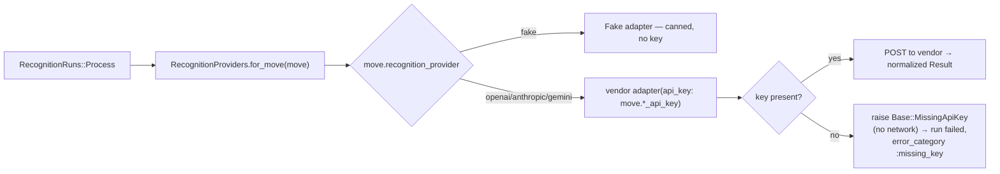

# AI providers (recognition + embeddings)

Move's AI layer is **provider-agnostic**: domain code talks to
`RecognitionProviders` / `EmbeddingProviders`, never a vendor API.

The two capabilities are scoped differently (#185):

- **Recognition is per-Move, bring-your-own-key.** Each Move chooses its provider
  and supplies its **own** API key in **Settings → Recognition & AI** (admin-only).
  There is no shared app-wide recognition account — a Move never bills another
  tenant's key. The default is the deterministic, network-free **`fake`** provider
  (no key, no cost), so the app and CI run for free.
- **Embeddings are still app-wide**, chosen by `EMBEDDING_PROVIDER` and the
  deployment's `OPENAI_API_KEY`. Per-Move recognition keys do **not** feed
  embeddings (out of scope for #185).

| Capability | Module | Selector | Adapters | Default model (openai) |
|---|---|---|---|---|
| Image recognition | `app/services/recognition_providers/` | **per Move** (`moves.recognition_provider` + encrypted `*_api_key`) | `fake` (default), `openai`, `anthropic`, `gemini` | `gpt-5-mini` |
| Text embeddings (D8 search) | `app/services/embedding_providers/` | `EMBEDDING_PROVIDER` (env) | `fake` (default), `openai` | `text-embedding-3-small` @ 1536d |

### How a recognition provider is resolved (per Move)

`RecognitionRuns::Process` calls `RecognitionProviders.for_move(run.move)`, which
reads `move.recognition_provider` and builds that adapter **with the Move's own
key** (`move.recognition_api_key_for(provider)`). Keys live in encrypted columns
on `moves` (`ActiveRecord::Encryption`; the encryption keys are in
`credentials.active_record_encryption`, decrypted in every environment via
`RAILS_MASTER_KEY`). Managed by `Moves::SetRecognitionProvider` /
`Moves::RemoveRecognitionKey`, gated by `MovePolicy#manage_recognition_keys?`
(admin). Keys are **write-only** in the UI — only `••••`+last-4 is ever rendered.

**Strict BYO — no shared-key fallback.** A Move that selects a real provider with
no key fails the run fast with `RecognitionProviders::Base::MissingApiKey`
**before any network call** (→ `RecognitionRun#error_category == :missing_key` →
the capture surface shows *"Add this move's AI provider API key in Settings"*).
The deployment's environment is never consulted for a recognition key.



### Recognition detection contract

Every recognition adapter constrains the model to **native structured output**
(OpenAI strict `json_schema`, Anthropic forced `tool_use`, Gemini `responseSchema`)
returning `{"objects": [...]}`, where each object is:

| Field | Type | Meaning |
|---|---|---|
| `label` | string | the item name |
| `confidence` | number 0–1 | the model's rough certainty |
| `count` | integer | identical duplicates collapsed into one entry |
| `category` | string | the model's classification — best-effort onto the Move's category vocabulary (an existing name when one fits, else a new concise one) |
| `fragile` | boolean | whether the item can break/scratch easily |

`RecognitionRuns::Process` feeds the Move's **category** names into the prompt as
candidates (only categories — the output has a single `category` field that maps
to a `Category`, so tags are not offered), then on materialization resolves
`category` onto the Move's categories (reuse-or-create, case-insensitive) and sets
`fragile` directly on the `Item`; both also ride on the `RecognitionSuggestion`
(`proposed_category_id`, `proposed_fragile`) for the review queue. Before encoding, phone photos are
EXIF-auto-oriented and down-scaled to ≤1536px (libvips) to cut image tokens and
latency. Each adapter pins a cost-matched `DEFAULT_MODEL` constant (per-Move model
choice is intentionally not exposed — YAGNI).

Both vendor adapters POST JSON over HTTPS through the shared
[`app/services/provider_http.rb`](../../app/services/provider_http.rb), which
**checks the HTTP status** and raises `ProviderHttp::Error` (status + the
vendor's `error.message` only — never the key or raw body) on any non-2xx.
Consequences by design:

- **Recognition failure is loud.** A 429/401/5xx ends the run `failed`
  (rescued by `RecognitionRuns::Process`), never a phantom `succeeded` with
  zero objects. The user can retry.
- **Embedding failure degrades gracefully.** `Search::RefreshDocument` rescues
  to a nil vector and logs the real reason; lexical + trigram search keep
  working, so search is never broken by a provider outage — just non-semantic
  until the next successful (re)index.

## Fake vs. real — what differs

With the fakes (the default everywhere unless flipped):

- Recognition returns deterministic canned detections.
- Embeddings are a token-hashed pseudo-vector — cosine similarity is a rough
  lexical proxy, **not** true semantic ranking. Search is effectively
  **lexical + trigram only**.

Functional, but not the real product experience. A per-Move provider key turns on
genuine vision recognition; `EMBEDDING_PROVIDER=openai` turns on semantic search.

## Enabling real recognition (per Move — no deploy)

> **Cost:** vendor calls are **pay-per-call**, billed to **the key the Move owner
> supplies**. Recognition runs once per uploaded photo.

Recognition is configured entirely in-app, with **no env var and no deploy**:

1. Sign in as a **Move admin** and open **Settings → Recognition & AI**.
2. Pick a provider (OpenAI / Anthropic / Gemini) and paste **that Move's** API key.
   Save. The status chip turns **Active**; until a key is present it reads
   **Key required** and recognition fails fast with the "add your key" caption.
3. Capture a box photo on the org subdomain → confirm the run reaches `succeeded`
   with real detections. Switch back to **Demo (no key)** any time to use the
   network-free `fake` provider.

Keys are stored encrypted per Move and can be rotated (paste a new value) or
cleared (**Remove key**) from the same screen. No Doppler/Kamal change is involved
for recognition — `RECOGNITION_PROVIDER` and `*_RECOGNITION_MODEL`/`*_API_KEY`
env vars are **no longer used** for recognition (they were removed in #185).

> Each adapter pins a cost-matched `DEFAULT_MODEL` (`gpt-5-mini`,
> `claude-haiku-4-5-20251001`, `gemini-2.5-flash`). These are current-generation
> defaults; changing them is a code change, not configuration.

## Enabling OpenAI **embeddings** in production (env, deploy)

Embeddings (D8 semantic search) remain app-wide and key-gated by env.

> **Ordering is load-bearing.** If `EMBEDDING_PROVIDER=openai` is set **before**
> `OPENAI_API_KEY` exists in the environment, every embedding goes nil. **Add the
> key first.**

1. **Add the secret to Doppler** (`move/prd`):
   `doppler secrets set OPENAI_API_KEY=sk-… --project move --config prd`. The
   Doppler→GitHub Actions integration syncs it into the Deploy workflow secrets.
   `.kamal/secrets` is gated on `KAMAL_SECRETS_FROM_ENV`: CI reads the synced env;
   a **local** deploy reads from the Doppler CLI. Rotating requires a redeploy.
2. **Already referenced in config** (committed): `.kamal/secrets` resolves
   `OPENAI_API_KEY`; `.github/workflows/deploy.yml` exports it into the runner;
   `config/deploy.yml` `env.secret` includes it and `env.clear` sets
   `EMBEDDING_PROVIDER: openai` (optional `OPENAI_EMBEDDING_MODEL`).
3. **Deploy** (push to `main`), then **backfill** real vectors across tenants:
   ```bash
   kamal app exec --reuse 'bin/rails search:reindex'
   ```
4. **Smoke-test:** run a semantic search (synonym, not exact token) → relevant hits.

## Accepted image formats

Uploads are normalized by [`ImageNormalizer`](../../app/services/image_normalizer.rb)
before they're stored (called from `Captures::Create`, so it covers both web
capture and the MCP `add_media` tool). The type is **sniffed from the bytes**
(Marcel), not trusted from the client:

- **PNG / JPEG / WEBP** — stored as-is (browser- and provider-native).
- **HEIC / HEIF / AVIF / TIFF / BMP / GIF** — decoded (first frame), auto-rotated
  from EXIF, and re-encoded to **JPEG** via libvips. So an iPhone HEIC photo
  "just works" end to end.
- **Anything else** (SVG/vector, PDF, or a file that won't decode) — rejected
  with an actionable message; no recognition run is created.

Uploads over **`Media::MAX_IMAGE_BYTES` (25 MB)** are rejected up front by their
reported size, before the bytes are read into memory or transcoded (a phone
photo is a few MB); `Media` re-checks the stored blob's size as a backstop.

This keeps every stored blob renderable in-browser (the display surfaces serve
the original blob straight to ``) and readable by the vision providers.
`Media::SUPPORTED_IMAGE_TYPES` (PNG/JPEG/WEBP) remains as a storage backstop.

> **libvips needs the HEIF/AVIF/TIFF decoders.** The app image ships
> `libheif1` + `libde265` (HEVC) + the AV1 plugin (AVIF), so decode works with
> no extra build step. There is no HEIC/AVIF *encoder* (we only decode → JPEG).
> Implemented in #123 (follow-up from #78).

**Real-bytes verification (#128).** `spec/fixtures/files/sample.heic` (a real
HEIC photo) and `sample.avif` back end-to-end specs that decode→JPEG through the
actual `ImageNormalizer` path — no stubbing. They self-skip where libvips lacks
the codec plugin (e.g. a dev host without `libheif-plugin-libde265`); CI installs
`libheif-plugin-libde265` + `libheif-plugin-aomdec` so they run there, and the
app image already has them. A Marcel-sniff spec (no decoder needed) always
asserts real HEIC bytes are detected as a `heic/heif` type. The HEIC fixture
can't be regenerated locally (no HEVC encoder in the toolchain).

## Rolling back

- **Recognition:** switch the Move's provider to **Demo (no key)** in Settings
  (or **Remove key**). Per-Move, instant, no deploy.
- **Embeddings:** set `EMBEDDING_PROVIDER` back to `fake` (or unset) in
  `config/deploy.yml` and redeploy. Stored real vectors stay valid; new items
  fall back to fake vectors. No schema change.

## Local development

Recognition defaults to `fake` for every Move — no key needed. To exercise a real
recognition adapter locally, open **Settings → Recognition & AI** on a Move, pick a
provider and paste a key (no restart). Embeddings still default to the env `fake`;
set `OPENAI_API_KEY` + `EMBEDDING_PROVIDER=openai` and `bin/cli app restart` to
exercise real embeddings.

> The app's first `ActiveRecord::Encryption` setup landed with #185 — the three
> encryption keys live in `config/credentials.yml.enc`
> (`active_record_encryption.{primary_key,deterministic_key,key_derivation_salt}`),
> decrypted everywhere via `RAILS_MASTER_KEY`. See `new-app-recipe.md`.

---

_Last updated: 2026-06-15, per-Move BYO recognition keys + AR encryption (#185)._
