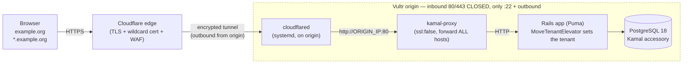
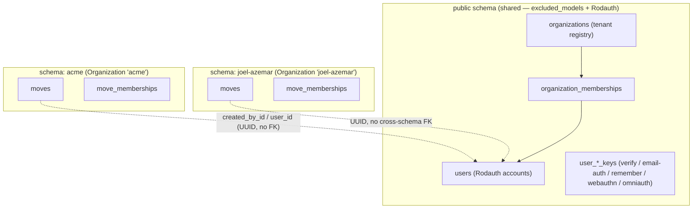
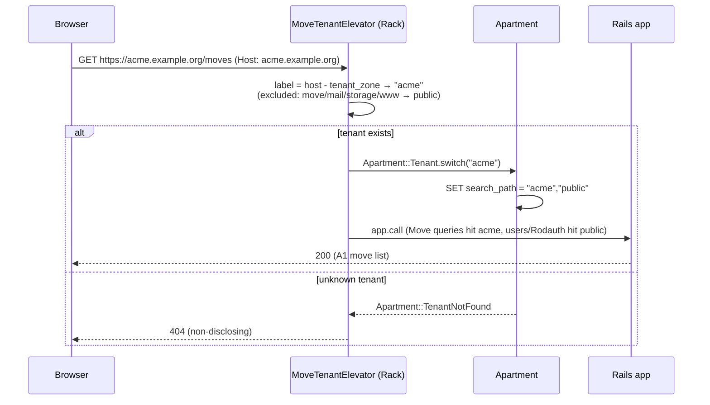
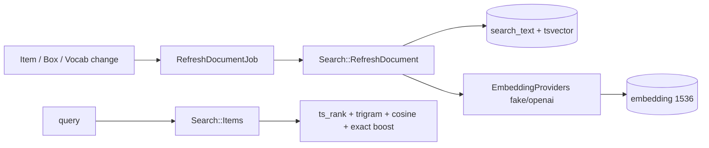
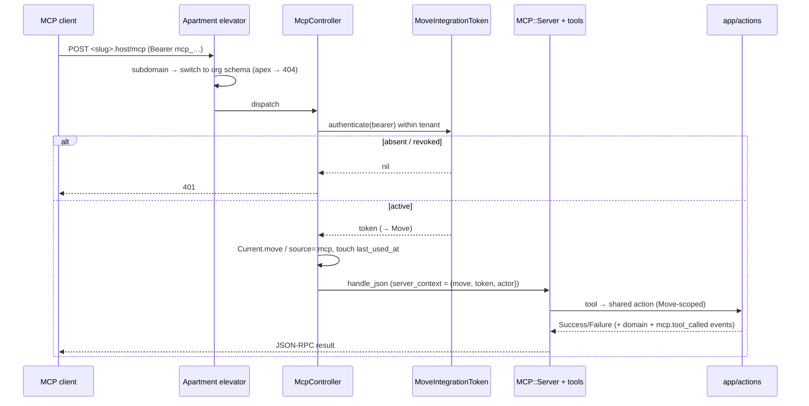

# Architecture

Runtime + tenancy architecture for Move (and the reusable pattern for any
multi-tenant app on this stack). Build/deploy steps live in
[`new-app-recipe.md`](new-app-recipe.md).

> Editable diagram source: [`diagrams/production-architecture.excalidraw`](diagrams/production-architecture.excalidraw)
> (open at [excalidraw.com](https://excalidraw.com/)). The Mermaid diagrams below
> render inline on GitHub. _(An Excalidraw MCP server was not connected when these
> were authored — wire one up to regenerate richer drawings.)_

---

## 1. Production request flow

Browser → Cloudflare edge (TLS, WAF, wildcard cert) → **Cloudflare Tunnel**
(outbound-only, encrypted) → `cloudflared` on the origin → **kamal-proxy**
(plain HTTP) → Rails app → PostgreSQL. **No inbound ports are open on the
origin** — the tunnel dials out.



Key points:
- **kamal-proxy serves HTTP only** and forwards *every* host (no `host:` filter).
  It cannot wildcard-match hosts, and its validator requires a host when TLS is
  on — so it can't terminate TLS for dynamic `*.example.org`. The tunnel does TLS.
- The **origin has no exposed ports**; `cloudflared` connects out to Cloudflare.
- `cloudflared` targets `http://ORIGIN_IP:80` because kamal-proxy publishes on the
  **public IP**, not `localhost` (pointing at `localhost:80` → 502).

---

## 2. Multi-tenancy: schema-per-tenant (Apartment)

`public` holds shared/auth/registry tables; each Organization is its own schema
holding the tenant-scoped tables. Excluded models stay pinned to `public`; Rodauth
key tables are schema-qualified to `public`.



- **Tenant schemas are cloned from `public`** via `pg_dump` (`use_sql`).
  `pg_exclude_clone_tables` keeps the excluded tables (users, organizations…) out
  of tenant schemas; `pg_excluded_names: [citext]` stops the `public.citext` type
  reference being rewritten per tenant.
- Tenant tables reference `public.users` **by UUID with no cross-schema FK**.
- **Rodauth tables are schema-qualified to `public`** (`Sequel[:public][:users]`)
  because Rodauth shares the AR connection whose search_path Apartment switches,
  and its model-less key tables get cloned (empty) into tenants.

### Migrating tenant schemas on deploy

A new migration must reach **every** existing tenant schema, not just `public` —
otherwise a tenant frozen at an older schema misses the new table and unqualified
writes fall through `search_path` to `public`, hitting FK constraints against the
empty `public` copy (this caused a production `boxes` FK violation — see
`new-app-recipe.md` §8). ros-apartment migrates tenants by **enhancing the
`db:migrate` Rake task** (`apartment:migrate` runs after it). `db:prepare` calls
the migrator *programmatically* and never invokes that Rake task, so the deploy
entrypoint must run **both**:

```mermaid
sequenceDiagram
  participant K as Kamal deploy (bin/docker-entrypoint)
  participant P as db:prepare
  participant M as db:migrate (Rake task)
  participant AP as apartment:migrate (enhancement)
  K->>P: ./bin/rails db:prepare
  P->>P: create DB if absent; migrate **public** (programmatic)
  K->>M: ./bin/rails db:migrate
  M->>M: migrate public (no-op if current)
  M->>AP: after-hook (Apartment.db_migrate_tenants)
  AP->>AP: each tenant → run pending migrations in its schema
```

New tenants created later via `Apartment::Tenant.create` clone the current full
`public`, so they start correct; this path keeps **pre-existing** tenants current.

---

## 3. Per-request tenant resolution



The session + Rodauth-remember cookies are scoped to `.example.org`
(`config.x.cookie_domain`), so the apex login session carries to every org
subdomain (no redirect loop). The login UI is apex-only; subdomains are post-auth.

---

## 3a. Authorization: move membership & roles (D11)

Tenancy isolates by Organization; **within** a tenant, access to a Move is gated
by `move_memberships` (a tenant-schema join of `public.users` → Move). A user is
**not** automatically allowed every Move in their Organization — they must hold a
membership, whose `role` is one of:

| role | reads (move, boxes, items, **manifest**) | mutates content (boxes/items/recognition) | curates vocabulary | manages members |
|------|:---:|:---:|:---:|:---:|
| **admin** | ✓ | ✓ | ✓ | ✓ |
| **contributor** | ✓ | ✓ | – | – |
| **viewer** | ✓ | – | – | – |

`Moves::Create` makes the creator the first `admin`. Enforcement has two layers
(ActionPolicy via `MoveMembershipAuthorization`):

- **Read gate = membership.** `MovePolicy.relation_scope` returns only the Moves
  the user belongs to, so `MoveScopedController#set_move`
  (`authorized_scope(Move.all).find`) **404s a non-member** before any nested
  resource loads. This is what closes the manifest-export gap (#86): a member of
  another Move in the same Organization can no longer read a box manifest.
- **Mutation gate = editor role.** The authorization decision lives in
  ActionPolicy: `MovePolicy#edit_contents?` (admin/contributor) is checked via
  `authorize!` in the shared `require_writable_move!` guard, so a viewer gets the
  standard ActionPolicy 403. The guard then applies the **archived → read-only
  redirect** (a UX/response concern, not authorization). `BoxPolicy`/`ItemPolicy`
  additionally answer the complete rule (`editor_of?` = editor *and* writable)
  for the `authorize!`-based actions. Vocabulary curation and member management
  are admin-only.

```mermaid
flowchart TD
  R["Request to /moves/:id/&lt;nested&gt;"] --> SM["set_move:<br/>authorized_scope(Move.all).find"]
  SM -->|"not a member<br/>(relation_scope)"| NF["404 (non-disclosing)"]
  SM -->|"member"| ACT{action kind}
  ACT -->|read| OK["render (viewer+)"]
  ACT -->|mutate| ED{"authorize!<br/>MovePolicy#edit_contents?"}
  ED -->|viewer| F403["403 (ActionPolicy)"]
  ED -->|editor| WR{"move.writable?"}
  WR -->|archived| RO["redirect: read-only"]
  WR -->|writable| OK2["run action"]
  ACT -->|manage members| AD{"admin?"}
  AD -->|no| F403b["403"]
  AD -->|yes| OK3["MoveMemberships::Add / ChangeRole / Remove"]
```



Member management (F1) is admin-only and **Organization-bounded**: a Move can only
be shared with existing Organization members (`MoveMemberships::Add` rejects a
non-Org user non-disclosingly). Changes emit `move_membership.added |
role_changed | removed` events; a last-admin guard stops a Move losing its only
admin. New-user email invitations are deferred.

---

## 4. Component / config map

| Component | Where | Notes |
|---|---|---|
| Tenancy config | `config/initializers/apartment.rb` | excluded_models, persistent_schemas, use_sql, pg_exclude_clone_tables, pg_excluded_names |
| Subdomain elevator | `config/initializers/apartment_elevator.rb` | zone-based (`.docker`/`.app` aren't always public suffixes), 404 on unknown |
| Auth | `app/misc/rodauth_main.rb` | passwordless; **all tables `Sequel[:public][:…]`**; onboarding creates tenant post-verify |
| Page layouts | `app/views/layouts/*` | `ApplicationLayout` (TopNav, auth/marketing) vs `AppShellLayout` (D0 sidebar + bottom tab bar, in-app surfaces); shared `<head>` in `ChromeHead`. Controllers opt in via `layout -> { … }` (e.g. `BoxesController`) |
| File storage | `config/storage.yml`, `config/deploy.yml` | Active Storage; dev/test = Disk, prod = the **shared host-wide SeaweedFS S3** gateway (also used by sibling apps) via move's own `move` bucket (`STORAGE_ENDPOINT=http://seaweedfs:8333`, `force_path_style`). Images served through **proxy URLs** (internal endpoint never exposed). Media tables are per-tenant (not Apartment-excluded) |
| Background jobs | `config/queue.yml`, `app/jobs/*` | Solid Queue: async (dev), `:inline` (test), in-Puma (prod, `SOLID_QUEUE_IN_PUMA`). Jobs restore the Apartment tenant from args (`Current` is never carried across the enqueue boundary) |
| Recognition | `app/services/recognition_providers/*` | Provider-agnostic adapter interface (`fake`/`openai`/`anthropic` via `RECOGNITION_PROVIDER`); normalized `label/confidence/count` only — no raw vendor data or bounding boxes. Vendor adapters POST via shared `provider_http.rb`, which raises on non-2xx so a rate-limited/unauthorized call fails the run loudly instead of a phantom empty `succeeded`. Enabling openai in prod: [`ai-providers.md`](ai-providers.md) |
| Deterministic dump | `config/initializers/structure_sql.rb` | exclude tenant schemas + normalize search_path |
| Per-env tenancy | `config/environments/*.rb` | `tenant_zone`, `cookie_domain`, `config.hosts` |
| Deploy | `config/deploy.yml` | `proxy.ssl: false`, no host, forward_headers; db accessory `postgres:18` at `/var/lib/postgresql` |
| Boot migration | `bin/docker-entrypoint` | on server start runs `db:prepare && db:migrate`; the `db:migrate` Rake task fires Apartment's `apartment:migrate` so every tenant schema is migrated (§2) |
| Secrets | `.kamal/secrets` + Doppler `<app>/prd` | synced to GitHub Actions |
| CI | `.github/workflows/ci.yml` | lint + test; `paths-ignore` for docs (not `[skip ci]`) |
| Deploy CI | `.github/workflows/deploy.yml` | Kamal on push to `main`; `workflow_dispatch` recovery lever |
| Skip-marker guard | `.git-hooks/commit_msg/forbid_skip_markers.rb` | rejects `[skip ci]` / `skip-checks: true` |
| Edge/TLS | Cloudflare Tunnel + `cloudflared` (origin) | `/etc/cloudflared/config.yml` → `http://ORIGIN_IP:80` |

---

## 5. Why this shape (the two forks we evaluated)

- **kamal-proxy custom wildcard cert** → rejected: kamal-proxy has no wildcard
  host matching and forces a host when TLS is on; a custom cert deploy fails
  validation. (`Caddy`-in-front is the documented alternative if you ever need
  origin-terminated TLS.)
- **Cloudflare Full(Strict) to a public origin** → workable but leaves the origin
  exposed and makes you manage the wildcard cert. The **Tunnel** wins: no exposed
  origin, no origin cert, wildcard handled at the edge.

## 6. Hybrid search (D8)

Move-scoped item search over an `item_search_documents` projection (one row per
item, in the tenant schema): denormalized `search_text` → generated
`search_tsvector` (full-text, GIN), a trigram GIN index (fuzzy), and a nullable
`embedding vector(1536)` (pgvector, HNSW cosine). `Search::Items` ranks a
weighted blend of `ts_rank_cd` + `similarity()` + cosine with an exact-match
boost, excluding needs_correction/removed; it degrades to lexical/trigram when no
query embedding is available.



Embeddings come from **textual metadata only** (never images) and are
(re)generated async; lexical/trigram is always correct. Providers mirror
`RecognitionProviders` (env `EMBEDDING_PROVIDER`: fake default, openai
`text-embedding-3-small`). A provider error degrades to a nil vector
(`Search::RefreshDocument` rescue) so search stays lexical-correct. Enabling
openai + backfilling (`bin/rails search:reindex`): [`ai-providers.md`](ai-providers.md).

**Infra:** Postgres image is `pgvector/pgvector:pg18` (stock 18 lacks pgvector;
pg_trgm is contrib). The `vector` type + `*_ops` opclasses live in `public` and
are added to Apartment's `pg_excluded_names` so tenant clones don't rewrite them
to `<tenant>.X`. See `new-app-recipe.md` for the image swap + accessory cutover +
glibc-collation gotcha.

## 7. MCP assistant surface (D13)

An AI assistant reaches a single Move through the **official `mcp` gem** at
`POST /mcp` on the **org subdomain** — a stateless JSON-RPC endpoint
(`McpController < ActionController::API`, no session/CSRF). Tenancy resolution
reuses the existing two layers, then a third credential resolves the Move:

1. The **Apartment elevator** (Rack middleware) resolves the **Organization** from
   the subdomain and switches the schema — exactly as for a web request. The apex
   (no tenant) is a non-disclosing **404**.
2. The **Bearer integration token** resolves the **Move** within that schema:
   `MoveIntegrationToken.authenticate` looks up the SHA-256 digest among *active*
   (non-revoked) tokens. Absent / unknown / revoked → **401**.
3. The controller sets `Current.move` + `Current.source = :mcp`, touches
   `last_used_at`, and builds a per-request `MCP::Server` whose `server_context`
   is `{ move:, token:, actor: token.created_by }`.

The eight tools (`list_boxes`, `get_box_contents`, `search_items`,
`add_item_to_box`, `add_media_to_box`, `move_item`, `mark_unpacked`,
`get_volume_summary`) are thin wrappers over the **same `app/actions`** the web UI
calls — so MCP cannot bypass authorization, validation, audit, or tenant scoping.
Every record is loaded through the token's `move` association, so a token can
never reach another Move or Organization. Mutating tools emit `mcp.tool_called`;
`MoveMcp::AuditSubscriber` records token lifecycle (`integration_token.*`) and
tool mutations with source `mcp` (events-not-callbacks).

Tokens are admin-only (create/revoke) and managed in the F3 Settings/Assistant
screen; the raw token is shown **once** at creation (only its digest is stored)
and revocation is independent of MoveMembership.



_Last updated: 2026-06-09._
