# Architecture

Runtime + tenancy architecture for Move (and the reusable pattern for any
multi-tenant app on this stack). Build/deploy steps live in
[`new-app-recipe.md`](new-app-recipe.md).

> Editable diagram source: [`diagrams/production-architecture.excalidraw`](diagrams/production-architecture.excalidraw)
> (open at [excalidraw.com](https://excalidraw.com/)). The Mermaid diagrams below
> render inline on GitHub. _(An Excalidraw MCP server was not connected when these
> were authored — wire one up to regenerate richer drawings.)_

---

## 1. Production request flow

Browser → Cloudflare edge (TLS, WAF, wildcard cert) → **Cloudflare Tunnel**
(outbound-only, encrypted) → `cloudflared` on the origin → **kamal-proxy**
(plain HTTP) → Rails app → PostgreSQL. **No inbound ports are open on the
origin** — the tunnel dials out.

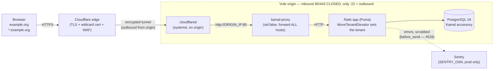

Key points:
- **kamal-proxy serves HTTP only** and forwards *every* host (no `host:` filter).
  It cannot wildcard-match hosts, and its validator requires a host when TLS is
  on — so it can't terminate TLS for dynamic `*.example.org`. The tunnel does TLS.
- The **origin has no exposed ports**; `cloudflared` connects out to Cloudflare.
- `cloudflared` targets `http://ORIGIN_IP:80` because kamal-proxy publishes on the
  **public IP**, not `localhost` (pointing at `localhost:80` → 502).

### 1a. Media images: Cloudflare-edge transforms (a PARALLEL edge path, #572)

Display images do **not** flow through the request path above. `media.<zone>` is a
**Cloudflare Worker Custom Domain** — an exact-match DNS record that outranks the
`*.<zone>` wildcard CNAME, so requests hit the Worker at Cloudflare's edge and
**never reach `cloudflared`/kamal-proxy/Rails**. The Worker resizes the R2 master
on demand (replacing the in-app Active Storage variant pipeline). Access is a
short-lived HMAC token minted by Rails (`MediaVariants::TransformUrl`); the R2
bucket stays private (Worker R2 binding). Dev/test have no Worker and fall back to
the same-origin Active Storage master proxy.

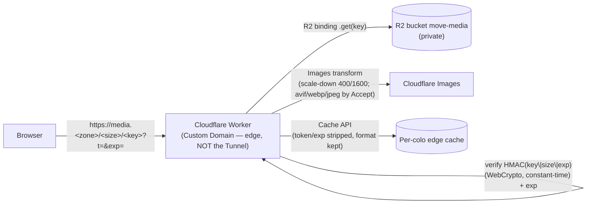

Source + provisioning runbook: `workers/media-transform/`. The Worker deploys
independently of Kamal (`wrangler deploy`) and **must be live before** the Rails
config that points at it ships (else prod images break).

---

## 2. Multi-tenancy: schema-per-tenant (Apartment)

`public` holds shared/auth/registry tables; each Organization is its own schema
holding the tenant-scoped tables. Excluded models stay pinned to `public`; Rodauth
key tables are schema-qualified to `public`.

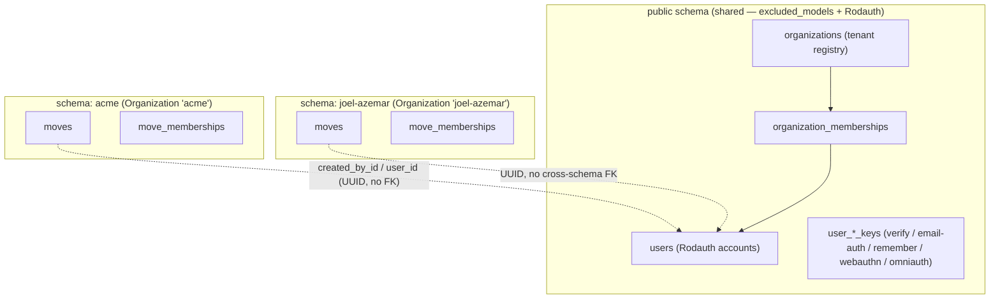

- **Tenant schemas are cloned from `public`** via `pg_dump` (`use_sql`).
  `pg_exclude_clone_tables` keeps the excluded tables (users, organizations…) out
  of tenant schemas; `pg_excluded_names: [citext]` stops the `public.citext` type
  reference being rewritten per tenant.
- Tenant tables reference `public.users` **by UUID with no cross-schema FK**.
- **Rodauth tables are schema-qualified to `public`** (`Sequel[:public][:users]`)
  because Rodauth shares the AR connection whose search_path Apartment switches,
  and its model-less key tables get cloned (empty) into tenants.
- **Gotcha — raw SQL / views that read auth tables must also qualify `public.`.**
  The Rodauth *config* qualifies its own datasets, but any hand-written query
  outside it inherits the request's tenant `search_path`. On an org subdomain an
  unqualified `SELECT … FROM user_webauthn_keys` reads the **empty tenant clone**,
  not the real rows. This bit the "Manage passkeys" view (`app/views/rodauth/
  webauthn_remove.rb#passkey_rows`): it listed zero keys on a subdomain, so every
  removal failed with "must select a valid webauthn authenticator to remove".
  Same rule applies to the Google One Tap controller's raw identity lookups
  (`app/controllers/google_one_tap_sessions_controller.rb`) — they qualify
  `public.user_omniauth_identities`.
  Fix: `FROM public.user_webauthn_keys`. Same rule for `users`,
  `user_*_keys`, `user_omniauth_identities`. The rack_test suite runs on `public`,
  so a tenant-host system spec is the regression guard (`spec/system/passkey_nav_spec.rb`).

### Migrating tenant schemas on deploy

A new migration must reach **every** existing tenant schema, not just `public` —
otherwise a tenant frozen at an older schema misses the new table and unqualified
writes fall through `search_path` to `public`, hitting FK constraints against the
empty `public` copy (this caused a production `boxes` FK violation — see
`new-app-recipe.md` §8). ros-apartment migrates tenants by **enhancing the
`db:migrate` Rake task** (`apartment:migrate` runs after it). `db:prepare` calls
the migrator *programmatically* and never invokes that Rake task, so the deploy
entrypoint must run **both**:

```mermaid
sequenceDiagram
  participant K as Kamal deploy (bin/docker-entrypoint)
  participant P as db:prepare
  participant M as db:migrate (Rake task)
  participant AP as apartment:migrate (enhancement)
  K->>P: ./bin/rails db:prepare
  P->>P: create DB if absent; migrate **public** (programmatic)
  K->>M: ./bin/rails db:migrate
  M->>M: migrate public (no-op if current)
  M->>AP: after-hook (Apartment.db_migrate_tenants)
  AP->>AP: each tenant → run pending migrations in its schema
```

New tenants created later via `Apartment::Tenant.create` clone the current full
`public`, so they start correct; this path keeps **pre-existing** tenants current.

### Tenant teardown: deleting an account drops its solo-org schemas (#365)

Account deletion is the inverse of tenant creation and the only place a tenant
schema is **dropped** in normal operation. It is a domain action,
[`Accounts::Delete`](../../app/actions/accounts/delete.rb) — both self-service
(`AccountsController#destroy`) and admin (`UsersController#destroy`) route through
it, so the rules below always apply.

**What it deletes.** For every Organization the user is the **sole member** of
(membership `COUNT(*) = 1`, computed in SQL), it destroys the registry row and
drops the tenant schema — taking that org's moves, boxes, photos and
move_memberships with it. The `users` row then goes; its Rodauth `user_*_keys`
cascade via FK. An org the user shares with **any** other member is **refused**
(`Failure(:owns_shared_data)`): dropping a shared tenant would destroy others'
data, and deleting the user would strand the moves they authored there
(`Move#created_by` is required, no FK). Multi-member deletion is deferred to the
ownership-transfer feature (#366). Today every user owns a single org, so the
guard never trips.

**Ordering is the whole game** — `DROP SCHEMA` is irreversible and runs on a
neutral connection (it can't share the row-delete transaction), and the Active
Storage `attachments`/`blobs` tables are excluded into `public`, so a naive drop
orphans them. Each solo org is therefore torn down as a **per-org atomic unit**,
then the user is deleted last:

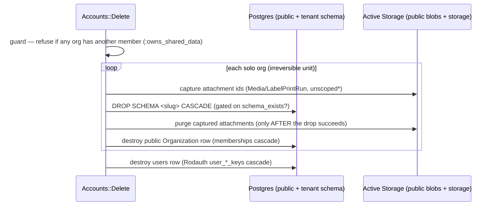

- **Drop before the row delete; abort on a real drop failure.** The schema is
  what makes a tenant's data + MCP tokens inaccessible (the elevator resolves the
  subdomain by label and tokens authenticate as long as the schema exists), so a
  drop that genuinely fails returns `Failure(:tenant_drop_failed)` rather than
  reporting a "deleted" account in front of a live, routable schema. Drops are
  gated on `schema_exists?`, so a retry after a partial teardown is idempotent.
- **Capture attachments *before* the drop, purge *after* it.** The tenant records
  must still exist to identify their public attachment rows; purging before the
  drop would strip files from a tenant that then survives a failed drop.
  `*unscoped` reaches soft-deleted (`Discardable`) media too.
- **Best-effort cleanup never fails an already-irreversible step** — blob
  capture/purge swallow errors (the sanctioned `Move/BroadRescue` of AGENTS §1#4).
- **Tenant-safe redirect.** After a delete that dropped the **current** subdomain
  (detected by `ApplicationController#current_subdomain_dropped?` — `!schema_exists?`,
  since teardown drops the schema before the row), the controller redirects to the
  **apex** (`allow_other_host`) instead of routing back through the missing tenant
  (the elevator would 404); otherwise it stays on the current host, because
  host-only cookies ([#280](#cookies-are-host-only-the-apex-hands-off-to-subdomains-by-token-280))
  mean a needless apex bounce lands the user unauthenticated. The danger-zone
  delete submits with `data-turbo="false"` + a `confirm` Stimulus controller so
  the browser follows the cross-host redirect (Turbo won't follow it via fetch).

### Terms-agreement gate: every account accepts before any app surface (#369)

The app is open-signup while the legal framework is still being put in place, so
every account must accept a **versioned risk-acknowledgement** before it can do
anything. This is modelled as an **access gate**, not a signup-form field, which
makes it path-agnostic — it holds identically whether the account was created via
the email form or Google OAuth, because the check sits at the access layer, not
the create-account step.

- **State.** `Terms::CURRENT_VERSION` (a date string) names the live terms;
  acceptance is an append-only audit row in `public.terms_acceptances` (an excluded
  Apartment model — identity-level, like `users`/`session_handoff_tokens` — with a
  `user_id` FK `ON DELETE CASCADE`). One row per `(user, version)`; `Terms::Accept`
  upserts via `create_or_find_by!` (idempotent on the DB unique index).
- **Gate.** `ApplicationController#require_terms_agreement!` is a **global**
  `before_action` (fail-closed: every authenticated tenant surface is gated by
  default, so a new controller can't silently bypass it). It no-ops when
  unauthenticated **and on the apex** (`current_tenant.nil?`) — the app and the wall
  are tenant-only, and the apex is a broker whose authenticated session only lingers
  in an error/fallback state (#349); redirecting it to the tenant-only `/agreement`
  would 404. On a tenant it redirects to `/agreement` unless `terms_accepted?` (an
  indexed `exists?`).
  Explicit `skip_before_action`s cover the surfaces that must stay reachable without
  acceptance: `AgreementsController` (the wall itself), the auth/session-establishment
  controllers (`RodauthController` — so an unaccepted account can still **Sign out** —
  `SessionHandoffsController`, `GoogleOneTapSessionsController`), and
  `AccountsController#destroy` (deleting the account is always an exit). MCP
  controllers are `ActionController::API` and never inherit the gate (bearer-auth, no
  session). The only ways forward on the wall are **Accept** (writes the row) or
  **Sign out**.
- **Re-agreement, for free.** Bumping `CURRENT_VERSION` re-gates every account on
  its next request — the (not-yet-built) re-acceptance flow needs no new mechanism.

### Onboarding sample provisioning: a new account starts populated (#432)

So a new user never lands on an empty app, creating an Organization auto-provisions
a curated **sample Move** (boxes, photos with recognized items) into the new tenant.
It is an event-driven side effect, never inline in the auth path: `Organizations::Create`
already emits `organization.created`, which `DemoData::ProvisionSubscriber` consumes
to enqueue a tenancy-aware `DemoData::ProvisionJob`. The job builds the sample from the
**committed demo catalog** (`db/seed_images/*` + recorded recognition JSON) via the
shared `DemoData::SampleBuilder` — the same code the dev seed uses — so it makes **no
AI call** and costs nothing. The sample runs on the network-free `fake` providers and
is marked `moves.sample` (which surfaces a one-tap "Remove sample" → `Moves::Destroy`).

The reveal is live and poll-free. `organizations.demo_data_status`
(`provisioning`→`provisioned`/`failed`) drives the Moves index: while provisioning it
renders a placeholder subscribed to a Turbo Stream anchored on the Organization; the
job persists the terminal status **then** broadcasts the real list — so a page that
loads after the broadcast reads the right state and never shows a stuck spinner.

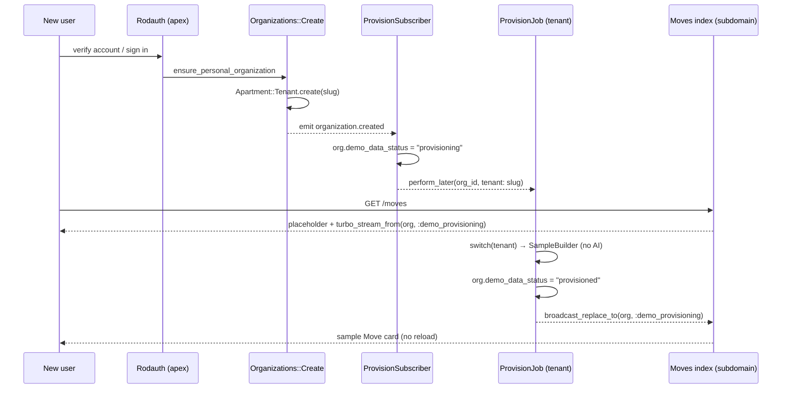

---

## 3. Per-request tenant resolution

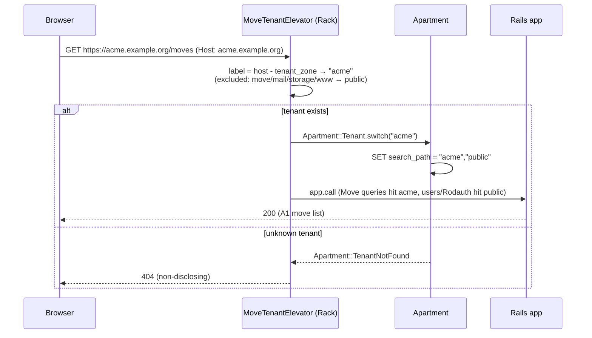

### Cookies are host-only; the apex hands off to subdomains by token (#280)

The session and Rodauth-remember cookies are **host-only** — each host (the apex
`example.org` and every `<slug>.example.org`) holds its own, independent session.
There is no shared `.example.org` cookie, so an apex session does **not** travel
to a subdomain. (apex and subdomain are the same *site*, so this is a cross-*host*
boundary, not a SameSite one.) The login UI is apex-only; subdomains are post-auth.

Crossing from the apex to a subdomain after authentication therefore goes through
a **single-use handoff token**, never a shared cookie:

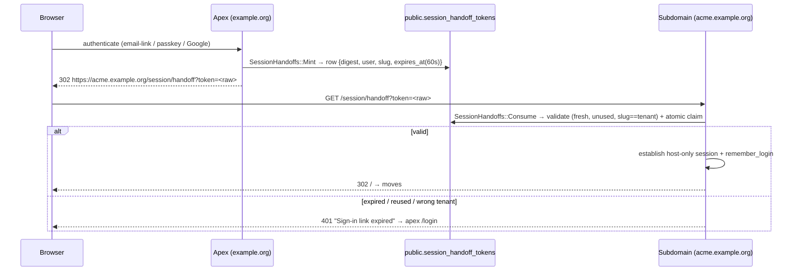

The token is unguessable (32 url-safe bytes; only its SHA-256 digest is stored),
single-use (an atomic `UPDATE … WHERE consumed_at IS NULL`), short-lived (60s
TTL), and tenant-bound (a token minted for one org is rejected on another's
subdomain). `SessionHandoffToken` is an **excluded Apartment model** (public-only,
like `Organization`) so the apex (no tenant) mints it and a subdomain (tenant
active) consumes it against the same rows. Spent rows are swept daily
(`PurgeStaleSessionHandoffTokensJob`). `WEBAUTHN_RP_ID` stays the apex parent, so
passkeys remain an apex-login concern and the handoff carries the result onward.

**The apex is a pure auth broker.** It authenticates, mints the handoff, then
**clears its own session** (`tenant_handoff_url` → `clear_session`) and never sets
a remember cookie — the subdomain is the sole holder of the durable session +
remember. This is what keeps **sign-out global** under host-only cookies: a
subdomain logout (which deletes the shared `public.user_remember_keys` row) leaves
no apex session to silently re-enter from. (Multi-org session switching, if ever
needed, would revisit this — there are no multi-org users today.)

**Cutover (one-time).** Dropping `domain:` only changes *future* `Set-Cookie`, so
browsers already holding the old shared `.move-easy.org` cookies would keep
authenticating cross-subdomain. The session and remember cookie **keys are rotated**
(`_move_session`→`_move_session_v2`, `_remember`→`_move_remember`) so those stale
cookies are never read again (they expire on their own); existing users re-login
once onto the host-only model.

**Which org the handoff targets (#346).** `login_redirect` hands off to the org the
login **started from** when applicable, not blindly to the user's primary org —
resolved by `SessionHandoffs::TargetResolver` and always **membership-validated**
(a stray/forged origin slug falls through to the primary org). The origin comes
from: the active Apartment tenant on a **subdomain login** (passkey / email-auth
submitted on the subdomain), or an `org` slug carried through the **Google apex
bridge** (the subdomain link adds `?org=<slug>`, forwarded into the OmniAuth
request → `omniauth.params`). The **email magic-link** (#353): when the sign-in
link is requested from an org subdomain the user belongs to, `RodauthMailer`
points the link **back at that subdomain** (overriding `rails_url_options` host,
membership-validated at send time), so login completes there and the same
subdomain-origin path applies — its query can't carry the slug because Rodauth's
email-auth flow strips it (`redirect(r.path)`). The fallback `primary_organization`
is **deterministic** (oldest membership, slug tiebreak). Moot for single-org users
today; correct once a user belongs to more than one org.

---

## 3a. Authorization: move membership & roles (D11)

Tenancy isolates by Organization; **within** a tenant, access to a Move is gated
by `move_memberships` (a tenant-schema join of `public.users` → Move). A user is
**not** automatically allowed every Move in their Organization — they must hold a
membership, whose `role` is one of:

| role | reads (move, boxes, items, **manifest**) | mutates content (boxes/items/recognition) | curates vocabulary | manages members |
|------|:---:|:---:|:---:|:---:|
| **admin** | ✓ | ✓ | ✓ | ✓ |
| **contributor** | ✓ | ✓ | – | – |
| **viewer** | ✓ | – | – | – |

`Moves::Create` makes the creator the first `admin`. Enforcement has two layers
(ActionPolicy via `MoveMembershipAuthorization`):

- **Read gate = membership.** `MovePolicy.relation_scope` returns only the Moves
  the user belongs to, so `MoveScopedController#set_move`
  (`authorized_scope(Move.all).find`) **404s a non-member** before any nested
  resource loads. This is what closes the manifest-export gap (#86): a member of
  another Move in the same Organization can no longer read a box manifest.
- **Mutation gate = editor role.** The authorization decision lives in
  ActionPolicy: `MovePolicy#edit_contents?` (admin/contributor) is checked via
  `authorize!` in the shared `require_writable_move!` guard, so a viewer gets the
  standard ActionPolicy 403. The guard then applies the **archived → read-only
  redirect** (a UX/response concern, not authorization). `BoxPolicy`/`ItemPolicy`
  additionally answer the complete rule (`editor_of?` = editor *and* writable)
  for the `authorize!`-based actions. Vocabulary curation and member management
  are admin-only.

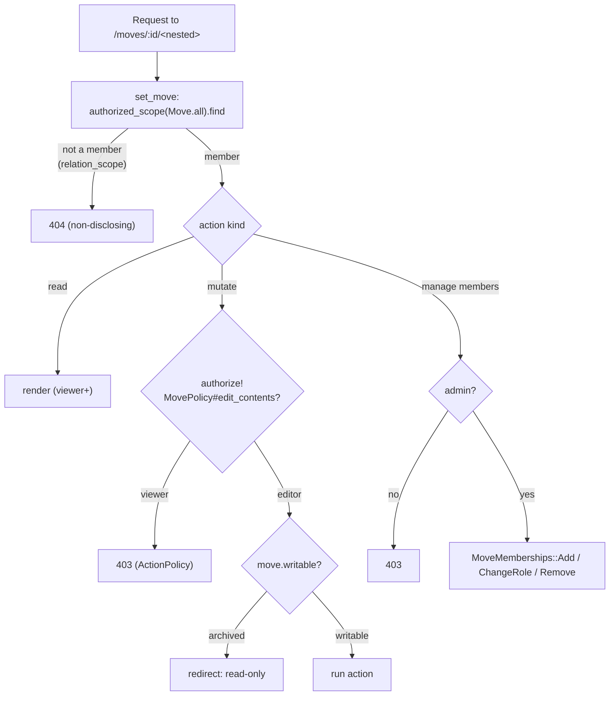

Member management (F1) is admin-only and **Organization-bounded**: a Move can only
be shared with existing Organization members (`MoveMemberships::Add` rejects a
non-Org user non-disclosingly). Changes emit `move_membership.added |
role_changed | removed` events; a last-admin guard stops a Move losing its only
admin. New-user email invitations are deferred.

---

## 4. Component / config map

| Component | Where | Notes |
|---|---|---|
| Tenancy config | `config/initializers/apartment.rb` | excluded_models, persistent_schemas, use_sql, pg_exclude_clone_tables, pg_excluded_names |
| Subdomain elevator | `config/initializers/apartment_elevator.rb` | zone-based (`.docker`/`.app` aren't always public suffixes), 404 on unknown |
| Auth | `app/misc/rodauth_main.rb` | passwordless (passkey / email-link / Google); **all tables `Sequel[:public][:…]`**; a personal tenant is provisioned both post-verify and after a Google (OmniAuth) login (`after_login` → `ensure_personal_organization`, idempotent). Google sign-in is gated on `GOOGLE_CLIENT_ID` — see [`new-app-recipe.md`](new-app-recipe.md) §6c. **Google One Tap** (`app/controllers/google_one_tap_sessions_controller.rb`) is **login-only** — it never creates an account from the tokeninfo-verified id_token; a brand-new user is bridged into the account-creating OAuth flow (`/login?via=google` auto-submits to `/auth/google`, whose callback runs `omniauth_create_account?`). The client (`google_one_tap_controller.js`) **time-boxes** a `no_account` suppression flag (`SUPPRESS_MS`) to break the `auto_select` redirect loop on the bridge page, then lets it self-expire so One Tap re-prompts later — a clear-on-sign-out won't work because `sessionStorage` is origin-scoped to the apex while sign-in/out happens on the org subdomain. The FedCM cooldown after a dismissal is browser-enforced |
| Page layouts | `app/views/layouts/*` | `ApplicationLayout` (TopNav, auth/marketing) vs `AppShellLayout` (D0 sidebar + bottom tab bar, in-app surfaces); shared `<head>` in `ChromeHead`. Controllers opt in via `layout -> { … }` (e.g. `BoxesController`) |
| File storage | `config/storage.yml`, `config/deploy.yml`, `bin/cli-files/storage-cmd/storage_service.rb` | Active Storage; **prod = Cloudflare R2** (off-box, ~11-nines durable — `move-media` bucket via `R2_ENDPOINT`/`R2_BUCKET`, `force_path_style`), migrated off the on-box SeaweedFS which silently corrupted ~35% of stored photos (#567 / resolves #537). **dev = local SeaweedFS, test = Disk.** Move's SeaweedFS bucket was **decommissioned 2026-07-06** (738 objects emptied, ~0.7 GB reclaimed) once all readable blobs were on R2; the shared host-wide gateway (`STORAGE_ENDPOINT=http://seaweedfs:8333`) itself stays up for sibling apps, and **dev still uses it**. See new-app-recipe.md §6b. Local `bin/cli storage start` exposes the SeaweedFS Web UI at `https://storage.move-easy.docker` (filer `:8888`) and the app bucket at `https://bucket.move-easy.docker` (S3 `:8333` with `/move` prefixed). Images served through **proxy URLs** (bucket never exposed to the browser). Media tables are per-tenant (not Apartment-excluded) |
| Media edge transform | `workers/media-transform/` (Worker), `packs/captures/app/services/media_variants/transform_url.rb` (Rails minter), `config/initializers/media_transform.rb` (#572) | Cloudflare Worker on Custom Domain `media.<zone>` (edge, **not** the Tunnel — see §1a) resizes the R2 master on demand (`thumb` 400 / `detail` 1600, `scale-down`; avif/webp/jpeg by `Accept`; edge-cached with a token-stripped cache key). Access = short-lived HMAC token over `blob_key\|size\|exp` under a **dedicated** `MEDIA_TRANSFORM_SECRET` (never `secret_key_base`), verified constant-time in the Worker; R2 bucket stays private (Worker R2 binding). `MEDIA_TRANSFORM_HOST`/`_SECRET` are prod-only (Doppler) — **dev/test have no Worker and fall back to the same-origin master proxy**. Deploys independently of Kamal (`wrangler deploy`); must be live before the Rails config ships |
| Image optimisation | `app/services/image_normalizer.rb`, `app/models/media.rb`, `lib/tasks/images.rake` (#299) | Every upload (web + MCP, one choke point) is decoded, auto-rotated, down-scaled to a **≤2048px JPEG master** (`MASTER_IMAGE_EDGE`, Q85, EXIF/GPS stripped, alpha flattened) before attach — the phone original is **never stored**. Display surfaces serve sized images off the master via the **Cloudflare-edge transform Worker** (`:thumb` 400px / `:detail` 1600px — see the "Media edge transform" row and §1a; #572), not the master directly. (The old in-app Active Storage variant pipeline — `Media#image` variant declarations + `MediaVariants::Prewarm`/`PrewarmJob`/subscriber + `images:prewarm`/`images:repair` — was **removed** with the edge cutover; #572. `images:cleanup_variants` purges the orphaned variant records/objects.) `media.optimized_at`/`original_byte_size` track the backfill; `images:optimize` re-encodes pre-existing blobs across all tenants (idempotent) and reclaims storage. Recognition is unaffected — it re-downscales to 1536px itself |
| Background jobs | `config/queue.yml`, `app/jobs/*` | Solid Queue: async (dev), `:inline` (test), in-Puma (prod, `SOLID_QUEUE_IN_PUMA`). **Two in-Puma worker pools (#543):** a dedicated `image_ingest` pool (CPU-bound libvips normalize/prewarm — the user-visible thumbnail path) isolated from the general `*` pool (recognition, embeddings, analyze, labels, maintenance), so a capture burst isn't starved by slow vision-API jobs; `*` also covers `image_ingest` for overflow. Sized via `INGEST_CONCURRENCY`/`JOB_CONCURRENCY`. Jobs restore the Apartment tenant from args (`Current` is never carried across the enqueue boundary) |
| Label print (async) | `app/models/label_print_run.rb`, `app/actions/label_print_runs/*`, `app/jobs/label_print_runs/generate_job.rb` (#303) | Bulk label generation is a background job with a **live progress bar** over ActionCable/Turbo Streams (same no-polling pattern as the indexing bar, #239), not a synchronous request-blocking render. `LabelPrintRuns::Start` SQL-counts the box range and enqueues; `GenerateJob` builds `BoxLabelsPdf` box-by-box, reporting progress via `RecordProgress` (atomic SQL set + rescued `broadcast_replace_to(run, :progress)`), attaches the PDF to the run, and the run page (`turbo_stream_from(@run, :progress)`) flips to a Download. QR scan URLs use the request `host`/`protocol` passed at enqueue (a job has no request). `PurgeStaleLabelPrintRunsJob` reaps old run PDFs daily, per tenant |
| Recognition | `app/services/recognition_providers/*` | Provider-agnostic adapter interface (`fake`/`openai`/`anthropic` via `RECOGNITION_PROVIDER`); normalized `label/confidence/count` only — no raw vendor data or bounding boxes. Vendor adapters POST via shared `provider_http.rb`, which raises on non-2xx so a rate-limited/unauthorized call fails the run loudly instead of a phantom empty `succeeded`. Enabling openai in prod: [`ai-providers.md`](ai-providers.md) |
| Deterministic dump | `config/initializers/structure_sql.rb` | exclude tenant schemas + normalize search_path |
| Per-env tenancy | `config/environments/*.rb` | `tenant_zone`, `config.hosts` (cookies are host-only — no `cookie_domain`; see §3 #280) |
| Session handoff | `app/controllers/session_handoffs_controller.rb`, `app/actions/session_handoffs/*`, `app/services/session_handoffs/target_resolver.rb`, `SessionHandoffToken` | single-use apex→subdomain token bridging host-only sessions (#280); minted in the post-auth redirects (`rodauth_main.rb#tenant_handoff_url`, One Tap). `TargetResolver` picks the origin org (subdomain tenant / Google `?org=` param, membership-validated) over the deterministic primary (#346) |
| Deploy | `config/deploy.yml` | `proxy.ssl: false`, no host, forward_headers; db accessory `postgres:18` at `/var/lib/postgresql` |
| DB backups | `config/kamal-backup.yml`, `config/deploy.yml` `accessories.backup` (#536) | `backup` accessory (`ghcr.io/crmne/kamal-backup`, pinned) pg_dumps `move_production` daily → encrypted restic repo on Cloudflare R2 (all tenant schemas; cache/queue/cable + media excluded — media gap is #537). Retention 7d/4w/6m, `check_after_backup`, restore drills. Runbooks: [`backups.md`](backups.md) |
| Boot migration | `bin/docker-entrypoint` | on server start runs `db:prepare && db:migrate`; the `db:migrate` Rake task fires Apartment's `apartment:migrate` so every tenant schema is migrated (§2) |
| Secrets | `.kamal/secrets` + Doppler `<app>/prd` | synced to GitHub Actions |
| CI | `.github/workflows/ci.yml` | lint + test; `paths-ignore` for docs (not `[skip ci]`) |
| Deploy CI | `.github/workflows/deploy.yml` | Kamal on push to `main`; `workflow_dispatch` recovery lever |
| Error monitoring | `config/initializers/sentry.rb` (#528, #531) | Sentry (errors + performance tracing at 100%, profiling sampled at 10% — #541), double-gated: `Sentry.init` only runs when `SENTRY_DSN` is present (optional Doppler secret; dev/test boot Sentry-free) **and** `enabled_environments=%w[production]` (an ambient prod DSN in a dev shell sends nothing). A fail-closed scrub in both `before_send` and `before_send_transaction` keeps auth material out of events, breadcrumbs and traced span SQL — see [`new-app-recipe.md`](new-app-recipe.md) §6d and [`security-model.md`](security-model.md) |
| Skip-marker guard | `.git-hooks/commit_msg/forbid_skip_markers.rb` | rejects `[skip ci]` / `skip-checks: true` |
| Edge/TLS | Cloudflare Tunnel + `cloudflared` (origin) | `/etc/cloudflared/config.yml` → `http://ORIGIN_IP:80` |

Local storage routing intentionally keeps the admin UI and bucket surface on
different hosts:

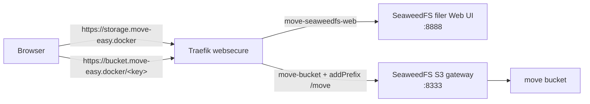

### 4a. Label print: async generation with live progress (#303)

Bulk label generation never blocks the request. The form POSTs a run, the user is
redirected to a progress page, and a background job renders the PDF box-by-box,
pushing progress over a per-run Turbo Stream (no polling — the #239 pattern). The
QR scan URLs need the request host, which the controller passes to the job (a job
has no request of its own). The finished PDF is an Active Storage attachment served
behind a `data-turbo="false"` Download link (Turbo Drive would otherwise swallow the
non-HTML response).

**Copies per box are a per-Move setting (Phase 45).** `moves.labels_per_box` (1–10,
default **2** = lid + side) controls how many identical pages each box gets.
`BoxLabelsPdf` takes a `copies:` arg (default `DEFAULT_COPIES = 2`, so a bare call is
unchanged); both print paths pass the Move's value — the single-box `LabelsController`
inline, and the bulk `LabelPrintRuns::Start` **snapshots it as a `GenerateJob`
argument** at click time (like `box_ids`), so a Settings change while the job is
queued can't alter the in-flight PDF. Total pages = boxes × copies; the `MAX_LABELS`
guard stays a **box-count** cap (worst case 200 × 10 = 2000 pages). The setting is
edited in Settings → Move Preferences via `Moves::SetLabelsPerBox`.

```mermaid
sequenceDiagram
  participant B as Browser
  participant C as LabelPrintRunsController
  participant S as LabelPrintRuns::Start
  participant Q as Solid Queue
  participant J as GenerateJob
  participant R as RecordProgress
  participant Ch as Turbo::StreamsChannel
  B->>C: POST label_print/runs (from,to)
  C->>S: call(from,to, host, protocol)
  S->>S: snapshot box_ids (SQL, LIMIT MAX+1) → validate empty/too_many
  S->>Q: GenerateJob.perform_later(run, tenant, host, protocol, box_ids)
  C-->>B: 302 → run page (turbo_stream_from run:progress)
  J->>J: switch tenant; render BoxLabelsPdf box-by-box
  loop every ~total/20 boxes
    J->>R: completed = done
    R->>Ch: broadcast_replace_to(run,:progress) LabelPrintStatus
    Ch-->>B: Turbo Stream → bar advances (no reload)
  end
  J->>J: attach PDF; status=completed
  J->>Ch: final broadcast → "Download" replaces the bar
  Ch-->>B: Turbo Stream → Download link
  B->>C: GET …/download (data-turbo=false → native)
  C-->>B: 200 application/pdf (attachment)
```

A `GenerateJob` failure marks the run `failed` and broadcasts that state (a "Try
again" link), then re-raises; a retry no-ops because the run is no longer in
progress. `PurgeStaleLabelPrintRunsJob` reaps day-old run PDFs per tenant.

### 4b. Bulk box lifecycle steps (Phase 44)

`BoxStepsController` (editor-only, Menu-reached) advances **every** box in a source
state through one forward lifecycle edge in a single click — "Seal all packing
boxes", "Send all sealed boxes in transit", "Start unpacking all", "Mark all
unpacked". It is a synchronous PRG redirect (no job/cable): a status change is a
cheap UPDATE and the only fan-out (one activity row per box) is bounded sync inserts.

`Boxes::BulkTransition` **reuses `Boxes::TransitionStatus` per box** rather than
hand-rolling an `UPDATE` — so the seal-requires-room guard, the `unpacked → items
removed` cascade, and the `box.status_changed` event are preserved for every box
with zero duplication (the feed gets N per-box rows). The forward steps are a
curated subset of `Box::TRANSITIONS` (`BulkTransition::STEPS`); backward edges
(unseal/reopen) stay corrective and per-box. It is **best-effort partial**: a
roomless box can't be sealed (`:room_required`), so the bulk transitions every box
it can and reports the skipped numbers + reason rather than failing the batch. All
counts/filtering are SQL — `move.boxes.group(:status).count` for the distribution,
`where(status:)` for the source set (AGENTS.md §1 #5). No schema change.

---

## 5. Why this shape (the two forks we evaluated)

- **kamal-proxy custom wildcard cert** → rejected: kamal-proxy has no wildcard
  host matching and forces a host when TLS is on; a custom cert deploy fails
  validation. (`Caddy`-in-front is the documented alternative if you ever need
  origin-terminated TLS.)
- **Cloudflare Full(Strict) to a public origin** → workable but leaves the origin
  exposed and makes you manage the wildcard cert. The **Tunnel** wins: no exposed
  origin, no origin cert, wildcard handled at the edge.

## 6. Hybrid search (D8)

Move-scoped item search over an `item_search_documents` projection (one row per
item, in the tenant schema): denormalized `search_text` → generated
`search_tsvector` (full-text, GIN), a trigram GIN index (fuzzy), and a nullable
`embedding vector(1536)` (pgvector, HNSW cosine). `Search::Items` ranks a
weighted blend of `ts_rank_cd` + `similarity()` + cosine with an exact-match
boost, excluding needs_correction/removed; it degrades to lexical/trigram when no
query embedding is available.

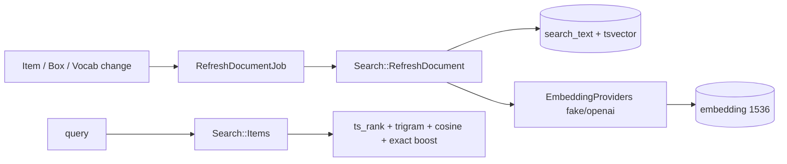

Embeddings come from **textual metadata only** (never images) and are
(re)generated async; lexical/trigram is always correct. Providers mirror
`RecognitionProviders` and are **per-Move bring-your-own-key** (#232):
`EmbeddingProviders.for_move(move)` picks the Move's own openai adapter
(`text-embedding-3-small`, keyed by `moves.openai_api_key`) when it opted in, else
the network-free `fake` — no app-wide env key. A provider error degrades to a nil
vector (`Search::RefreshDocument` rescue) so search stays lexical-correct. Enabling
openai per Move + backfilling (`bin/rails search:reindex`): [`ai-providers.md`](ai-providers.md).

**Infra:** Postgres image is `pgvector/pgvector:pg18` (stock 18 lacks pgvector;
pg_trgm is contrib). The `vector` type + `*_ops` opclasses live in `public` and
are added to Apartment's `pg_excluded_names` so tenant clones don't rewrite them
to `<tenant>.X`. See `new-app-recipe.md` for the image swap + accessory cutover +
glibc-collation gotcha.

## 7. MCP assistant surface (D13)

An AI assistant reaches a single Move through the **official `mcp` gem** at
`POST /mcp` on the **org subdomain** — a stateless JSON-RPC endpoint
(`McpController < ActionController::API`, no session/CSRF). Tenancy resolution
reuses the existing two layers, then a third credential resolves the Move:

1. The **Apartment elevator** (Rack middleware) resolves the **Organization** from
   the subdomain and switches the schema — exactly as for a web request. The apex
   (no tenant) is a non-disclosing **404**.
2. The **Bearer integration token** resolves the **Move** within that schema:
   `MoveIntegrationToken.authenticate` looks up the SHA-256 digest among *active*
   (non-revoked) tokens. Absent / unknown / revoked → **401**.
3. The controller sets `Current.move` + `Current.source = :mcp`, touches
   `last_used_at`, and builds a per-request `MCP::Server` whose `server_context`
   is `{ move:, token:, actor: token.created_by }`.

The tools (`list_boxes`, `get_box_contents`, `search_items`,
`add_item_to_box`, `create_media_upload`, `add_media_to_box`, `move_item`,
`mark_unpacked`, `get_volume_summary`) are thin wrappers over the **same
`app/actions`** the web UI calls — so MCP cannot bypass authorization,
validation, audit, or tenant scoping.

**Image upload is app-proxied streaming, not base64** (#110): `create_media_upload`
returns an app-hosted upload URL (size-capped); the client **POSTs the raw bytes
to `POST /mcp/uploads`** (`McpUploadsController`, same Bearer auth), which streams
them into an Active Storage blob and returns a **Move-scoped `signed_id`**
(`Captures::Create.signed_id_purpose`, tenant+move — blobs are shared in `public`);
then `add_media_to_box` attaches by `signed_id` through `Captures::Create`, which
sniffs the bytes (never the client-declared type) and transcodes non-JPEG/PNG/WEBP
to JPEG. Bytes never transit the JSON-RPC body / are not base64. It's app-proxied
(not a presigned S3 URL) because the SeaweedFS gateway is internal-only — not
client-reachable. Abandoned (never-attached) blobs are reclaimed daily by
`PurgeAbandonedUploadsJob`. `/mcp` rate-limiting is tracked in #134.
Every record is loaded through the token's `move` association, so a token can
never reach another Move or Organization. Mutating tools emit `mcp.tool_called`;
`MoveMcp::AuditSubscriber` records token lifecycle (`integration_token.*`) and
tool mutations with source `mcp` (events-not-callbacks).

Tokens are admin-only (create/revoke) and managed in the F3 Settings/Assistant
screen; the raw token is shown **once** at creation (only its digest is stored)
and revocation is independent of MoveMembership.

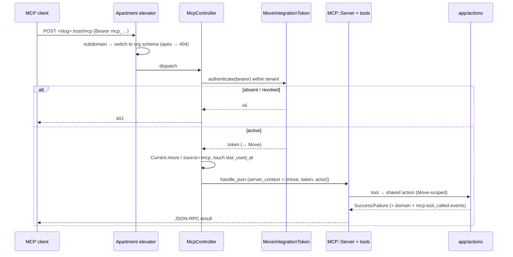

_Last updated: 2026-06-09._
