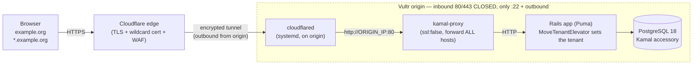
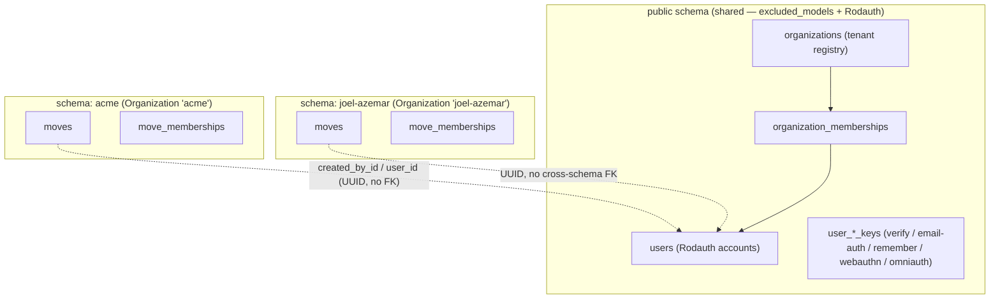
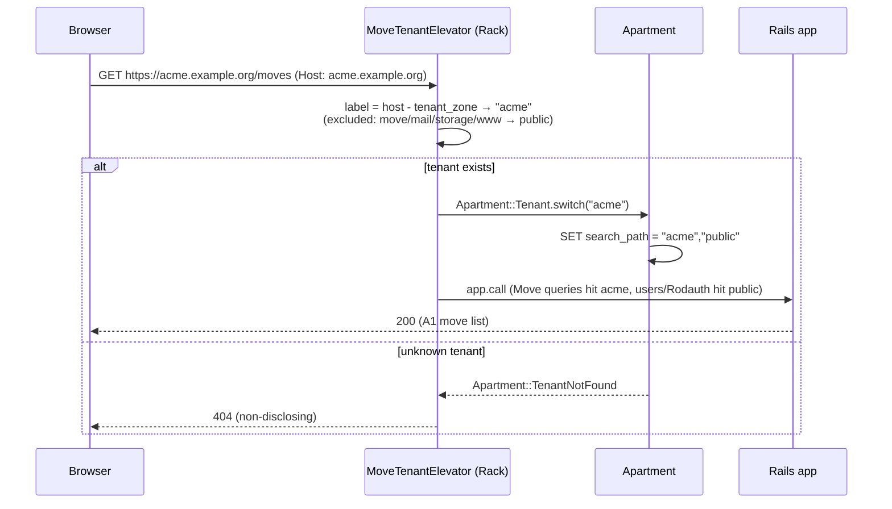

# Architecture

Runtime + tenancy architecture for Move (and the reusable pattern for any
multi-tenant app on this stack). Build/deploy steps live in
[`new-app-recipe.md`](new-app-recipe.md).

> Editable diagram source: [`diagrams/production-architecture.excalidraw`](diagrams/production-architecture.excalidraw)
> (open at [excalidraw.com](https://excalidraw.com/)). The Mermaid diagrams below
> render inline on GitHub. _(An Excalidraw MCP server was not connected when these
> were authored — wire one up to regenerate richer drawings.)_

---

## 1. Production request flow

Browser → Cloudflare edge (TLS, WAF, wildcard cert) → **Cloudflare Tunnel**
(outbound-only, encrypted) → `cloudflared` on the origin → **kamal-proxy**
(plain HTTP) → Rails app → PostgreSQL. **No inbound ports are open on the
origin** — the tunnel dials out.

Key points:
- **kamal-proxy serves HTTP only** and forwards *every* host (no `host:` filter).
  It cannot wildcard-match hosts, and its validator requires a host when TLS is
  on — so it can't terminate TLS for dynamic `*.example.org`. The tunnel does TLS.
- The **origin has no exposed ports**; `cloudflared` connects out to Cloudflare.
- `cloudflared` targets `http://ORIGIN_IP:80` because kamal-proxy publishes on the
  **public IP**, not `localhost` (pointing at `localhost:80` → 502).

---

## 2. Multi-tenancy: schema-per-tenant (Apartment)

`public` holds shared/auth/registry tables; each Organization is its own schema
holding the tenant-scoped tables. Excluded models stay pinned to `public`; Rodauth
key tables are schema-qualified to `public`.

- **Tenant schemas are cloned from `public`** via `pg_dump` (`use_sql`).
  `pg_exclude_clone_tables` keeps the excluded tables (users, organizations…) out
  of tenant schemas; `pg_excluded_names: [citext]` stops the `public.citext` type
  reference being rewritten per tenant.
- Tenant tables reference `public.users` **by UUID with no cross-schema FK**.
- **Rodauth tables are schema-qualified to `public`** (`Sequel[:public][:users]`)
  because Rodauth shares the AR connection whose search_path Apartment switches,
  and its model-less key tables get cloned (empty) into tenants.

---

## 3. Per-request tenant resolution

The session + Rodauth-remember cookies are scoped to `.example.org`
(`config.x.cookie_domain`), so the apex login session carries to every org
subdomain (no redirect loop). The login UI is apex-only; subdomains are post-auth.

---

## 4. Component / config map

| Component | Where | Notes |
|---|---|---|
| Tenancy config | `config/initializers/apartment.rb` | excluded_models, persistent_schemas, use_sql, pg_exclude_clone_tables, pg_excluded_names |
| Subdomain elevator | `config/initializers/apartment_elevator.rb` | zone-based (`.docker`/`.app` aren't always public suffixes), 404 on unknown |
| Auth | `app/misc/rodauth_main.rb` | passwordless; **all tables `Sequel[:public][:…]`**; onboarding creates tenant post-verify |
| Deterministic dump | `config/initializers/structure_sql.rb` | exclude tenant schemas + normalize search_path |
| Per-env tenancy | `config/environments/*.rb` | `tenant_zone`, `cookie_domain`, `config.hosts` |
| Deploy | `config/deploy.yml` | `proxy.ssl: false`, no host, forward_headers; db accessory `postgres:18` at `/var/lib/postgresql` |
| Secrets | `.kamal/secrets` + Doppler `<app>/prd` | synced to GitHub Actions |
| CI | `.github/workflows/ci.yml` | lint + test; `paths-ignore` for docs (not `[skip ci]`) |
| Deploy CI | `.github/workflows/deploy.yml` | Kamal on push to `main`; `workflow_dispatch` recovery lever |
| Skip-marker guard | `.git-hooks/commit_msg/forbid_skip_markers.rb` | rejects `[skip ci]` / `skip-checks: true` |
| Edge/TLS | Cloudflare Tunnel + `cloudflared` (origin) | `/etc/cloudflared/config.yml` → `http://ORIGIN_IP:80` |

---

## 5. Why this shape (the two forks we evaluated)

- **kamal-proxy custom wildcard cert** → rejected: kamal-proxy has no wildcard
  host matching and forces a host when TLS is on; a custom cert deploy fails
  validation. (`Caddy`-in-front is the documented alternative if you ever need
  origin-terminated TLS.)
- **Cloudflare Full(Strict) to a public origin** → workable but leaves the origin
  exposed and makes you manage the wildcard cert. The **Tunnel** wins: no exposed
  origin, no origin cert, wildcard handled at the edge.

_Last updated: 2026-06-06._
