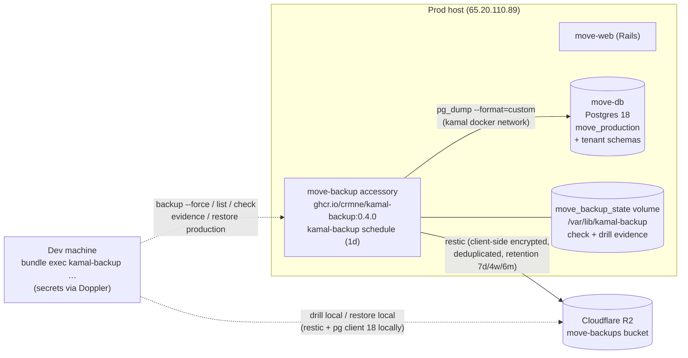

# Backups: scheduled encrypted DB backups (kamal-backup → restic → Cloudflare R2)

Production data protection for the primary database (#536). A dedicated Kamal
accessory ([`kamal-backup`](https://kamal-backup.dev), pinned `0.4.0`) runs a
scheduler loop that `pg_dump`s `move_production` once a day and streams the dump
into an **encrypted, deduplicated [restic](https://restic.net) repository** on
Cloudflare R2 — offsite, off-provider, with retention, integrity checks, restore
drills, and audit evidence built in.

**What is covered.** `move_production` in full: the dump is
`pg_dump --format=custom` with **no schema filter**, so the `public` schema
(Rodauth auth tables, the Organization registry) **and every Apartment tenant
schema** are captured in one consistent snapshot. Backups are encrypted
client-side by restic (`RESTIC_PASSWORD`) before they leave the box — R2 only
ever sees ciphertext.

**What is deliberately NOT covered.**

| Excluded | Why | Recovery path |
|---|---|---|
| `move_production_cache` / `_queue` / `_cable` | Transient by design; `db:prepare` recreates them. Queue contents are in-flight jobs (re-enqueueable); recurring schedules come from `config/recurring.yml`. | `db:prepare` on restore |
| Media (photos) in the shared SeaweedFS store | Lives outside Kamal, host-wide, shared with sibling apps. | **Gap — tracked in [#537](https://github.com/joel/move/issues/537)** |

## Architecture



## Configuration map

| Piece | Where | Notes |
|---|---|---|
| Backup settings | [`config/kamal-backup.yml`](../../config/kamal-backup.yml) | app/database/restic/schedule/retention. Mounted read-only into the accessory via Kamal `files:`. |
| Accessory | [`config/deploy.yml`](../../config/deploy.yml) `accessories.backup` | Image **pinned `0.4.0`** — bump together with the Gemfile gem pin, then `kamal accessory reboot backup`. |
| Operator CLI | `Gemfile` `group :development` | `gem "kamal-backup", "0.4.0", require: false` — remote commands fail fast on gem↔accessory version drift. |
| Secrets | [`.kamal/secrets`](../../.kamal/secrets) + Doppler `move/prd` | 4 required values (below); synced to GitHub Actions for the deploy guard. |
| Deploy guard | [`.github/workflows/deploy.yml`](../../.github/workflows/deploy.yml) | The 4 secrets are in the job `env:` **and** the required-secrets fail-fast loop. |

**Secrets** (all REQUIRED — `.kamal/secrets` has no `--no-exit-on-missing-secret`
on them):

| Secret | Value |
|---|---|
| `RESTIC_REPOSITORY` | `s3:https://<account-id>.r2.cloudflarestorage.com/move-backups` — kept in Doppler so the R2 account id stays out of this public repo. |
| `RESTIC_PASSWORD` | restic encryption key. **Hex only** (`openssl rand -hex 32`): kamal-backup parses `kamal secrets print` with Shellwords, so spaces/quotes are silently truncated locally. **Escrowed in the password manager — losing it loses every backup.** |
| `AWS_ACCESS_KEY_ID` / `AWS_SECRET_ACCESS_KEY` | R2 S3 API token (**Account** API token), scoped to the `move-backups` bucket (Object Read & Write). **Not IP-locked** — conscious trade-off: the standing credential also serves local drills and a replacement DR server without dashboard surgery. Revisit if the posture changes (an IP filter to the origin would neuter a copy exfiltrated from Doppler/GitHub, at the cost of ad-hoc tokens for drills and a mandatory filter edit before any DR restore). restic's S3 backend requires these exact env names. No region config needed — restic's `us-east-1` default aliases to R2's `auto`. |

## One-time provisioning

1. **Cloudflare dashboard → R2**: create bucket `move-backups`; then under
   **Manage API tokens** create an **Account API token** (not a User token — it
   must survive user changes): permission **Object Read & Write**, scoped to
   `move-backups`, TTL Forever. Note the account-id endpoint. (Optional
   hardening, currently **not** enabled: Client IP Address Filtering to the
   origin IP — see the trade-off note in the secrets table above.)
2. `openssl rand -hex 32` → `RESTIC_PASSWORD`.
3. **Escrow** in the password manager (NOT only Doppler): the restic password,
   the full repository URL, and a note that the R2 keys are re-issuable from the
   dashboard but the restic password is not re-issuable, ever.
4. Set the four secrets in Doppler — `doppler secrets set` needs `KEY=VALUE`
   pairs (bare names would write **empty** values):
   ```sh
   doppler secrets set --project move --config prd \
     RESTIC_REPOSITORY='s3:https://<account-id>.r2.cloudflarestorage.com/move-backups' \
     RESTIC_PASSWORD='<openssl rand -hex 32 output>' \
     AWS_ACCESS_KEY_ID='<R2 token key id>' \
     AWS_SECRET_ACCESS_KEY='<R2 token secret>'
   ```
5. **Verify the Doppler→GitHub sync** before merging anything that adds them to
   the deploy guard: `unset GITHUB_TOKEN && gh secret list` must show all 4 —
   otherwise the next deploy hard-fails on the guard.

## Ops runbook

All commands from a checkout, with Doppler CLI auth (local kamal-backup runs
resolve secrets through `.kamal/secrets` → Doppler, same rule as local deploys).

```sh
# Gate before any (re)boot — Kamal happily boots a container with EMPTY secrets
# (command-substitution failures are swallowed). validate resolves the accessory
# secrets via Doppler and catches an empty RESTIC_REPOSITORY / RESTIC_PASSWORD /
# POSTGRES_PASSWORD, plus config mistakes. NOTE: it does NOT check the AWS_* pair
# (plain runtime env for restic) — the first `backup --force` is the end-to-end
# proof of the R2 credentials; the CI deploy guard alarms on a broken sync.
mise x -- bundle exec kamal-backup validate

# First boot (and after a server rebuild):
mise x -- bin/kamal accessory boot backup      # takes the deploy lock — not mid-deploy
mise x -- bin/kamal accessory logs backup      # expect the scheduler loop, no crash-loop

# Manual/forced backup + verification:
mise x -- bundle exec kamal-backup backup --force
mise x -- bundle exec kamal-backup list        # snapshots (tags app:move, type:database)
mise x -- bundle exec kamal-backup check       # repository integrity (also runs after every backup)
mise x -- bundle exec kamal-backup evidence    # redacted JSON: snapshots/check/drill/retention/versions

# Retention (also applied automatically after each backup):
mise x -- bundle exec kamal-backup prune
mise x -- bundle exec kamal-backup unlock      # only if a stale restic lock blocks prune
```

**Changing anything about the backup setup** (`config/kamal-backup.yml`, the
image tag, accessory env):

- An app deploy **never** touches accessories, and `accessory boot` **skips** a
  running container — the only command that pushes a new config/image is
  `mise x -- bin/kamal accessory reboot backup` (it re-uploads `files:` and
  re-pulls the image). Run `validate` first.
- **Version bumps move in lockstep**: the Gemfile pin and the `deploy.yml` image
  tag are the same version, bumped in the same commit, followed by an accessory
  reboot — remote commands fail fast when the local gem and the accessory
  container disagree. (Dependabot bumping only the gem would break every remote
  command — the pin keeps that conscious.)

## Restore runbooks

### ⚠ Restores/drills in a DB-only setup: explicit snapshot id, never `latest`

kamal-backup 0.4.0's restore/drill flow always runs a file-restore leg. With a
DB-only config there is **no `type:files` snapshot**, so `… restore/drill …
latest` raises `no restic snapshot found for type:files` — *after* the database
was already restored (a mid-incident heart-stopper). An **explicit snapshot id**
(from `kamal-backup list`) bypasses that resolution, and the file leg then
no-ops: on production because the shared config has no `paths:`, and locally
because the committed [`config/kamal-backup.local.yml`](../../config/kamal-backup.local.yml)
pins `paths: []` (without it the CLI infers a `storage` path and fails).
Worth an upstream report; until then, always pass the id.

### Periodic restore drill — `drill production` into a scratch DB (no local prereqs)

A backup that was never restored is a hope, not a backup. The routine drill runs
**inside the accessory** — no restic/pg client needed on your machine, nothing
local overwritten — and restores into a scratch database, live data untouched.
The scratch DB must exist first (the gem's `pg_restore --dbname` doesn't create
it):

```sh
mise x -- bundle exec kamal-backup list                 # pick a snapshot id (NOT latest)
mise x -- bin/kamal accessory exec -i --reuse backup bash
# … then inside the accessory container:
export PGHOST=move-db PGUSER=move PGPASSWORD="$POSTGRES_PASSWORD"
createdb move_drill
kamal-backup drill production <snapshot-id> --database move_drill
psql -d move_drill -tc 'select count(*) from organizations'          # public schema restored?
psql -d move_drill -tc "select count(*) from \"<tenant-slug>\".boxes" # tenant schemas too?
dropdb move_drill
exit
mise x -- bundle exec kamal-backup evidence             # drill recorded
```

(Inside the container the CLI runs in direct mode: `move-db` resolves on the
docker network, the restic env is already baked, and the drill record lands in
the state volume, so `evidence` picks it up.)

### Occasional fresh-machine drill — `drill local`

Once in a while, rehearse the true disaster path: restore onto a machine that
has nothing but the repo and credentials.

Prereqs on the dev machine: `restic` **and** PostgreSQL 18 client tools
(`pg_restore` must be ≥ the dump's pg_dump 18) on PATH; the dev DB running
(`bin/cli db start`). ⚠ **Overwrites `move_development`** — rebuild it afterwards
with `bin/reset` / `bin/rails db:seed` if you were mid-work.

```sh
mise x -- bundle exec kamal-backup list        # pick a snapshot id (NOT latest)
doppler run --project move --config prd \
  --only-secrets RESTIC_REPOSITORY,RESTIC_PASSWORD,AWS_ACCESS_KEY_ID,AWS_SECRET_ACCESS_KEY -- \
  mise x -- bundle exec kamal-backup -c config/deploy.yml drill local <snapshot-id> \
  --check "bin/rails runner 'puts Organization.count'"
```

Both wrappers are load-bearing:

- **`-c config/deploy.yml`** switches the CLI into deployment mode, making the
  production config the *source* and inferring the local *target* from
  `config/database.yml`. Without it the shared `config/kamal-backup.yml` database
  URL becomes the local restore target and the CLI (correctly) refuses the
  "production-looking" target.
- **`doppler run --only-secrets …`** injects the restic/R2 credentials: the drill
  runs restic/pg_restore **on this machine**, and `{secret:}` references resolve
  from the local process env (the Kamal bridge only supplies accessory *clear*
  env, and ours are all secrets). `--only-secrets` keeps prod `POSTGRES_PASSWORD`
  et al. out of the local Rails boot (`config/database.yml` reads those env names).

A sane, non-zero `Organization.count` proves the `public` schema restored; spot
check a tenant (`Apartment::Tenant.switch("<slug>") { Box.count }`) to prove the
tenant schemas did too.

### Production restore (data loss / bad migration)

```sh
mise x -- bundle exec kamal-backup list                      # pick the snapshot id
mise x -- bundle exec kamal-backup -c config/deploy.yml restore production <snapshot-id>
```

The **`-c config/deploy.yml` flag is load-bearing**: it makes the CLI exec the
restore *inside the accessory* (whose env is already baked). Without it the CLI
runs restic + `pg_restore` on the dev machine directly against `move-db` — a
hostname that only resolves on the prod host's docker network — and fails.
(And per the section above: an explicit snapshot id, never `latest`.)

Interactive with a **mandatory typed confirmation** (`--yes` is deliberately
ignored; automation needs `--confirm-production-restore`). `pg_restore --clean
--if-exists` into the live `move_production`. Stop or quiesce the app first if
consistency matters more than availability.

### Full disaster (new server)

1. Rebuild the host per [`new-app-recipe.md`](new-app-recipe.md) (Kamal setup,
   tunnel, `kamal accessory boot db`, deploy — the entrypoint's `db:prepare`
   creates the four empty databases).
2. Reconstruct secrets: Doppler still has all four; if Doppler itself is gone,
   the escrowed password-manager entry has `RESTIC_PASSWORD` + the repository
   URL, and R2 keys are re-issuable from the Cloudflare dashboard.
3. `mise x -- bundle exec kamal-backup validate && mise x -- bin/kamal accessory boot backup`
4. `mise x -- bundle exec kamal-backup list`, then
   `mise x -- bundle exec kamal-backup -c config/deploy.yml restore production <snapshot-id>`
   (explicit id — `latest` fails in a DB-only setup, see the restore-runbook note).
5. Smoke-test the auth journey and a tenant (AGENTS.md §5); media is a separate
   surface (#537).

## Known gaps

- **Media is not backed up** — [#537](https://github.com/joel/move/issues/537).
  A DB-only restore brings back items/rooms/recognition rows whose photos are
  broken if SeaweedFS lost data.
- **No backup-failure alerting.** A failing scheduler only shows in
  `kamal accessory logs backup` / a stale `kamal-backup list`. Options when this
  earns its place: a Sentry cron check-in or a healthchecks.io ping around the
  backup command. Until then: run `list`/`evidence` when touching prod, and the
  restore drill periodically.
- **Backups are not application-quiesced.** `pg_dump` snapshots are
  transaction-consistent per database, which is sufficient here (single primary
  DB; queue/cache/cable are excluded and disposable).

## Gotchas (hard-won, keep)

| Gotcha | Detail |
|---|---|
| Kamal boots with empty secrets | Kamal 2.12 ignores command-substitution exit codes in `.kamal/secrets` — a missing Doppler value becomes `""`, the container boots, restic crash-loops. `kamal-backup validate` is the gate; run it before every boot/reboot. (It doesn't cover `AWS_*` — the first `backup --force` proves those.) |
| `restore`/`drill` with `latest` fail in this DB-only setup | The restore flow always resolves a `type:files` snapshot, which DB-only backups never create — `latest` raises *after* the DB restore already ran. Use an explicit snapshot id from `list`; `config/kamal-backup.local.yml` (`paths: []`) keeps the local file leg a no-op. |
| `accessory boot` skips a running container | Config/image changes need `kamal accessory reboot backup`. App deploys never touch accessories (same as the `db` accessory). |
| Gem↔image version drift | Remote CLI commands fail fast on mismatch. Pin both, bump together, reboot after. |
| Secrets with spaces break local commands | kamal-backup Shellwords-parses `kamal secrets print`; a value with spaces truncates silently (accessory works, local commands get "wrong password"). Hex-only secrets avoid it. |
| Local drill needs matching pg client | `pg_restore` older than the server's `pg_dump` 18 rejects the dump header. Install PostgreSQL 18 client tools locally. |
| `drill local` / `restore production` need `-c config/deploy.yml` | Only `-c`/`-d` enable deployment mode (a bare run refuses the "production-looking" target, or runs `pg_restore` locally against the unreachable `move-db`). `backup`/`list`/`check`/`evidence` don't need it — they auto-detect `config/deploy.yml`. Local drills additionally need the restic/R2 secrets in the process env (`doppler run --only-secrets …`). |
| `drill production` scratch DB isn't auto-created | The gem restores via `pg_restore --dbname <target>` without `createdb`. Create `move_drill` first, drop it after (see the periodic-drill runbook). |
| R2 region | None needed: restic defaults `us-east-1`, R2 aliases it to `auto`. |
