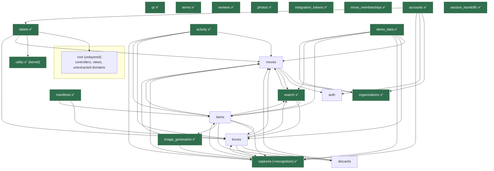
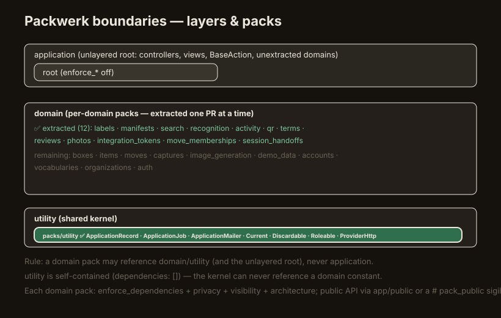
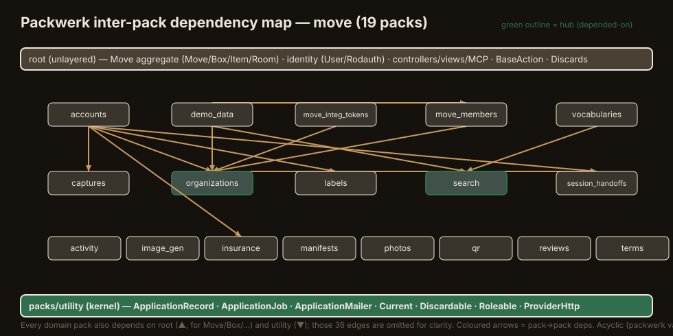

# Packwerk domain boundaries

[Packwerk](https://github.com/Shopify/packwerk) enforces **horizontal domain
boundaries** across the app — which domain may reference which, and through what
public surface. It complements the *vertical* layer rules already enforced by
[`spec/architecture/conventions_spec.rb`](../../spec/architecture/conventions_spec.rb)
and the `Move/*` RuboCop cops:

| Mechanism | Axis | Catches |
|---|---|---|
| `conventions_spec` + `Move/*` cops | vertical (layers) | a model doing business logic, an action loading rows to aggregate, a broad rescue |
| **Packwerk** | horizontal (domains) | `Boxes` reaching into `Search`'s internals, a domain using another's private constant, a dependency cycle |

This is a **staged migration**. Today the app is one flat tree under `app/`; each
domain is carved into a `packs/<domain>/` package one PR at a time. `packs/labels`
is the first, and the template for the rest.

---

## How Packwerk sees the code

Packwerk maps **every constant to the package (directory subtree) that defines it**,
derives the constant table from the Rails/Zeitwerk load paths (so it understands the
Phlex `Views`/`Components` namespaced roots from
[`config/initializers/phlex.rb`](../../config/initializers/phlex.rb) — verified by
`packwerk validate`), then, for every reference, checks four axes **on the
referencing package**:

| Axis (`package.yml` key) | Rule |
|---|---|
| `enforce_dependencies` | may only reference packs listed in `dependencies` |
| `enforce_privacy` | may only reference another pack's **public** constants (those under its `app/public/`, or marked `# pack_public: true`) |
| `enforce_visibility` | may only depend on a pack that lists it in `visible_to` |
| `enforce_architecture` | a pack's `layer` may reference its own layer or a **lower** one, never a higher one |

The checkers come from core `packwerk` (dependencies) + `packwerk-extensions`
(privacy, visibility, architecture), loaded via the `require:` line in
[`packwerk.yml`](../../packwerk.yml).

---

## Layers (architecture)

`packwerk.yml` defines the tiers, top → bottom:

```
application   →  controllers / orchestration (lives in the unlayered root for now)
domain        →  the per-domain packs (packs/labels, future boxes/items/…)
utility       →  the shared kernel (BaseAction, ApplicationRecord, Current, …)
```

A `domain` pack may reference `domain` + `utility`, never `application`.

A `utility` pack may reference only `utility` (itself).

**The shared kernel → `packs/utility`.** The cross-cutting framework infrastructure
(`ApplicationRecord`, `ApplicationJob`, `ApplicationMailer`, `Current`, `Discardable`,
`Roleable`, `ProviderHttp`) lives in `packs/utility` (`layer: utility`). It enforces
**dependencies** (`dependencies: []` — the kernel is self-contained; it can never
reference a domain or application constant) and **architecture** (bottom layer).
Privacy/visibility are **off** there: the kernel is the universal public foundation,
so per-constant privacy/visibility would be ceremony (a `visible_to` listing every
pack). Domain packs keep both strict.

> **Self-contained means *no domain coupling at all* — including method calls
> Packwerk can't see.** `BaseAction` and `Discards::Cascade`/`CascadeRestore` are
> deliberately **not** in utility: both call `ensure_writable(move)` →
> `move.writable?` / `Failure(:move_archived)`, a method-call dependency on the Move
> domain's archived-invariant. Packwerk only tracks *constants*, so it wouldn't flag
> it — but a bottom-layer kernel that has to change when Move's writable/archive
> contract changes isn't a kernel. They stay in the root until `ensure_writable` is
> factored out of the action base (tracked follow-up), after which they can be
> promoted to `utility`.

**The unlayered-root escape hatch.** The root package still has **no `layer:`**. The
architecture checker treats a reference to a layer-less package as always allowed
(`Layer::Package#can_depend_on?` returns `true` when the target layer is `nil`). The
root still holds the other ~14 domains' models + controllers that `packs/labels`
references (`Move`, `Box`, `BoxLabelsPdf`), so a `domain` pack depending on the root
is **not** a violation. The root is reclassified as `application` only once **all**
domains have been extracted.

---

## The public-API convention

A pack exposes the **minimum** surface. Two complementary mechanisms:

1. **Public data → `app/public/`.** A model/value object that is a domain's public
   contract lives in `packs/<pack>/app/public/`. Everything else (`app/models`,
   `app/services`, …) is private. **`app/public/` is reserved for persistence/data
   contracts** (`ApplicationRecord` subclasses + pure-data structs) — never an action:
   it must not use `Dry::Monads` or emit events. The architecture fitness tests scan
   `app/public/` as part of the model layer, so a misplaced action there fails them
   (move it to `app/actions/` + the sigil, per (2)).
2. **Public actions → stay in `app/actions/` + `# pack_public: true`.** The
   entry-point *action* a controller calls is the domain's public API too, but it
   must stay in the action layer so the architecture fitness tests keep governing it
   (an action in `app/public/` would escape the "events/business-logic live in
   `app/actions/`" check). Expose it with the
   [publicize sigil](https://github.com/rubyatscale/packwerk-extensions) — a
   `# pack_public: true` comment in the **first 5 lines** of the defining file.

> List a pack's public surface with `grep -rl "pack_public: true" packs/<pack>` plus
> `ls packs/<pack>/app/public`.

**Specs are excluded** from Packwerk (`exclude: spec/**/*` in `packwerk.yml`): a test
may reference any constant — including another pack's private internals — without it
counting as a boundary violation.

---

## `packs/labels` — the first pack

The bulk box-label printing domain (the async `LabelPrintRun` lifecycle, #303).

```
packs/labels/
  package.yml                                   # enforce_* all true, layer: domain
  app/
    public/
      label_print_run.rb                         # LabelPrintRun           (PUBLIC — model)
    actions/label_print_runs/
      start.rb                                   # LabelPrintRuns::Start    (PUBLIC — # pack_public)
      record_progress.rb                         # LabelPrintRuns::RecordProgress (private)
      broadcasting.rb                            # LabelPrintRuns::Broadcasting   (private)
    jobs/label_print_runs/
      generate_job.rb                            # LabelPrintRuns::GenerateJob    (private)
```

- **Public**: `LabelPrintRun` (referenced by `Accounts::Delete`, `Moves::Destroy`,
  `PurgeStaleLabelPrintRunsJob`) and `LabelPrintRuns::Start` (the controller's entry
  point).
- **Private**: the progress recorder, the broadcasting mixin, the generation job —
  referenced only inside the pack.
- `dependencies: ['.', 'packs/utility']` — reaches the shared kernel in
  `packs/utility` (`BaseAction`, `ApplicationRecord`, `ApplicationJob`) and the
  domain constants still in root (`Move`, `Box`, `BoxLabelsPdf`).
- `visible_to: ['.']` — only the root app references labels today. When
  `accounts`/`moves` become packs, add them here.

The controller, Phlex views, the `Ui::LabelPrintStatus` component, the
`BoxLabelsPdf`, and `PurgeStaleLabelPrintRunsJob` stay in the root (`application`)
layer for now — they reference only the labels **public** API.

---

## Migration status — what's a pack, and what stays in the root (and why)

The migration is **complete**: every domain that *can* be a self-contained pack is
one. **18 packs** now exist — the `utility` kernel plus 17 peripheral domains
(labels, manifests, search, activity, qr, terms, reviews, photos,
move_integration_tokens, move_memberships, session_handoffs, accounts, vocabularies,
image_generation, demo_data, organizations, and **captures** — which absorbed
recognition, see below).

**The core stays in the root — on purpose.** These are **not** un-migrated TODOs;
they are irreducible and correctly belong in the unlayered root:

- **The Move aggregate — `Move`, `Box`, `Item`, `Room`** (+ their `Moves::*`,
  `Boxes::*`, `Items::*` actions). These models are **bidirectionally** associated
  (`Move has_many :boxes`, `Box has_many :items`/`:media`, and the children
  `belong_to` back). Two packs with a mutual dependency are a **cycle**, which
  `packwerk validate` rejects (the graph must be acyclic). An aggregate root and its
  children are one bounded context — you don't split them. They live in the root, and
  the peripheral packs depend *on* them (one direction).
- **Identity — `User`** (+ Rodauth in `app/misc`). `User` is bidirectionally tied to
  the extracted identity packs (`User has_many :terms_acceptances` ↔ `TermsAcceptance
  belongs_to :user`; likewise session-handoff tokens, memberships). Extracting `User`
  would cycle with `packs/terms` / `packs/session_handoffs` / `packs/move_memberships`,
  so it stays in the root.
- **The application layer** — controllers, Phlex `Views::`/`Components::`, presenters,
  policies, mailers, channels, MCP — orchestrates the domains and belongs at the top.
- **`BaseAction`** and **`Discards::Cascade`/`CascadeRestore`** — the action base and
  the soft-delete cascade both carry Move-domain coupling (`ensure_writable(move)`),
  so they stay in the root until decoupled (#443).

This is a **standard, healthy Packwerk end state**: extract the *periphery* (which
depends inward on the core), and leave the core aggregate + identity + application in
the unlayered root. Because the root is unlayered and unenforced, a pack ↔ root
back-reference (e.g. `Media belongs_to :box` while `Box` is in the root) is **not** a
cycle — the acyclic rule only governs pack-to-pack edges.

> **captures = capture **and** recognition.** Recognition was briefly its own pack
> (#448), but `Media has_many :recognition_runs, dependent: :destroy` ↔ `RecognitionRun
> belongs_to :media` is an irreducible data-model cycle: a captured photo and its AI
> recognition are one lifecycle. They were folded into a single `packs/captures`
> (#478). This is the same aggregate rule that keeps the Move core in the root — the
> boundary is drawn by the ownership graph, not by wishful decomposition.

## The full domain map

The candidate packages and their dependencies, mapped from the current code. Arrows
point **from a domain to what it depends on**. Extracted packs are green; the Move
aggregate + identity remain in the root (see the status section above).



**kernel** = the domain-free framework infrastructure (`ApplicationRecord`,
`ApplicationJob`, `ApplicationMailer`, `Current`, `Discardable`, `Roleable`,
`ProviderHttp`) — extracted into **`packs/utility`** (the `utility` layer).
`BaseAction` stays in root for now (its `ensure_writable` couples it to Move).
`Apartment` + `Rails.event` are gem/framework globals, not packaged.

**Known coupling hotspots** (to untangle as domains are extracted):

- `Moves::Destroy::DELETE_ORDER` names constants from six domains — the worst
  fan-out; it forces `moves` to depend on captures/items/search/activity/labels.
- `Items::GenerateImage` builds a `Media` record directly (`item.box.media.new`) —
  couples `items` to the `captures` model; wants a `Captures::AttachGenerated`.
- `Search::Reindexing` is a mixin included by `Boxes`/`Vocabularies` actions.
- `Activity::Builder::SUBJECTS` is a string-keyed catalog of every domain's events
  (string names, so Packwerk-invisible, but a real semantic dependency).

The layer/pack structure (editable scene:
[`diagrams/packwerk-boundaries.excalidraw`](diagrams/packwerk-boundaries.excalidraw)):



### Inter-pack dependency map

The actual **pack → pack** dependency edges (from each `package.yml`'s
`dependencies:`), rendered from the real config. `organizations` is the main hub
(five packs depend on it); `search` and the identity packs form the rest. Every
domain pack also depends on the root (for the Move aggregate) and `utility` (the
kernel) — those 34 universal edges are omitted for clarity. The graph is **acyclic**
(`packwerk validate ✓`). Editable scene:
[`diagrams/packwerk-dependencies.excalidraw`](diagrams/packwerk-dependencies.excalidraw).



Regenerate both diagrams from the live `package.yml` files whenever a pack or a
dependency changes (Step 8b / §7 — the `/code-review` and Codex passes flag drift).

---

## How to extract a new pack

1. **Pick a leaf-ish domain** (few inbound references). Map its constants and every
   *external* reference (`grep -rn '\bConstantName\b' app packs --include=*.rb`).
2. **Decide the public surface** — the minimum other packs/root actually reference.
   Public model → `app/public/`; public action → `app/actions/` + `# pack_public: true`.
3. **`git mv`** the files into `packs/<domain>/app/{public,models,actions,jobs,…}`
   (constants are unchanged → no call-site edits).
4. **Write `packs/<domain>/package.yml`**: `enforce_* : true`, `layer: domain`,
   `dependencies:` (start with `['.']`), `visible_to:` (the packs that reference it).
5. **`bundle exec rails zeitwerk:check`** — constants still resolve.
6. **`bundle exec packwerk validate`** then **`bundle exec packwerk check`**.
7. **Resolve violations**: declare the missing dependency, widen `visible_to`, or
   publicize the referenced constant — or, if it's debt you can't fix now,
   **`bundle exec packwerk update-todo`** records it in `package_todo.yml` so the
   build stays green while you burn it down (don't let the todo grow).
8. Extend `spec/architecture/conventions_spec.rb` globs if the pack introduces a new
   layer directory shape.

> **Where do a pack's specs go?** For now, **keep them in the root `spec/` tree**
> (mirroring the code path, e.g. `spec/actions/label_print_runs/…`). The test runner
> (`.rspec` + the `rspec spec …` commands in CI/Rakefile) only discovers `spec/`, so
> a spec placed under `packs/<pack>/spec/` would be **silently skipped**. Wiring
> pack-local specs to run (the packs-rails RSpec integration) is tracked in #439;
> until then, `packs/*/spec` is excluded from Packwerk only as a safety net, not as a
> blessed location.

---

## CI & local enforcement

- **CI** — the dedicated `packwerk` job in
  [`.github/workflows/ci.yml`](../../.github/workflows/ci.yml) runs
  `packwerk validate && packwerk check` (needs Postgres — the app boots to derive
  load paths). A new violation fails the build, like rubocop. It is a **required
  status check** on `main` (alongside `lint` and `test`), so a boundary violation
  hard-blocks merges.
- **Local** — the overcommit `Packwerk` pre-commit hook
  ([`.git-hooks/pre_commit/packwerk.rb`](../../.git-hooks/pre_commit/packwerk.rb))
  runs `packwerk check` on staged Ruby files under `app/`/`packs/` for fast local
  fail.

_Last updated: 2026-06-30 (PR1 — Packwerk foundation + packs/labels)._
