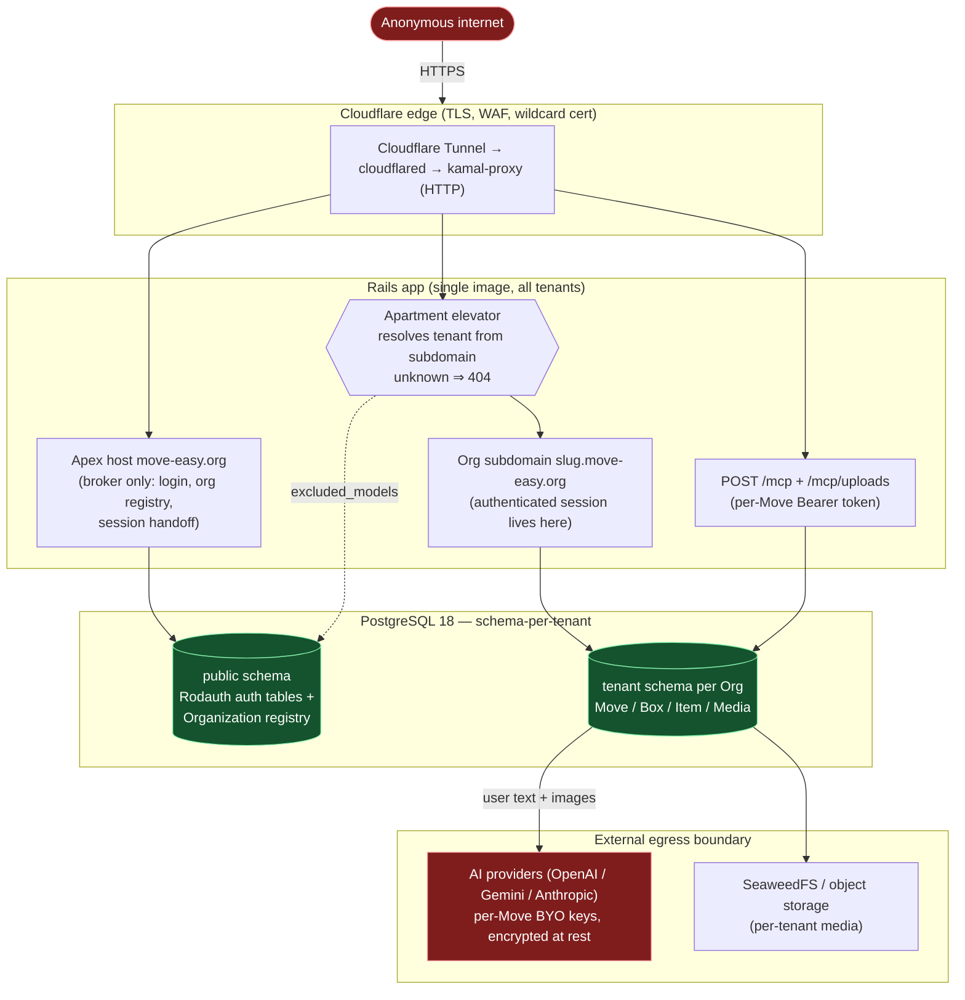

# Security model & threat model

This document is the **source of truth for Move's security posture**: the trust
boundaries, the assets we protect and the control enforcing each, a per-class
review checklist (with file pointers), and the risks we have consciously accepted.

It is **open source**, which is itself a threat-model assumption: assume an
attacker has full read access to this repository and can point an AI at it to hunt
for exploitable weaknesses. Our defence is twofold:

- a **per-change** security pass — [`/execution-plan`](../../.claude/skills/execution-plan/SKILL.md)
  **Step 5d** runs the `/security-review` skill on every security-sensitive branch
  diff *before* the PR is public; and
- a **periodic** whole-repo adversarial scan —
  [`.github/workflows/security-audit.yml`](../../.github/workflows/security-audit.yml)
  (`Security Audit`) runs **on demand** (manual `workflow_dispatch`; the weekly
  schedule is paused until #430 hardens the public-log residual) and, on findings, opens a
  fixed-body `security`-labelled issue and fails the run. **It never republishes the
  model's report** to any sink it controls (summary/artifact/issue) — those emit
  only a fixed, content-free notice — because prompt compliance is not an
  enforcement boundary. The audit prompt is additionally constrained to
  non-sensitive output to mitigate the one residual we cannot redact: the Codex
  action echoes its own output to the public Actions log. The **actionable** detail
  is the job of the per-change `/security-review` pass (Step 5d) and a maintainer's
  local audit re-run — never this public CI report. (Tracked hardening: route full
  detail through a private channel / suppress the action's stdout.)

Both apply the **"Security & data"** section of
[`.github/codex/review-rubric.md`](../../.github/codex/review-rubric.md), which
mirrors the checklist below.

---

## Trust boundaries

The headline boundaries an attacker probes:

1. **Apex vs org-subdomain.** The apex (`move.<zone>` locally, `move-easy.org` in
   prod) is **broker-only** — login, the org registry, and single-use session
   handoff. An authenticated session is established and lingers **only** on the org
   subdomain, never the apex. Cookies are host-only. On a tenant subdomain,
   `TenantController#require_membership!` (prepended ahead of the terms gate) rejects
   with a non-disclosing 404 any authenticated user who is **not** a member of that
   Organization — so a session that reaches a subdomain it doesn't belong to cannot
   act on it (e.g. create a Move and self-assign admin). Membership is authorized at
   the boundary, not assumed from how the session was obtained.
2. **`public` schema vs tenant schema.** Each Organization is a PostgreSQL
   **schema**. Auth (Rodauth) tables and the Organization registry live in `public`
   via Apartment `excluded_models`; everything Move-scoped lives in the tenant
   schema. The elevator picks the schema **per request** from the subdomain.
3. **Per-Move MCP Bearer token.** `POST /mcp` and `/mcp/uploads` are authenticated
   by a per-Move integration token (stored as a digest, never raw) that resolves a
   single Move *within* the subdomain's tenant. The Move-scoped `signed_id` means
   only the issuing token can attach an upload.
4. **External egress.** User text and images are sent to external AI providers for
   recognition/embedding. This is a one-way **data-egress** boundary: per-Move BYO
   keys, encrypted at rest, no secret/PII leakage.
5. **Sentry-derived data entering CI (self-healing pipeline).** The `Self-Healing`
   workflow ingests Sentry error data and writes to **world-readable** sinks
   (GitHub issues, PRs, Actions logs) and into an agent prompt. Sentry event
   content is **attacker-influenceable** (a crafted request becomes an exception
   message becomes pipeline input — a prompt-injection and PII channel), so the
   boundary is enforced **by construction**, not by prompt compliance: all Sentry
   data enters through the whitelist reducer
   [`script/self_healing/sentry_fetch.rb`](../../script/self_healing/sentry_fetch.rb)
   — exception classes, culprits, in-app frame locations, counts, and timestamps
   pass (charset-checked, truncated); exception **messages**, breadcrumbs,
   request/user context, and tag values **never** do. Hostile-payload specs pin
   the boundary (`spec/script/self_healing/sentry_fetch_spec.rb`). The pipeline's
   own control plane (`.github/**`, `script/**`) is deny-listed for autofix PRs,
   the scorer always executes from `main`, and the fix agent holds no push
   credential. See [`self-healing.md`](self-healing.md).

---

## Assets & controls

| Asset | Threat | Control | Where it lives |
|---|---|---|---|
| Other tenants' data | Cross-tenant read/write | Apartment schema-per-tenant + per-request elevator; unknown subdomain ⇒ 404 (no disclosure); `TenantController#require_membership!` ⇒ 404 for an authenticated non-member of the org | `config/initializers/apartment.rb`, `config/initializers/apartment_elevator.rb` (`EXCLUDED_SUBDOMAINS = %w[move mail storage bucket www media]`), `app/controllers/tenant_controller.rb` |
| Auth / account tables | Empty-tenant-clone footgun, cross-tenant auth | `excluded_models` + `persistent_schemas %w[public]`; schema-qualify auth SQL to `public.` | `config/initializers/apartment.rb`, `app/misc/` |
| Per-resource access | IDOR / privilege escalation | ActionPolicy `authorize` on every action + `authorized_scope` for row visibility; membership gate | `app/policies/` (`*_policy.rb`, `concerns/move_membership_authorization.rb`) |
| Domain invariants | Forged param / stale form / direct MCP call | Phase/state + ownership guards in the **shared action**, gating on the validated result | `app/actions/` |
| Sessions | Hijack, fixation, cross-host leak | Passwordless Rodauth; verify-before-login; host-only cookies; single-use `SessionHandoffToken`; remember-me scoped to subdomain | `app/misc/`, `app/jobs/purge_stale_session_handoff_tokens_job.rb` |
| API keys / secrets | Leakage | Encrypted per-Move attributes; Doppler / Rails credentials only; nothing in code or logs | `app/models/` (encrypted attrs), Doppler `move/prd` |
| Uploaded media | Malicious upload, oversized payload, attach-others' | Magic-byte sniff (`image/*`) + size cap (`Media::MAX_IMAGE_BYTES`) + Move-scoped `signed_id`; transcode-on-attach | `app/controllers/mcp_uploads_controller.rb`, `app/services/image_normalizer.rb` |
| Media display URLs (edge transform, #572) | Forged/replayed edge-image request; unbounded/abusive transform sizes | Short-lived HMAC-SHA256 over `blob_key\|size\|exp` under a **dedicated** secret (never `secret_key_base`), verified constant-time in the Worker; `exp` expiry (unlike the never-expiring AS proxy id — closes F5's residual); size restricted to a **bounded** 2-value set (billing/abuse cap); R2 bucket stays private (Worker R2 binding, never public) | `workers/media-transform/src/index.js`, `packs/captures/app/services/media_variants/transform_url.rb` |
| MCP endpoints | Token theft / cross-Move | Per-Move Bearer (digest-stored), resolved within tenant; every tool reuses an authorized `app/actions` call; `mcp.tool_called` audit events | `app/mcp/` |
| Error-report egress | Auth material (magic-link `key` — in query strings, Sequel-literalized SQL, and mailer-job args — session/remember cookies, MCP Bearer tokens, outbound OAuth bodies) shipped to Sentry with the request context (`send_default_pii`) or inside traced db-span SQL | Fail-closed scrub in `before_send` **and** `before_send_transaction`: cookies + `Authorization` + job `arguments` + breadcrumb `body`/`query` dropped; query string + form/JSON bodies through `ActiveSupport::ParameterFilter` (unparseable ⇒ `[FILTERED]`); `:sql` removed from breadcrumb payloads; quoted SQL string literals redacted from `db.*` span descriptions (#531); init gated on DSN presence + `enabled_environments=%w[production]`; DSN an optional Doppler secret, never committed (#528) | `config/initializers/sentry.rb`, `spec/config/sentry_spec.rb` |
| Soft-deleted user data | Indefinite retention of "deleted" content (rows + photo blobs kept forever) | 30-day retention window (`Discardable::RETENTION`): the nightly `PurgeExpiredDiscardsJob` → `Discards::PurgeExpired` hard-deletes expired discards per tenant, blobs included. After the purge, the data persists only in the encrypted restic DB backups until the backup retention (7 daily / 4 weekly / 6 monthly) lapses | `app/actions/discards/purge_expired.rb`, `app/jobs/purge_expired_discards_job.rb`, `config/recurring.yml`, `config/kamal-backup.yml` |
| Output / XSS | Injected script via a rendering bug | Phlex auto-escaping (primary); a Content-Security-Policy backstop (#493) — strict `script-src` (`self` + per-request nonce, no `unsafe-inline`); `style-src` allows `unsafe-inline` for inline `style=` attrs; `form-action` omitted (cross-host auth). **Report-only during rollout** — violations collected via `report-uri` → `CspReportsController` (public, bounded, logs only); flip to enforcing after prod (esp. Google One Tap + ActionCable `wss`) is confirmed violation-free | `config/initializers/content_security_policy.rb`, `app/controllers/csp_reports_controller.rb` |

---

## Per-class review checklist

The classes the per-change pass (Step 5d) and the scheduled audit work through —
each with where the control lives, so a finding can be traced to code:

- **Tenant isolation** — queries resolve in the right schema; AR lookups after an
  `Apartment::Tenant.switch` block are re-wrapped; signed Turbo Stream names derive
  from a tenant-unique uuid (that signed name **is** the channel auth); no
  `default_scope` widening leaks other-tenant/soft-deleted rows. → `config/initializers/apartment*.rb`, ActionCable `turbo_stream_from` sites.
- **Authorization / IDOR** — org membership enforced at the tenant boundary
  (`TenantController#require_membership!`, prepended ahead of the terms gate; a
  non-member 404s on every tenant surface); `authorize` + `authorized_scope`
  everywhere; selection-only vocabulary rejects out-of-Move ids; ownership/phase
  guards in the action, gating on the validated result not the raw param.
  → `app/controllers/tenant_controller.rb`, `app/policies/`, `app/actions/`.
- **Authentication** — no Rodauth bypass; verify-before-login; status checks;
  remember-me on subdomain only; single-use handoff tokens; WebAuthn RP id = apex;
  social sign-in respects account-creation guards. → `app/misc/`.
- **Injection & input** — strong-params re-sliced inside the action; no `Arel.sql`
  string interpolation; no new shell/command injection. → `app/actions/`, `app/controllers/`.
- **Upload & egress** — magic-byte sniff + size cap + Move-scoped signed-id;
  external AI calls leak no secret/PII; BYO keys encrypted. → `app/services/image_normalizer.rb`, `app/services/recognition_providers/`, `app/services/embedding_providers/`.
- **Secrets** — none in code/fixtures/logs; encrypted attrs; Doppler/credentials.
- **Output safety** — audit `raw`/`html_safe`/`sanitize` for XSS; Rodauth forms
  carry context via hidden fields; Prawn user text uses a Unicode TTF. → Phlex views, `app/misc/` Rodauth views.

---

## Accepted risks

- **5 dev-only command-injection warnings** in `config/brakeman.ignore`
  (`bin/cli-files/**` — `system("docker …")`). Accepted because `bin/cli` is local
  developer tooling: the interpolated values come from project config, not user
  input, and the code is **never reachable from a web request**. New `system(...)`
  with interpolation outside `bin/cli` is **not** covered by this acceptance and
  must be flagged.

- **Active Storage blob bytes are not tenant-isolated; delivery relies on
  signed-id secrecy, not membership authorization.** `ActiveStorage::Blob`,
  `Attachment`, and `VariantRecord` are Apartment-**excluded** and live in the
  shared `public` schema (`config/initializers/apartment.rb`) — deliberately, so
  Rails 8.1's Active Storage proxy (which leases a fresh pool connection that
  Apartment resets to `public`) can resolve them regardless of the active tenant.
  Files are served via `rails_storage_proxy` URLs, and the default proxy
  controller performs **no** authorization beyond validating the (non-expiring)
  signed id. So while the domain `Media` row is per-tenant, the file it points to
  is **not** — anyone holding a valid proxy URL can fetch that blob without an
  Organization/Move membership check. Accepted because: (a) proxy signed ids are
  unguessable (HMAC over the app secret), (b) the schema-per-tenant model still
  isolates every *domain* record and the `Media`→blob mapping, and (c) fronting
  blob delivery with a per-request membership check conflicts with the
  fresh-`public`-connection constraint above. **Residual risk:** a signed-id /
  proxy URL that leaks (shared link, server/CDN log, CDN cache) grants
  cross-tenant read of that single image with no membership gate — there is no
  second authorization layer behind the URL. Revisit if blob contents ever hold
  higher-sensitivity data than move-inventory photos, or wrap proxy delivery in an
  authorization check at that point. (Audit finding F5, 2026-07-02.)
  **Update (#572):** the display path is moving off the Active Storage proxy to a
  Cloudflare-edge transform Worker (`workers/media-transform`), reached via a
  server-minted signed URL (`MediaVariants::TransformUrl`). This is the **same**
  risk shape — URL-secrecy substitutes for a membership check, since a stateless
  edge Worker has no session/tenant context and can only verify
  `HMAC(blob_key\|size\|exp)` — but with a materially **shorter blast radius**: the
  token carries a real `exp` (≤1h), so a leaked URL goes dead within the hour
  rather than never. Tenant/Move binding stays enforced at *mint* time (a URL is
  only rendered to an authorized in-tenant member). Dev/test keep the same-origin
  master proxy (no Worker locally).

- **WebAuthn ceremonies bind to the request host, not a pinned apex origin.**
  `webauthn_origin` falls back to the request host (`base_url` in
  `app/misc/rodauth_main.rb`), while the RP id is pinned to the apex
  (`WEBAUTHN_RP_ID`) — a registrable suffix of every `<slug>.<zone>` subdomain. So
  a passkey ceremony can technically complete on any org subdomain, not only the
  apex. This is **deliberate**: passkey *management* (add/remove — the
  `account/passkeys` routes) happens on the org subdomain, so pinning the origin to
  the apex would break enrollment/removal there. The one risk this leaves — a
  passkey *login* establishing a session on a subdomain the user does not belong
  to — is **neutralized in depth**:
  - The **always-holding** layer is `TenantController#require_membership!`, which
    404s any non-member on *every* tenant surface, however the session was obtained
    — so a session on a foreign subdomain is **inert** regardless of the below.
  - On the **normal successful-handoff path**, `login_redirect` additionally mints a
    handoff token to the user's *own* org and `clear_session`s the just-set foreign
    session, so it is usually wiped immediately. This wipe does **not** apply on the
    fallback paths where `login_redirect` returns `/` with the session intact: an
    account with **no resolvable target org** (`handoff_target_slug` → nil — e.g. a
    failed personal-org provision; see `target_resolver_spec`) or a **handoff-token
    mint failure** (`tenant_handoff_url` returns `/` unless a token was minted, #349).
    There the foreign session lingers but stays inert via the membership backstop above.

  Revisit (e.g. gate only the webauthn-login ceremony to the apex, keeping
  management on the subdomain) if the membership backstop is weakened. (Audit
  finding F4 / PR-3 — not pursued for this reason; advisory `GHSA-29rm-pfr6-xc82`.)

---

## Related references

- [`.github/codex/review-rubric.md`](../../.github/codex/review-rubric.md) — the
  "Security & data" checklist applied by every review.
- [`architecture.md`](architecture.md) — runtime request flow + schema-per-tenant
  model (the non-adversarial counterpart to this doc).
- [`app/misc/AGENTS.md`](../../app/misc/AGENTS.md) — auth-layer gotchas.
- [`app/mcp/AGENTS.md`](../../app/mcp/AGENTS.md) — MCP token + upload handshake.
- [`self-healing.md`](self-healing.md) — the automated Sentry→fix-PR pipeline and
  its safety engine (trust boundary #5 above).
- CI static checks: Brakeman + bundle-audit in [`.github/workflows/ci.yml`](../../.github/workflows/ci.yml).

_Last updated: 2026-07-02 (accepted risk: WebAuthn ceremonies bind to the request host — F4/PR-3 not pursued; earlier: tenant-membership boundary — F4; shared-schema Active Storage blob delivery — F5)._
