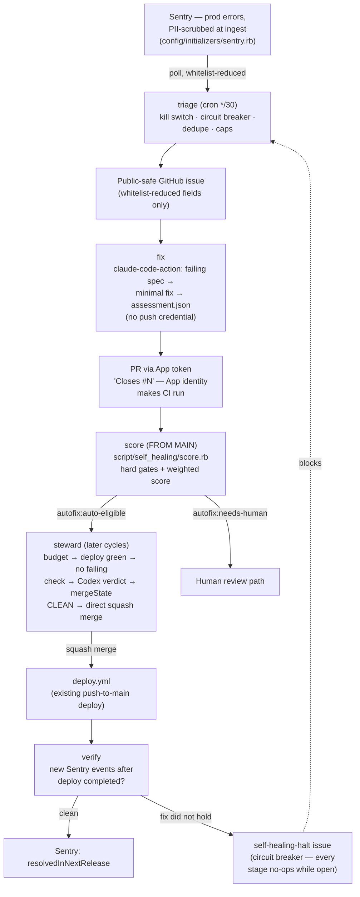

# Self-Healing Infrastructure (Loop A)

Sentry → GitHub issue → agent fix PR → confidence-gated auto-merge → deploy →
post-deploy verification. This document is the operating manual for the
automated error-remediation pipeline: what each stage does, the safety
engine that governs autonomy, the manual setup it needs, and the runbooks
for pausing, recovering, and rolling back.

**Status: incremental rollout.** Stages land in order (release finalization →
scorer → triage → fix/score → steward → post-deploy verification); each
section below states which workflow/job implements it. Autonomy (auto-merge)
is OFF until the canary drill (§ Setup) passes and the
`SELF_HEALING_AUTONOMY_ENABLED` repo variable is set.

## Release tracking (already live — zero app code)

Prod Sentry events are tagged `release=<deployed git SHA>` without any app
configuration:

- Kamal injects `KAMAL_VERSION=<full git SHA>` into the app container
  (`kamal-2.12.0/lib/kamal/commands/app.rb:24`).
- sentry-ruby's `ReleaseDetector` auto-detects `ENV["KAMAL_VERSION"]` when
  `config.release` is unset (`config/initializers/sentry.rb` deliberately
  leaves it unset).

A dedicated **`Sentry Release` workflow**
(`.github/workflows/sentry-release.yml`, `workflow_run` on a successful
Deploy) finalizes each release: SHA-pinned `getsentry/action-release`
creates the release for the deployed SHA, associates commits from a
full-history checkout, and marks a `production` deploy. A separate workflow
on purpose: it must not hold the Deploy workflow's `deploy-production`
concurrency lock (best-effort Sentry bookkeeping must never delay a queued,
possibly urgent deploy), and the third-party action must never run in the
deploy job, whose env carries the full production secret set — here it sees
only the Sentry token + slugs. Unprovisioned credentials skip the steps
explicitly; a real Sentry failure turns only this workflow red, never the
deploy. Finalized releases + deploys are what make Sentry's `is:regressed`
query and suspect-commit attribution trustworthy for the pipeline.

**Verify** (one-time, and after Sentry/Kamal upgrades): open any recent prod
event in Sentry → the `release` tag equals the SHA of the currently deployed
merge commit; the release page shows commits and a production deploy.

## Pipeline overview



Separation of duties: **Claude** (claude-code-action) writes the fix; **Codex**
(`chatgpt-codex-connector[bot]`) independently reviews it; a **deterministic
Ruby scorer** — always executed from `main`, never from the PR head — decides
whether the change is even eligible for autonomy; the **steward** merges only
when every gate agrees. The agent never holds push credentials; a GitHub App
token is minted by a deterministic workflow step after the agent finishes.

## Safety engine (summary)

- **Kill switch**: repo variable `SELF_HEALING_ENABLED` — anything but `true`
  makes every job a no-op.
- **Autonomy switch**: repo variable `SELF_HEALING_AUTONOMY_ENABLED` — the
  steward (auto-merge) additionally requires it. Everything upstream (issues,
  fix PRs, scoring) can run for calibration with autonomy off.
- **Circuit breaker**: an open issue labelled `self-healing-halt` stops the
  pipeline. Opened automatically by post-deploy verification on a suspected
  bad fix; closed manually after triage.
- **Blast radius**: `.github/autofix/blast_radius.yml` deny/allow path lists.
  Deny-listed paths (migrations, config, `.github/**`, `script/**`, auth/
  tenancy packs, JS/assets — untestable under `rack_test`) force the human
  path.
- **Hard gates + score**: `script/self_healing/score.rb` — deny paths, spec
  evidence, skip-marker regex, assessment integrity, size caps; then
  `S = 0.45·C_agent + 0.25·size + 0.20·spec_quality + 0.10·locality`,
  auto-eligible iff `S ≥ 85` and `C_agent ≥ 70`.
- **Budgets**: ≤2 fix candidates per cycle, ≤3 open autofix PRs, ≤3 automated
  merges per 24 h, one steward merge per cycle.
- **Public-repo doctrine**: everything the pipeline writes to public sinks
  (issues, PRs, logs) is non-sensitive **by construction** — the whitelist
  fetcher (`script/self_healing/sentry_fetch.rb`) reduces Sentry events to
  exception class/frames/transaction/counts; exception *messages* and
  breadcrumb values never reach the agent prompt or any public sink (they are
  attacker-influenceable → prompt-injection and PII channels). See
  `security-model.md`.

**Accepted risk — no pre-merge live verification on the bot path.** Human PRs
run the mandatory live `/product-review` (AGENTS.md §5) before pushing; the
pipeline structurally cannot (no `bin/cli` container stack or real browser in
CI, and `rack_test` system specs execute no JavaScript). Mitigations, layered:
the browser-only failure classes this repo has been bitten by live behind
deny-listed paths (`app/javascript/**`, `app/assets/**` — untestable under
`rack_test`); the blast radius caps what an autofix may touch at all; Codex
independently reviews every PR pre-merge; and post-deploy verification plus
the circuit breaker bound the damage window to about one cron cycle. A
regression class that slips all four layers is the residual risk accepted in
exchange for autonomy — revisit if a real incident shows the layers are not
enough.

## Post-deploy verification (the breaker's trigger)

Each cycle, for every autofix PR merged in the last 24 h whose deploy has
completed: if the Sentry issue's `last_seen` is **after** the deploy's
completion time, the fix did not hold — the verify stage reopens the GitHub
issue and opens a `self-healing-halt` issue, halting every stage until a human
closes it. Timestamps, not release tags, are the signal: a merge SHA can be
superseded before its deploy runs, so "events after the deploy that shipped
the fix completed" is the reliable check. Residual window: one cron cycle
(~30 min) between a bad deploy and the breaker tripping.

## Runbooks

**Pause the pipeline** (planned work, noisy period): set the repo variable
`SELF_HEALING_ENABLED` to anything but `true`. Autonomy alone can be paused by
unsetting `SELF_HEALING_AUTONOMY_ENABLED` (issues and scored PRs keep flowing,
nothing merges).

**Triage a halt** (`self-healing-halt` issue open — the pipeline is stopped):

1. Read the halt issue: it names the autofix PR, the tracked error issue, the
   deploy completion time, and the post-deploy `last_seen`.
2. Check the Sentry issue — same failure mode, or a new one at the same
   location? (The GitHub issue's frames are the pre-fix snapshot to compare
   against.)
3. If the fix is wrong: **revert forward** — `git revert <squash SHA>` on a
   branch, PR, merge (the merge push deploys the revert). Never rewrite main.
4. If the fix is right but incomplete: fix forward on a new branch (a human
   one — the Sentry issue's GitHub issue stays open and `autofix:attempted`,
   so the pipeline won't touch it again).
5. Close the halt issue to resume the pipeline.

**Emergency rollback** (prod is broken now, can't wait for a revert deploy):
`mise x -- kamal rollback <previous version>` from a local checkout — with the
caveat that **the schema never rolls back** (the entrypoint runs
`db:prepare && db:migrate` on boot), which is exactly why migrations are
deny-listed for autofix PRs: an autofix rollback is always schema-safe.

**Deploy didn't fire after a merge** (skip marker slipped through, workflow
hiccup): `unset GITHUB_TOKEN && gh workflow run Deploy --ref main`.

**Retry a failed fix attempt**: remove the issue's `autofix:attempted` label —
the next cycle picks it up again (the fix branch is force-pushed).

## Label state machine

| Label | Lives on | Meaning |
|---|---|---|
| `autofix` | issue + PR | Created/managed by the pipeline. |
| `sentry:<shortId>` | issue + PR | Binds them to one Sentry issue; the all-states dedupe key. |
| `autofix:attempted` | issue | A fix attempt ran (set BEFORE the agent runs — the retry-loop guard). Remove it to consciously allow a retry. |
| `autofix:auto-eligible` / `autofix:needs-human` | PR | The scorer's verdict, re-derived every cycle with an upserted breakdown comment. |
| `self-healing-halt` | issue | Circuit breaker: while one is open, every stage no-ops. Close after triage to resume. |

## Fix attempt lifecycle

1. `select` picks up to 2 open, unattempted `autofix` issues.
2. `fix` (per issue, matrix): labels the issue `autofix:attempted` first, checks
   out `main` with **no persisted credentials**, boots the CI Postgres service,
   stages whitelist-reduced context (`tmp/autofix/issue.md`, `event.json`), and
   runs `claude-code-action` with `.github/autofix/fix-prompt.md` — strict TDD
   (failing regression spec first), house conventions, path/size constraints,
   an honesty-calibrated `assessment.json`, and **no push/gh/network tools**
   (`--max-turns 40`, 30-minute timeout).
3. Deterministic post-steps validate (commits exist, assessment well-formed,
   `fixable: true`) and only then mint the App token, push
   `fix/sentry-<shortid>`, and open the PR (`Closes #<issue>`, assessment
   embedded in an HTML comment for the scorer). A failed attempt is reported on
   the issue instead — nothing is pushed.
4. `score` re-scores **every** open autofix PR from `main` each cycle:
   hard gates + weighted score → labels + a transparent breakdown comment.

Until autonomy is enabled (`SELF_HEALING_AUTONOMY_ENABLED` after the canary
drill), nothing merges — scored PRs wait for a human, which doubles as the
scorer's calibration window: compare `autofix:auto-eligible` labels against
what review actually found before enabling autonomy.

## Steward (the autonomy switch)

One merge per cycle, of the **oldest** `autofix:auto-eligible` PR, only when
every gate agrees — evaluated in order, every uncertain state failing closed
(demote to `autofix:needs-human`) or waiting for the next cycle:

1. **Autonomy variable** — the job doesn't run without
   `SELF_HEALING_AUTONOMY_ENABLED == 'true'` (on top of the kill switch and
   circuit breaker).
2. **Merge budget** — ≤ 3 automated merges per 24 h.
3. **Deploy pipeline healthy** — the last `Deploy` run on main completed and
   didn't fail; an in-flight deploy means wait.
4. **Staleness** — a PR open > 48 h is demoted (something kept it unmerged;
   a human should look).
5. **No failing check on HEAD** — any `statusCheckRollup` conclusion of
   FAILURE/ERROR/TIMED_OUT/CANCELLED demotes (checked by name via the rollup,
   never `gh pr checks` buckets, which flap mid-run). Whether every
   *required* context is green is deliberately NOT re-derived from a
   hard-coded list — GitHub's own `mergeStateStatus` (gate 7) answers that
   from live branch protection, so a renamed or newly-required check can
   never be silently bypassed.
6. **Independent review verdict (dual-channel, recency-anchored)** — findings
   are a formal `chatgpt-codex-connector[bot]` review after the last commit
   (demote: a human triages findings, always — they override any score); a
   clean round is an issue comment containing "Didn't find any major issues"
   after the last commit (matched loosely — the exact wording is
   canary-verified). **No verdict within 90 minutes of the last commit ⇒
   fail closed** (demote). If the canary drill shows Codex ignores bot PRs
   entirely, the designed fallback is a second-model review job
   (`openai/codex-action`, read-only, machine-readable
   `AUTOFIX_REVIEW_STATUS:` first line — the security-audit house pattern)
   feeding this same gate.
7. **GitHub's merge verdict (live branch protection)** — `mergeStateStatus`
   must be `CLEAN` (every required context green AND up to date). `BEHIND`
   triggers `update-branch` with the **App token** (so the update push
   retriggers CI) and waits; `DIRTY` demotes; anything else waits (bounded by
   the staleness gate).
8. **Merge** — direct `gh pr merge --squash` with the App token at decision
   time (no enable-auto-merge race, and the App identity is what makes the
   merge push trigger CI-on-main + the production deploy). Post-merge: the
   Sentry issue is set to `resolvedInNextRelease` and an audit-trail comment
   records every gate's state.

## Manual setup checklist

One-time provisioning, in order:

1. **GitHub App `move-autofix`** — permissions: Contents RW, Issues RW,
   Pull requests RW; no webhook; installed on `joel/move` only.
   - Actions secrets `AUTOFIX_APP_ID`, `AUTOFIX_APP_PRIVATE_KEY` (CI-only,
     NOT Doppler-synced — same pattern as `CODEX_OPENAI_API_KEY`).
   - The same two values ALSO as **Dependabot secrets** — the dependabot
     auto-merge workflow runs on dependabot-triggered events, which read the
     Dependabot secrets store, not Actions secrets.
2. **Sentry internal integration** (Issue & Event Read/Write, Project Read)
   → Actions secret `SENTRY_AUTOFIX_TOKEN`. Smoke-test before enabling
   triage:
   ```bash
   # list candidate issues
   curl -sS -H "Authorization: Bearer $SENTRY_AUTOFIX_TOKEN" \
     "https://sentry.io/api/0/projects/$ORG/$PROJECT/issues/?query=is:unresolved+level:error&statsPeriod=24h" | jq 'length'
   # latest event for an issue
   curl -sS -H "Authorization: Bearer $SENTRY_AUTOFIX_TOKEN" \
     "https://sentry.io/api/0/organizations/$ORG/issues/$ISSUE_ID/events/latest/" | jq .eventID
   # update status
   curl -sS -X PUT -H "Authorization: Bearer $SENTRY_AUTOFIX_TOKEN" \
     -H "Content-Type: application/json" -d '{"status":"unresolved"}' \
     "https://sentry.io/api/0/organizations/$ORG/issues/$ISSUE_ID/" | jq .status
   ```
3. **Sentry org auth token** (scope `org:ci`) → Actions secret
   `SENTRY_RELEASE_TOKEN`; repo **variables** `SENTRY_ORG_SLUG`,
   `SENTRY_PROJECT_SLUG`, `SENTRY_PROJECT_ID` (slugs are not derivable from
   the repo).
4. **Anthropic** → Actions secret `AUTOFIX_ANTHROPIC_API_KEY`, with a spend
   cap configured in the Anthropic console (API key, not subscription OAuth —
   unattended CI billing must be capped and attributable).
5. Repo variable `SELF_HEALING_ENABLED=true`. No label setup needed — the
   pipeline creates/refreshes every label it uses (`autofix`, `sentry:*`,
   `autofix:attempted`, `autofix:auto-eligible`, `autofix:needs-human`,
   `self-healing-halt`) idempotently at its own use sites.
6. Verify release tagging (§ Release tracking above).
7. **Canary drill — gates autonomy.** Using the App identity: open a trivial
   PR → confirm (a) the branch push triggers CI, (b) whether Codex reviews a
   bot-authored PR (and whether `@codex review` wakes it), (c) an App-token
   merge to main triggers CI + Deploy. Record the outcome here. Only then set
   `SELF_HEALING_AUTONOMY_ENABLED=true`.

| Canary check | Result | Date |
|---|---|---|
| App branch push triggers CI | _pending_ | |
| Codex reviews bot PR | _pending_ | |
| `@codex review` wakes Codex on bot PR | _pending_ | |
| App merge to main triggers CI + Deploy | _pending_ | |
