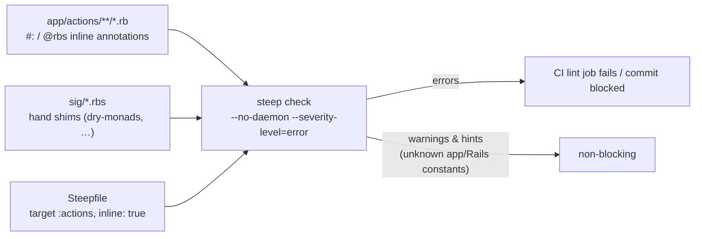

# Static type checking — RBS + Steep

Move type-checks the **entire actions layer** (`app/actions/**` and every pack's
`packs/*/app/actions/**` — rollout completed #519) **and the models**
(`app/models/**`, packs' `app/public/**` + `app/models/**` — #521, which also
brought real model types via generated signatures and the community gem
signatures) with
[Steep](https://github.com/soutaro/steep) 2.0 reading **inline RBS
annotations** (`#:` / `@rbs` comments) natively from the Ruby files — the
[RBS 4 inline syntax](https://github.com/ruby/rbs/blob/master/docs/inline.md),
enabled per target via the Steepfile's `inline: true`. There is **no
rbs-inline preprocessor and no generated `.rbs` tree**: types live next to the
code they describe, so there is nothing to drift. The check is merge-blocking
(CI `lint` job) and runs locally as an Overcommit pre-commit hook — the same
"standards as automated checks" ladder as the `Move/*` cops and Packwerk.



## Why the actions layer first

Business logic lives in `app/actions` (AGENTS.md §1 rule 2): plain Ruby, one
`call` per class, already unit-tested in isolation — the highest-value,
lowest-friction layer to type. Growth is staged like the Packwerk migration:
pack-by-pack (`packs/<domain>/app/actions` next), each addition a `check` line
in the Steepfile. Models, controllers, and Phlex views are deliberately out of
scope for now (see *Known gaps*).

## Running it

```bash
mise x -- bundle exec steep check --no-daemon --severity-level=error
```

~2s at the current scope; no DB, no Rails boot. It runs automatically:

- **CI** — a step in the `lint` job (merge-blocking via branch protection).
- **Pre-commit** — the `Steep` Overcommit hook (`.git-hooks/pre_commit/steep.rb`)
  whenever files under `app/actions/`, `sig/`, or the `Steepfile` are staged.
  Always whole-target: signatures are cross-file, so a staged shim edit can
  break an unstaged action and vice versa.

Two non-obvious flags, both mandatory:

- **`--no-daemon`** — Steep 2.0 defaults to a `steep server` daemon that can
  deadlock in headless environments (observed locally: master thread crash →
  workers wait forever at 0% CPU). The direct check is fast enough not to care.
- **`--severity-level=error`** — the default gate is `warning`, which would
  block on every unknown constant. Domain models have **no RBS signatures
  yet**, so `Move`/`Box`/`Rails` references inside actions surface as
  `UnknownConstant` *warnings* and degrade to `untyped` — non-blocking by
  design. Genuine contract violations (wrong arity, a body that can't produce
  its declared return type, a method call on a *known* type that doesn't
  exist) are errors and block.

## The annotation convention

Full method-type comment on its own line directly above the `def`:

```ruby
    #: (params: untyped, creator: untyped) -> Dry::Monads::Result[untyped, untyped]
    def call(params:, creator:)
      move = yield with_responsible(creator) { persist(params, creator) }
      yield emit_event(move)
      Success(move)
    end

    #: (untyped move) -> Dry::Monads::Success[nil]
    def emit_event(move)
      Rails.event.notify("move.created", move_id: move.id)
      Success()
    end
```

House rules (`spec/architecture` of the type system, so to speak):

1. **Domain objects are `untyped`.** A type name that doesn't resolve in the
   RBS environment aborts Steep at signature-load time regardless of severity
   config — and models have no signatures. Real types only for unambiguous
   scalars (`String`, `Symbol`, `Integer`, `bool`, `String?`,
   `Hash[Symbol, untyped]`, …).
2. **`call` returns `Dry::Monads::Result[untyped, untyped]`**; step methods
   returning only `Success(x)` use `Dry::Monads::Success[untyped]`
   (`[nil]` for a bare `Success()`).
3. **A bare do-notation `yield` needs no block declaration** in the method
   type — Steep 2.0 accepts it (verified; earlier designs assumed an optional
   block was required).
4. **The annotation must be its own comment block.** A `#:`/`@rbs` line that
   shares a contiguous comment block with prose can fail to parse
   ("unexpected token for inline leading annotation") — put a blank line
   between a prose comment and the annotation.
5. **`def self.` is not supported by inline RBS yet.** Put `# @rbs skip`
   (bare — no `-- comment` suffix) above the def and declare the singleton
   method in a `sig/*.rbs` file (see `sig/default_vocabularies.rbs`).
6. **`Data.define` / `Struct.new` constants stay unannotated** (dynamic class
   definitions; inline RBS ignores them and inference copes).
7. Local escape hatch, sparingly: `move = nil #: untyped` (a trailing type
   assertion) when flow analysis over unknown constants narrows a local too
   hard. RuboCop is configured to leave `#:` comments alone
   (`Layout/LeadingCommentSpace: AllowRBSInlineAnnotation`).

## Model types (#521): three signature sources

1. **Generated, schema-derived** — `sig/rbs_rails/` (committed). `bin/rails
   rbs_rails:all` introspects the booted app (columns, associations, AR
   methods — pack-nested models included) and writes one `.rbs` per model.
   Config in `config/rbs_rails.rb`. **Freshness is CI-enforced** in the
   `packwerk` job (regenerate + `git diff --exit-code`), the model-signature
   analogue of `RailsSchemaUpToDate`: after a migration touching a model,
   rerun `bin/rails rbs_rails:all` and commit the diff.
2. **Community gem signatures** — the rbs collection (`rbs_collection.yaml`,
   committed `rbs_collection.lock.yaml`, gitignored `.gem_rbs_collection/`).
   A fresh clone runs `bundle exec rbs collection install` once; CI installs
   `--frozen` with a cache keyed on the lockfile. Known gaps in the
   Rails-7.0-era sigs are bridged in `sig/rails_gaps.rbs` (e.g. `Rails.event`)
   or suppressed at single call sites with a trailing
   `# steep:ignore <Diagnostic>` + reason (e.g. `create!` declared
   kwargs-only). Broken gem-shipped sigs are `ignore:`d in
   `rbs_collection.yaml` (snaky_hash crashes the whole environment load).
3. **Inline annotations** for hand-written model methods — same `#:`
   convention as actions. Model-specific rules:
   - **`initialize` must be annotated** — unannotated it inherits
     `Object#initialize`'s `() -> void` and errors on any parameter.
   - **Bind attribute reads to locals before nil-guards** — Steep correctly
     refuses to narrow across two separate reads of an AR attribute
     (`return nil if foo.nil?; foo * 2` fails). Worked examples:
     `Box#volume_cm3`, `Item#image_generating?`,
     `RecognitionSuggestion#confidence_percent` — each was a live
     nil-blind-spot the checker exposed.
   - **The two model concerns are deliberately unchecked** (Steepfile
     enumerates `packs/utility/app/models` file-by-file to exclude
     `concerns/`): a concern's `included do` body runs in the includer's
     context at runtime, which Steep can't model — the concern counterpart of
     do-notation's `yield`. Their modules are declared in `sig/concerns.rbs`;
     macros they provide (`discard_cascade_to`) live in `sig/rails_gaps.rbs`.
     Note `ignore` in the Steepfile does **not** exclude inline-mode sources —
     hence file enumeration.

## The shims (`sig/`)

Hand-written, deliberately minimal — only what the actions layer actually
calls. Grow them method-by-method; never bulk-generate.

| File | Declares | Why |
|---|---|---|
| `sig/dry_monads.rbs` | Generic `Result`/`Success`/`Failure` (`value!` on the base, so unwrapping an action's declared return type-checks), the `Success()`/`Failure()` constructors on `BaseAction`, `Dry::Monads.[]` | No community RBS for dry-monads; `include Dry::Monads[:result, :do]` is a dynamic call RBS can't model (`@rbs skip` on the include, surface declared here) |
| `sig/rails_gaps.rbs` | `Rails.event`, `ApplicationRecord.has_logidze`/`.has_neighbors`/`.discard_cascade_to`, `ActiveStorage::Attached::One#content_type`/`#blob` | Real runtime APIs missing from the Rails-7.0-era community sigs (or from gems with no RBS) that model/action bodies call on **known** types |
| `sig/model_singletons.rbs`, `sig/default_vocabularies.rbs`, `sig/label_print_runs.rbs`, `sig/captures.rbs` | The checked scope's `def self.` methods (incl. `Current`'s CurrentAttributes readers) | Inline RBS can't declare `def self.` yet — each def carries `# @rbs skip` and its type lives in a sig file |
| `sig/discard.rbs`, `sig/concerns.rbs` | `Discard::Model` + per-model/proxy discard scopes; the `Discardable`/`Roleable` module names | The discard gem has no RBS; the concerns are unchecked (see above) but their modules must resolve for models' `include` lines |

(`sig/active_support.rbs` and `sig/search_reindexing.rbs` are gone — the
collection's activesupport sigs and `packs/search`'s inline annotations took
over, per each shim's deletion trigger.)

## What the checker actually catches (honesty section)

**Caught:** wrong arity/kwargs against any annotated method (including every
`Success`/`Failure` call), a step method whose body can't produce its declared
return type, `NoMethod` on known types, literal-type inference errors (a
symbol-keyed hash literal indexed with a string — a real mixed-key bug this
adoption found in `Moves::SetRecognitionProvider#persist` before a single
annotation was written).

**Not caught (accepted, structural):**

- **Do-notation `yield` unwrapping is `untyped` by construction.**
  `Dry::Monads::Do` re-invokes `call` with an implicit unwrap block —
  metaprogramming Steep can't model. Each step method's declared contract is
  checked; the hand-off between steps is not. Don't oversell this: "each
  rail's shape is checked, the coupling between rails is not."
- **Cross-model mix-ups** (passing a Box where a Move is expected) — domain
  types are `untyped` until models get signatures.

## Growth roadmap (documented triggers, not speculation)

| Trigger | Action |
|---|---|
| A NEW pack gains an `app/actions`, `app/public`, or `app/models` directory | Add its `check` line to the target and annotate from day one — the fitness spec's globs cover it (unannotated defs fail) and its Steepfile-mirror example fails a missing `check` line |
| A migration changes a model's columns/associations | `bin/rails rbs_rails:all`, commit the `sig/rbs_rails/` diff (the packwerk CI job fails on drift) |
| Community rails sigs catch up (activerecord/activesupport ≥ 8.1) | Re-audit `sig/rails_gaps.rbs` and the two `steep:ignore` sites — delete whatever the collection now covers |
| Real model types wanted (cross-model mix-ups start hurting) | Adopt `rbs_rails` (generated model sigs, needs DB — pair with the `packwerk` CI job the way structure.sql freshness works) and/or `rbs collection` (community gem sigs; commit `rbs_collection.lock.yaml`, gitignore `.gem_rbs_collection/`; beware activesupport sigs lag Rails 8.1) |
| An ActiveSupport core-ext on a known type blocks an annotation | Add the one method to `sig/active_support.rbs` |
| rbs/steep ship inline `def self.` support | Fold `sig/default_vocabularies.rbs` back into inline annotations |
| Steep's inline mode supports multiple targets over one tree | Optionally split strict/lenient targets (Steep 2.0.0 crashes on this today: "Source already exists" + deadlock) |

## Version coupling

`rbs` and `steep` are pinned in the Gemfile and must be **bumped together**
(the inline parser lives in rbs; Steep bundles against it). CI installs them
via `bundler-cache` — never `gem install` — so the checked versions are the
locked ones.

_Last updated: 2026-07-03 (#515 — initial adoption)._
